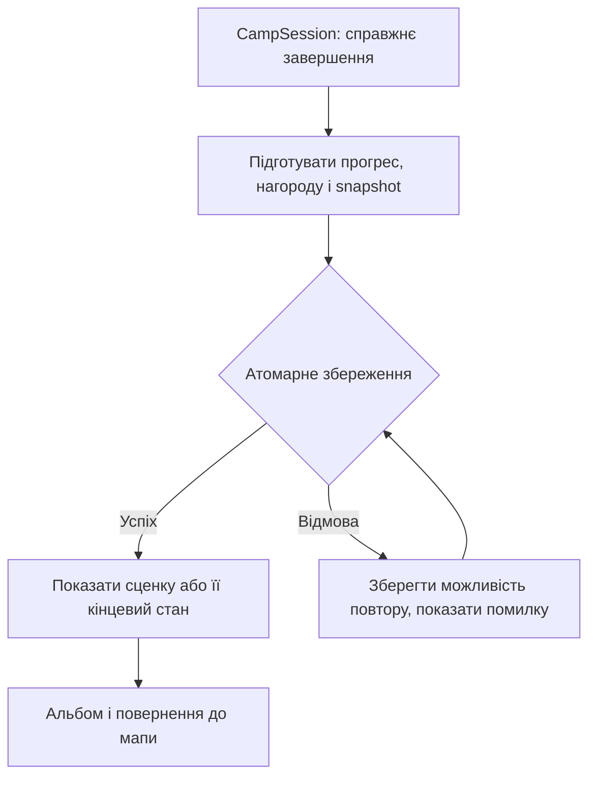
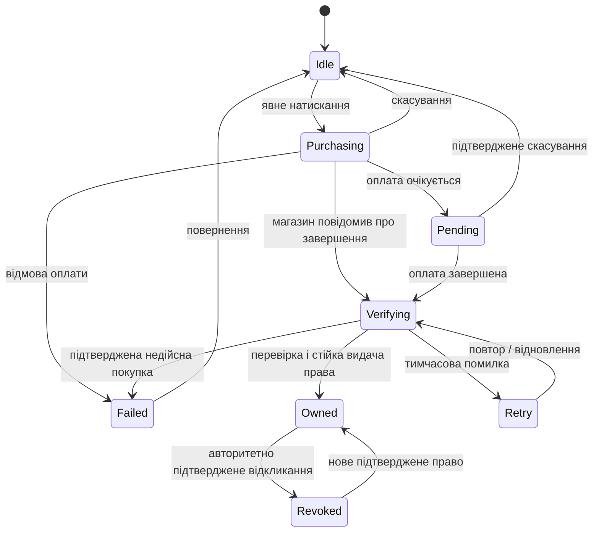

# Quiet Camp: план впровадження подорожей і монетизації

Дата: 2026-10-05. Статус: **план**, реалізація за цим документом ще не виконана.
Основа: [продуктова концепція](CONCEPT-UA.md).
Приймання: [сценарії та критерії тестування](TEST-PLAN-UA.md).

## Ціль

Дати гравцеві зрозумілу причину продовжувати гру: облаштувати особливе місце,
побачити результат турботи й повертатися до власного обжитого табору.
Монетизація фінансує завершені подорожі з новими галявинами та історіями.

Готовий результат:

- Безкоштовний вступ демонструє головоломку, наслідок турботи й живий альбом.
- Гравець бачить точний склад подорожі та ціну до підтвердження покупки.
- Після підтвердженої покупки відкривається саме придбаний контент; його
  можна відновити й використовувати офлайн після першого підтвердження.
- Успішне проходження відкриває стійкі зміни табору й сцени життя;
  повторний callback, перегравання чи відновлення не дублюють нагороду.
- Прогрес, старі права доступу, косметика, навчання, незавершені розкладки
  й snapshots альбому переживають оновлення.
- Основні правила, підказки, undo, доступність і приємне освітлення
  однаково доступні всім гравцям.

## Обсяг і рішення до активації платежів

Робочий варіант — завершений безкоштовний вступ із 10 галявин,
одноразове відкриття решти основних 30 рівнів і пізніші окремі подорожі.
Альтернатива — безкоштовні всі 30 та платні лише нові подорожі.
Архітектура підтримує обидва варіанти через каталог; UI не містить власного
правила «після десятої галявини вимагати оплату».

| Рішення | Робочий напрям | Коли зафіксувати |
| --- | --- | --- |
| Модель основної кампанії | Вступ + одноразовий доступ | Після тесту вступу й бажаності, до обмеження будь-якого доступу |
| Межа вступу | 10, із завершеною малою історією | Після вимірювання тривалості й зрозумілості |
| Перше доповнення | «Світло старого маяка», 8–12 галявин | Після порівняння трьох реальних прев'ю |
| Ціни й регіони | Не визначені | До створення активних товарів у магазині |
| Платіжний адаптер | Один Unity-сумісний провайдер Play Billing | Після перевірки підтримки поточної Unity/Android і pending/restore |
| Перевірка покупок | Мінімальний захищений backend | До реальних покупок |
| Реклама / підписка | Вимкнені для першого релізу | Лише після окремого продуктового рішення |
| Завантаження доповнень | Перший готовий набір у складі гри | Переглянути за виміряними розміром і пам'яттю |

Невизначена модель не блокує прототип історії, альбому, каталог і fake-
провайдер. Вона блокує активацію реальних платних меж. Готовність платежів
і готовність самого контенту мають окремі прапорці; відсутній контент
не можна продавати. Наявність SDK або namespace не вмикає продажі.

## Підготовка й збереження існуючої роботи — етап 0

1. Зафіксувати стан кампанії: ID, порядок, contentHash, summaries, ruleVersion,
   snapshots і архіви. Зберегти поточні незакомічені зміни.
2. Підготувати синтетичні fixtures старих saves: порожній старий слот,
   початкове навчання, середина кампанії, усі 30, старий альбом, незавершений
   v1/v2, пошкоджений primary з валідним backup. Реальні saves не редагувати.
3. Записати baseline UI, кількості об'єктів, матеріалів, джерел звуку й
   frame-time для сцени прототипу. Позначити, де є лише Editor-дані.
4. Підготувати QA-режим: явний fake-provider, окреме сховище, ін'єкція
   затримок/відмов і жодних покупок чи мережевого збору за замовчуванням.
5. Застосувати правила ресурсу хоста: один Unity-прогін, перевірка RAM,
   без паралельних важких імпортів.

Вихід: відтворюваний baseline і міграційні fixtures. Жоден player build
не запускається без нового прямого запиту користувача.

## Одна завершена історія — етап 1

Створити вертикальний прототип на безкоштовній галявині. Гравець ставить
намети за поточними правилами, успішно перевіряє розкладку, бачить коротку
зміну життя табору й знаходить той самий результат в альбомі після перезапуску.

Перший образ: знайомий гість із сумкою облаштовується; з'являються дві чашки,
сушиться тканина й світиться внутрішній ліхтар. Біля старої лавки лишається
охайний слід турботи. Повні анімовані персонажі для цього прототипу не потрібні.

- Тривалість першої сценки — орієнтовно 3–6 секунд; пропуск доступний
  відразу. Пропуск переходить до кінцевого вигляду й зберігає винагороду.
- Reduced motion показує кінцевий стан без руху камери чи швидких прольотів.
- Історія не додає колайдерів, логічних blocked/noise або нових умов solver.
- Для речей використати правила `TentLivingSpace`: перевірка поверхні,
  меж, footprint, дверей, стежок, води й сусідів; безпечний fallback усередину.
- До успіху поле не підказує станом предметів приховане «правильне рішення».
- Повторне проходження відтворює сценку за бажанням, але не видає другу
  первинну нагороду. Альбом має один узгоджений запис на рівень.

Вихід: прототип для людського тесту U01–U04 та автоматичних W01–W08.
Після нього вирішити, які деталі справді помітні й бажані.

## Сюжетні нагороди й альбом — етап 2

Додати `CampMemoryService` як єдиного власника отриманих сюжетних результатів.
Назви нових типів у цьому плані є пропозицією; вони не існують у runtime зараз.

- `MemoryDefinition`: стабільний rewardId, journeyId, умова завершення,
  локалізована назва для альбому, sceneId, revision і профіль reduced motion.
- `MemoryState`: отримані rewardId, доступні sceneId, переглянуті revision;
  перегляд і отримання — окремі факти.
- `CampMemoryPresenter`: лише відтворює отриманий результат через
  `TentStoryVisual`, `CampStoryComposer` і спільну камеру.
- Альбом зберігає сюжетний snapshot: отримані мотиви, завершальний стан,
  revision scene-композиції. Новий патч не переписує історію старого табору.
- Якщо стара сцена недоступна, відтворювати збережений кінцевий стан або
  базову діораму. Помилка декору не закриває альбом чи навігацію.
- «Побути тут» приховує HUD, залишає зрозуміле повернення, дозволяє
  обертання й слухання. Тиша, mute, гучність і reduced motion застосовуються.

Потік завершення:

Для первинного проходження completionKey стабільний для journeyId + levelId;
contentHash описує версію збереженої сцени, а не дає нову первинну нагороду.
rewardId також стабільний між виправленнями контенту. Оновлення SaveAdapter
використовує існуючий атомарний pipeline: у разі відмови не стирає in-progress
та не оголошує незбережену нагороду постійною. Retry відновлює один результат.

Сюжетні умови рахують завершення в конкретній подорожі/главі, а не загальний
CompletedCount усіх наборів. Наявні косметичні прапорці й подарунок навчання
зберігаються; нова система не переінтерпретовує їх як факт покупки.

Під час зміни альбому залишаються одна діорама, одна активна камера й один
власник звукових шарів. Швидке перемикання приводить до останнього вибору.

## Каталог, доступ і навігація — етап 3

Ввести легкий версійований `JourneyCatalog`; читання мапи не запускає
solver або генерацію. Джерело прав — `EntitlementService`; рішення про
конкретний рівень — `JourneyAccessService`. `ProgressionService` продовжує
відповідати за проходження, а не за факт оплати.

| Дані | Мінімальний склад |
| --- | --- |
| JourneyDefinition | journeyId, revision, title/description keys, впорядковані levelIds, introIds, requiredEntitlementId, previewId, memories, published |
| ProductDefinition | entitlementId, provider productId, список journeyId, точний локалізований опис, published; без жорстко записаної ціни |
| ProductDetails | Ціна/валюта й актуальна пропозиція від магазину; статус завантаження |
| AccessDecision | CanStart, причина, journeyId, nextPlayableId, доступне продовження архівної сесії |
| EntitlementRecord | entitlementId, джерело store/compatibility, verified state, receipt revision, останній авторитетний статус |

Каталог перевіряє унікальність ID, існування всіх ресурсів, відсутність циклів
і відповідність опису кількості реально поставлених рівнів. ID старих
30 рівнів і порядок зберігаються. Нові подорожі отримують окремі ID.

AccessDecision розділяє: контент не готовий; ще не пройдений попередній
рівень цієї подорожі; потрібна покупка; pending; перевірка; доступний;
підтверджено відкликаний. UI не виводить ці стани з CompletedCount.

Усі входи в рівень використовують це рішення: CTA головного меню, мапа,
qc.next, прев'ю, альбом і відновлення сесії. Пряма передача levelId не обходить
доступ. Куплене окреме доповнення починається зі свого першого рівня без
вимоги пройти всі 30 основних; потрібні правила повторюються локально.

Наявні безкоштовні бонуси лишаються окремими від комерційного каталогу.
`BonusCampAccessService` і `GameServices.BonusEntitlement` підключаються
до єдиного рішення там, де це потрібно; список premium bool у UI не заводити.

## Збереження й сумісність — етап 4

Розширення SaveAdapter: окремі версійовані модулі `qc.journeys.v1` та
`qc.entitlements.v1`; необов'язкові сюжетні поля в AlbumSaveData.Entry.
Поточні модулі й їхні ID залишаються сумісними. Міграція проходить у
тимчасових DTO й комітиться лише цілком; невідомі додаткові поля не стираються.
Для необов'язкових JSON-полів передбачити збереження extension data;
для непідтримуваної обов'язкової версії не перезаписувати слот, залишити
резервну копію й показати зрозуміле пояснення. Цю поведінку перевіряє S10.

1. Старий валідний save отримує явний compatibility grant для раніше
   доступного набору. Критерій походження — відомий попередній формат/manifest
   і дані до введення монетизації; кількість завершень не є доказом покупки.
   Включити старий порожній слот. Свіжий слот поточного формату не отримує grant.
2. До платної межі визначити спосіб збереження доступу тестувальників без
   локального save; автоматично встановити походження чистої інсталяції
   неможливо. За потреби використати окремий beta-grant механізм. Цей випадок
   блокує застосування нових обмежень до поточного тестового каналу.
3. Compatibility grant позначений окремо від store grant й не передається
   магазину як покупка. CRC старого save не називається захистом від підробки.
4. Незавершена стара сесія використовує власний snapshot/архів і старі правила;
   нова межа не обриває вже доступну тестувальнику гру.
5. Відновлення покупки відновлює доступ. Відновлення прогресу між пристроями
   є окремою функцією: хмарний save тут не обіцяється.
6. «Скинути прогрес» зберігає платні права. «Очистити всі локальні дані»
   видаляє також їхній локальний кеш після чіткого пояснення; покупка
   в магазині залишається, відновлення потребує мережі.
7. Підтверджене відкликання store grant змінює майбутній доступ; старі
   прогрес і спогади залишаються. Альбом можна переглядати, а запуск
   відповідної головоломки знову перевіряє право. Уже активну галявину
   дозволити завершити; автоматичного старту наступної немає. Якщо гру
   закрито, збережену розкладку не видаляти, але повторний запуск цієї
   платної головоломки потребує чинного права.
8. Тимчасова відсутність мережі, timeout чи порожній список ще не є
   підтвердженим відкликанням. Локально перевірений доступ не стирається.
   Офлайн використовується останній перевірений стан; миттєве відкликання
   без зв'язку із сервером не обіцяється. Після успішної звірки застосовується
   актуальний авторитетний результат.

Вихід: fixtures проходять S01–S10, A01–A10. Міграція повторного запуску
не змінює результат; primary/backup залишаються відновлюваними.

## Інтерфейси — етап 5

Додати локалізовані екрани й стани через UnityHTML:

- Бічні подорожі на мапі: реальний вигляд, назва, чесний стан доступу;
  скрол і поточний вузол не губляться після прев'ю чи магазина.
- JourneyPreview: власний тихий фрагмент сцени, кількість готових галявин,
  що входить у набір, спосіб початку, одноразовість покупки й повернення.
- Наприкінці вступу: «Продовжити подорож», «Мої кемпінги», повернення до мапи;
  ніякого переходу у платіжний діалог без окремого натискання.
- PurchaseStatus: отримання ціни, платіж, pending, перевірка, успіх,
  скасування, помилка й retry. Pending показує реальний стан, не пропонує
  повторно купити ту саму подорож.
- Restore: зрозуміла доступна дія в налаштуваннях і на прев'ю; повідомлення
  про знайдені права, відсутність покупок або тимчасову помилку.
- Альбом: «Побути тут», перегляд спогаду, перегравання, доступне повернення.

Кнопка покупки активна лише для published контенту й актуальних ProductDetails.
Використати форматовану ціну магазину. До відповіді — стан завантаження,
за недоступності — пояснення; вигаданої ціни чи чужої валюти немає.

Touch-зони ≥48 dp, uk/en/de, 130% тексту, portrait/landscape/tablet,
high contrast і reduced motion. Модальний ввід захоплює один власник;
закриття зовнішнього платіжного вікна не спричиняє tap-through чи drop намету.
Камера під час розміщення нерухома. Інші екрани й налаштування продовжують
працювати при помилці декору, магазина або мережі.

## Реальні платежі — етап 6

Спочатку реалізувати той самий контракт із FakePurchaseProvider для Editor.
Для production підключити один адаптер, який підтримує одноразові
non-consumable товари, отримання ціни, query/restore, pending, cancellation
та lifecycle. Fake grant у production недоступний; відсутній SDK дає
Unavailable, а не успішну покупку. Версію пакета закріпити після перевірки.

Власний стан процесу:

Це стан одного запиту; він не замінює існуючі права іншого джерела.
Наприклад, відкликана покупка не стирає незалежний compatibility grant.

Google вимагає перевіряти покупку до видачі, видавати право лише після
PURCHASED і підтверджувати обробку через acknowledge. PENDING не дає доступу;
триденний строк acknowledge починається після переходу в PURCHASED.
[Життєвий цикл Google Play Billing](https://developer.android.com/google/play/billing/integrate).

Backend:

- Перевіряє token, package/product і стан у Google; зберігає мінімальний
  журнал прав та результат видачі. Секрети й service-account ключі лише на сервері.
- Token — ключ ідемпотентності: повторна доставка повертає узгоджений
  результат, не створює другу покупку. Законний restore на іншому пристрої
  не відхиляється лише через те, що token вже відомий.
- Право й retry acknowledge зберігаються стійко. Backend може завершити
  підтвердження навіть після закриття гри; локальна відмова save не втрачає покупку.
- Клієнт отримує перевірюваний підписаний результат для локального офлайн-кешу.
  Одного редагованого bool недостатньо. Для відновлення на чистому пристрої
  потрібні магазин, мережа й перевірка; акаунт Play Games не є передумовою.
- Авторитетні зміни й refund з відкликанням обробляються через звірку та
  сповіщення провайдера. Повернення коштів і відкликання права розрізняються.
- Endpoint має TLS, обмеження запитів і безпечні журнали без сирих token.
  Якість захисту й офлайн-компроміс приймаються окремо; антипіратський DRM
  не перетворюється на постійне очікування мережі для гравця.

[Рекомендації Google щодо перевірки і відкликання](https://developer.android.com/google/play/billing/security).
Деталі реалізації API й SDK звірити з актуальними версіями під час етапу 6.

При старті/поверненні у foreground відновлювати незавершені операції;
системний callback і ручний Restore об'єднуються одним власником. Подвійні
натискання не відкривають два платежі. Скасування покупки не змінює ні
прогресу, ні історії, ні інших підтверджених прав.

## Повна подорож і художнє приймання — етап 7

1. За результатом прототипів обрати один набір. Спершу авторувати всі його
   галявини й завершення у staging; не продавати набору до їхньої готовності.
2. Для кожної галявини: validator, witness, незалежний solver, rules v2,
   зони речей, берег, візуально обґрунтовані стежки й шум.
3. Мінімум одна впізнавана нова композиційна деталь на подорож і кілька
   повторюваних предметів, що пов'язують її початок і завершення.
4. Середовище в gameplay, прев'ю, мапі й альбомі читає однакові season/seed/
   biome/weather. Сюжетні зміни декоративні й не змінюють рішення головоломки.
5. Платний набір використовує ту саму базову якість світла, тіней і звуку,
   що й вступ; цінність покупки — новий зміст подорожі.
6. Сцени життя адаптуються до дощу/снігу: вразливі речі сухі всередині,
   шляхи не перекриті, тінь/мокрість/вітер відповідають оточенню.
7. У перевірку включити особливо тісний табір, берег, сніг, густий туман,
   багаття й найширший екран. За браку місця зовнішні речі йдуть усередину.

Початковий бюджет доданої історії на одну активну сцену: до 12 малих
статичних предметів, об'єднаних за спільними матеріалами; до 6 рухомих
деталей; 0 додаткових камер і realtime lights; один короткий звуковий accent
одночасно. Це стартовий ліміт, уточнюється профілюванням. Невидимі деталі
не анімуються, Low зберігає впізнавані предмети й кінцевий стан.

## Приватність, магазин і експлуатація — етап 8

Оновити [юридичні заготовки](../Legal/README-UA.md) за реальним складом:
видавець, контакт, регіони, правила повернень/підтримки, платіжний провайдер,
backend, мінімальні дані покупки, строки зберігання й видалення. Порожні
реквізити та чернетка політики блокують production-публікацію, не локальний QA.

Для цифрового контенту звірити Play Payments і застосовні регіональні
програми; стандартний напрям цього плану — Play Billing, без переходів
на зовнішню оплату. [Політика платежів Google Play](https://support.google.com/googleplay/android-developer/answer/9858738?hl=en).

Діагностика покупки, необхідна для доставки/відновлення, відокремлена від
добровільної поведінкової аналітики. Відмова від аналітики не перешкоджає
оплаті чи restore. Платіжні token, receipts і дані підтримки не копіювати
в Firebase Analytics або комфортні події.

Для добровільної аналітики розширити закриту числову схему ComfortAnalytics:
тип подорожі як enum, перегляд прев'ю, outcome процесу, повернення в альбом.
Довільні рядки, raw input, ім'я гостя/гравця, token і receipt заборонені.
Подія підтвердженої покупки ідемпотентна; Restore не рахується новим доходом.
Після відмови немає черги для пізнішої відправки. Події доповнень не губляться
через нинішню перевірку тільки рівнів 1–30.

Підтримка може пояснити pending, відсутність мережі, різні акаунти магазину,
відновлення, повернення й відсутність хмарного прогресу. Немає вимоги
передавати пароль чи повний receipt у звичайний feedback.

## Порядок приймання й випуску — етап 9

Послідовність: **baseline → одна історія → людський пілот → каталог/сумісність
→ UI/fake-provider → готова подорож → реальні платежі → device QA → випуск**.
Правові реквізити й backend можна готувати паралельно з контентом.

| Ворота | Умова переходу |
| --- | --- |
| G0: безпечна основа | Fixtures, baseline, ізольований QA; жодні існуючі saves не змінені |
| G1: зрозумілість і бажаність | U01–U08 за критеріями; конкретне місце/результат помітні, умови покупки зрозумілі й без тиску |
| G2: технічна основа | A/S/W/I/N групи Passed, немає критичних дефектів |
| G3: готовий товар | Усі опубліковані галявини C01–C06 Passed, точний опис, пакет присутній |
| G4: магазин | P/L групи Passed із backend і реальним тестовим Play flow |
| G5: мобільна якість | F/R групи Passed на зазначених пристроях; Editor не замінює їх |
| G6: випуск | Вибрана модель, ціни/регіони, заповнені документи, підтримка, план відкату |

До нового дозволу на player build доступні лише документи, контент,
EditMode/PlayMode й ізольовані симуляції. Device/store тести мають статус
Not run або Blocked із причиною. Жоден timeout не є Passed.

Відкат: припинити нові продажі/пропозиції через підтримуваний каталог,
зберегти чинні права й snapshots; UI залишається працездатним при
недоступності backend. Не вимикати вже придбаний контент рекламним прапорцем.
Виправлення проходить ті самі обов'язкові групи, яких воно торкається.

## Критерій завершення всього впровадження

План виконано, коли гравець розуміє цінність подорожі, може без тиску
обрати покупку або повернення, отримує рівно оплачений доступ, бачить
стійкий результат турботи й відновлює власні місця без втрати даних.
Усі обов'язкові тести вибраного релізу пройдені з доказами; модель, ціни,
контент і документи відповідають тому, що реально поставляється.
Людський пілот підтверджує придатність концепції для наступного етапу,
а фінансова доцільність окремо перевіряється реальними продажами та витратами.
