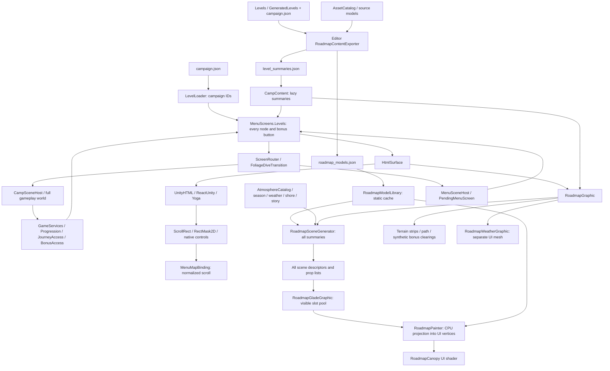

# Level Path / Roadmap: технічний аудит

Дата: 2026-10-07. Репозиторій: `kruty1918dev-ai/quiet-camp`. Перевірена база: `84af15d6f9b257dc1a955d8fcd210ee76456ce24`.

Це етап дослідження. Runtime, оформлення, контент, правила та збереження не змінено. Додано лише документацію та ізольовані інструменти аудиту. UnityHTML: **0.2.1**, SHA `ed36a7ce864f595432033da6f6b75c43ec92e7d9`; ReactUnity core: `8c4caa95f49b45e8fb7bb1f833eaa08adaa31496`.

## Висновок

Поточна мапа має пул **видимих UI-мешів**, але не має потокового завантаження регіонів. Відкриття генерує scene descriptors усіх рівнів, HTML містить усі кнопки, а кожен кадр обходить усю кампанію. Відсікання частини малювання не усуває цих витрат. На 300 рівнях це вже 300 генерацій при відкритті, 300 оновлень погодних станів і 300 перевірок видимості за кадр; перебудова фонової стежки виконує 10 764 обчислення вузлів.

Відтворено дефекти життєвого циклу: невдале відкриття може назавжди залишити часткову мапу; повторно ввімкнений `MenuMapBinding` перестає запам’ятовувати скрол. Пул при вході однієї галявини перепризначає також дві, які залишилися видимими. Навіть у reduced motion нерухомі мініатюри інвалідуються раз на секунду.

**Це підтверджені механізми зайвої роботи й нестабільності, але не виміряна атрибуція всіх фризів телефону.** Profiler/Frame Debugger для актуальної версії не запускалися; їхній протокол наведено у плані міграції. Не можна чесно стверджувати, що кожен спостережений користувачем дефект уже має встановлену єдину причину.

## 1. Поточна архітектура

Мініатюра на мапі — **2.5D-геометрія, спроєктована CPU у Canvas**. Це не маленька Unity-сцена з URP-камерою. Тіні — спроєктовані UI-полігони, туман і дощ — прозора UI-геометрія, вітер — зміщення вершин у UI-шейдері. Освітлення CPU бере профілі гри, але gameplay post effects, volumetric rendering і світлові компоненти автоматично сюди не переносяться.

### Власники відповідальності

У таблиці використано скорочені назви класів. `UI`, `World`, `Domain`, `Infrastructure` — відповідні підкаталоги `QuietCamp/Assets/QuietCamp/Scripts/`; `Editor` і Resources розміщені безпосередньо під `Assets/QuietCamp/`.

| Область | Класи / ресурси | Роль і межа |
|---|---|---|
| Повні дані | `Domain/LevelData`, `Infrastructure/LevelLoader`, `QuietCampLevelAdapter`, `LevelContentValidator` | Авторські та заморожені згенеровані рівні; звичайний scroll їх не завантажує й не запускає solver |
| Легкі дані | `LevelSummary`, `CampContent.Summaries/Summary` | Дані мапи; статичний масив, лінійний пошук за ID |
| Експорт | `Editor/RoadmapContentExporter`, `RoadmapContentWatcher` | Editor bake моделей і summaries; watcher відкладає експорт, пропускає Play Mode |
| Каталог моделей | `UI/RoadmapModelLibrary` | JSON → expanded arrays; кеш голих дерев і story geometry |
| Layout | `UI/RoadmapLayout`, `RoadmapGraphic.NodeX`, `Camp.css.txt` | Крок 420, бонусний проміжок 500, абсолютні координати; HTML і art обчислюються окремо |
| UI | `UI/MenuScreens`, `HtmlSurface`, `HtmlCallbacks`, `HtmlUi`, `CampMotion`, UnityHTML host/tree | Побудова всіх вузлів, локалізація, callbacks, reconcile, Yoga, motion |
| Scroll | `MenuMapBinding`, ReactUnity `ScrollComponent`, `ScrollContentResizer` | Нативний ScrollRect; RectMask2D; відновлення normalized position після трьох кадрів |
| Orchestration | `UI/RoadmapGraphic` | Генерація всіх descriptors, пошук видимих, пул, фоновий mesh, матеріал |
| Mini-diorama rendering | `RoadmapGladeGraphic`, `RoadmapPainter` | Видимі слоти; CPU-проєкція моделей, тіней, снігу, берега |
| Композиція | `RoadmapSceneGenerator`, `AtmosphereCatalog`, `SeasonProfile`, `SeasonPalette`, `CampWeatherTimeline`, `ShorelineGeometry`, `CampStoryComposer` | Seed, палітра, props, погода, сезон, берег, сюжетні предмети |
| Animation | `RoadmapCanopy.shader`, `RoadmapWeatherGraphic`, `CampMotion`, `FoliageDiveTransition` | UI-вітер, погодні полігони, переходи; різні незалежні clocks |
| Progress | `ProgressionService`, `ProgressSaveData`, `CampCompletionService`, `CampContent` migration | Завершення, canonical IDs, snapshots та старі записи |
| Unlock | `JourneyAccessService`, `JourneyCatalog`, `BonusCampAccessService`, `BonusCampCatalog`, `EntitlementSaveData`, `CozyEconomyService` | Основна послідовність, права на маршрути, бонусні умови, Pro |
| Bonus preview | `MenuScreens.BonusPreview`, `BonusCampPreviewGraphic`, `RoadmapGraphic.BonusClearing` | Модальне вікно та синтетична clearing за theme; не модель реального бонусного рівня |
| Story Trails / Journeys | `MenuScreens.Journeys/JourneyPreview`, `JourneyCatalog`, `JourneyAccessService`, `MemoryCatalog`, `CampStoryComposer` | Окрема навігація історіями; у коді немає окремої системи з назвою `StoryTrail` |
| Реальна 3D-діорама | `World/AlbumDiorama`, `BoardRenderer`, `DecorSpawner`, `CampAtmosphere` | Альбом і JourneyPreview: один активний світ, спільна камера; не renderer мапи |
| Scene navigation | `ScreenRouter`, `World/MenuSceneHost`, `World/CampSceneHost`, `GameServices.PendingMenuScreen` | Main → Levels → gameplay → menu; busy gate і leaf transition |

`CampTrail` — фізичні проходи і виходи поля, **не** Story Trails. Окремої системи fog-of-war / progress reveal не знайдено: lock/completion/current state показують кнопки; `RoadmapWeatherGraphic` малює атмосферний mist, а `FoliageDiveTransition` закриває/відкриває сцену.

## 2. Фактичний життєвий цикл

1. `MenuSceneHost.Start` створює `MenuScreens` і реєструє дії перед необов’язковим світом. Виняток декору має fallback. Це корисна існуюча межа.
2. `MenuScreens.Show("Levels")` інвалідує HTML. `HtmlSurface` виконує mount/reconcile у `LateUpdate`, тому кілька `Refresh()` за кадр coalesce.
3. `Levels()` проходить усі campaign IDs, створює кнопки, побажання, callbacks та всі bonus cards. `OnOverlayMounted` додає `RoadmapGraphic`, якщо його немає, та binding до scroll.
4. `RoadmapGraphic.Configure → EnsureData` синхронно читає профілі/моделі та генерує descriptor кожної галявини. Story cache miss додатково створює тимчасовий native Mesh.
5. `LateUpdate` оновлює погоду всіх descriptors, рахує visible rect та проходить усі descriptors для наповнення пулу. Позицію скролу binding встановлює через три `LateUpdate`.
6. Видимі слоти будують UI-меші. Фоновий graphic заново проходить усю стежку при invalidation. Weather graphic має окрему частоту приблизно 6–12,5 Гц.
7. Натискання рівня використовує захоплений стан кнопки, а router повторно перевіряє `CanStart`. Після leaf cover завантажується gameplay Single scene.
8. При поверненні MainMenu створюється заново, відновлюється екран із `PendingMenuScreen`, normalized scroll береться з RAM-поля `LevelMapScroll`. Це не персистентний save.

В `AlbumDiorama.OnScreen` для `Levels` та `BonusPreview` меню-світ приховується, drift вимикається, atmosphere suspend. **Не підтвердилось припущення, що повна анімована 3D-сцена продовжує працювати за мапою.** Створення меню-світу при вході в menu scene усе ж відбувається до цього приховування.

## 3. Підтверджені performance risks

Позначення: **CF** — відтворено control-flow тестом на фактичному коді з platform doubles; **SRC** — підтверджено прямим шляхом коду; **DATA** — перевірено поточні ресурси. Наведений ризик не означає, що його тривалість уже виміряна.

| ID / пріоритет | Доказ | Механізм і наслідок |
|---|---|---|
| P01 / високий | CF; `RoadmapGraphic.cs:50` | `EnsureData` створює всі N scenes одразу. Props усієї кампанії залишаються в RAM; це не chunk-based lifetime |
| P02 / високий | CF; `RoadmapGraphic.cs:72,95`; `RoadmapWeatherGraphic.cs:30` | Weather Advance і pool scan — O(N) кожного кадру; погодне малювання також сканує N перед culling |
| P03 / високий | CF; `RoadmapGraphic.cs:144,164` | 18 відрізків на кожну пару рівнів, по два `Node()`; відсікання після обчислення. `Terrain(y)` додатково шукає рівень від початку |
| P04 / високий | SRC; `MenuScreens.cs:215`; `CampContent.cs:115`; `JourneyAccessService`, `ProgressionService` | Усі N кнопок і callback closures; `Summary`, journey membership, unlocked index шукаються лінійно. Сукупно є O(N²) робота при побудові меню |
| P05 / високий для Editor | SRC; `GameServices.cs:197`; `LevelLoader.cs:90` | `CanStart` в Editor для кожної кнопки викликає `TestLevelId → LoadCampaign → Resources.Load + Deserialize`. У player ця гілка виключена; не переносити цей діагноз на телефон |
| P06 / високий | CF; `RoadmapGraphic.cs:95`; `RoadmapGladeGraphic.Configure` | Пул прив’язаний до порядкового slot, а не стабільного scene ID. Перехід `[0,1,2] → [1,2,3]` перебудовує три слоти замість одного |
| P07 / високий | CF/SRC; `RoadmapGraphic.cs:77,187` | Щосекундна invalidation навіть при reduced/static. `DrawSurroundings` створює Random і нові Prop; shadow hull не переживає repaint цих props |
| P08 / високий для winter | SRC; `RoadmapPainter.cs:81,92,153`; `SeasonProfile.cs:42`; `CampTrail.cs:64` | SnowDepth перераховується для кожного видимого трикутника дерева. Усередині — corridor traversal, вкладені проходи й iterator access points. Grid 16×16 робить 1024 samples замість 289 унікальних |
| P09 / високий для modal | SRC; `MenuScreens.cs:147,205`; UnityHTML `UnityHtmlDocumentTree.Node.Matches` | Levels root `sheet` стає дочірнім `bonus-map-background` при BonusPreview. Tag/key/parent reconcile не переносить стару піддеревину: стара видаляється, нова створюється разом із roadmap configuration |
| P10 / середній | SRC; `RoadmapModelLibrary.cs:63`; `CampStoryComposer.cs:134` | Story cache miss створює native Mesh, читає копії arrays, нормалізує, Destroy. Кеш обмежений 64 комбінаціями; наступні унікальні motifs не кешуються |
| P11 / середній | SRC/DATA; `RoadmapModelLibrary.Model.Expand` | JSON залишається разом із expanded geometry. Для 16 моделей/2200 трикутників raw payload 167 200 B + expanded 193 600 B = мінімум 360 800 B, без headers/JSON/native/variants. Зараз це не великий leak, але дублювання підтверджене |
| P12 / середній | SRC; `HtmlSurface.cs:64,107`; UnityHTML `CompleteLayoutPass:385` | Refresh перебудовує текст документа/callbacks, Regex CSS, масиви Selectable/Slider/RectTransform. Змінений HTML запускає Yoga, resizers і `Canvas.ForceUpdateCanvases` |
| P13 / середній | SRC; `RoadmapGraphic.UpdatePool` | Пул зростає через `new GameObject/AddComponent` у scroll/LateUpdate. Немає hard bound. Після warmup звичайний scroll не має Destroy кожного елемента |
| P14 / середній | SRC | UI gradients, shadow softness, fog, beams, rain мають прозорий overlap. Вартість GPU/Canvas upload невідома; невидимі кнопки можуть усе ще брати участь у layout/state update |

### Масштабний characterization test

Фактичні `RoadmapGraphic`, `RoadmapLayout` і `MenuMapBinding` компілюються з doubles Unity/SceneGenerator/Painter. Це counts викликів, **не** профіль часу генерації або FPS.

| Рівнів N | Generate при відкритті | Advance за кадр | Перевірок Centre за кадр | Node обчислень при rebuild стежки | Видимих слотів у fixture |
|---:|---:|---:|---:|---:|---:|
| 30 | 30 | 30 | 30 | 1 044 | 3 |
| 300 | 300 | 300 | 300 | 10 764 | 3 |
| 1000 | 1000 | 1000 | 1000 | 35 964 | 3 |

Fixture: viewport 850×1000, SceneExtent minimum 230, без фактичних props. Слоти 3 не є універсальною кількістю для реального tablet/shore/snow. Бонуси залишаються трьома існуючими slots: масштабування не додає новий контент.

### Що не підтвердилось

- Немає додаткової Camera/RenderTexture на кожну мініатюру або кожен bonus preview.
- Немає ParticleSystem у renderer roadmap: погодні ефекти — UI vertices.
- Немає solver, full level JSON load чи prefab Instantiate на кожен звичайний scroll кадр.
- Немає `LayoutGroup/ContentSizeFitter` як основного механізму цієї мапи: layout через Yoga і `ScrollContentResizer`.
- `HtmlSurface.Refresh` сам по собі не означає негайний full remount. UnityHTML робить keyed reconcile, якщо root/context/CSS стабільні; однаковий HTML early-outs.
- UnityHTML задає ReactUnity `PoolingType.Basic`. Звичайні view/scroll components у цьому режимі не отримують component pool, на відміну від текстових. Зміна root у bonus flow тому має реальну причину native recreation; точні GameObject/Destroy counts ще треба записати в Unity. Не приписувати кожному Refresh таку саму поведінку.
- У roadmap `LateUpdate` немає явного LINQ у головних циклах. LINQ/allocations є у lookups/render paths; точні allocation stacks не виміряні.
- Shader compilation stall, texture upload stall або нестача VRAM актуального білду не доведені.

## 4. Дефекти стану та rendering risks

| ID / статус | Джерело | Діагноз / спосіб перевірки |
|---|---|---|
| V01 / CF, дефект | `RoadmapGraphic.cs:50` | `_painter` присвоєний до завершення генерації. Fault на третій scene залишає 2/30; retry бачить painter і не завершує scenes/scroll/material. Тест відтворив саме цей шлях, не реальний asset exception |
| V02 / CF, дефект | `MenuMapBinding.cs:15,41` | `OnDisable` прибирає `_armed`; Configure early-out через `_services`; немає OnEnable rearm. Після disable/configure/5 frames скрол .2, збережене .6 |
| V03 / SRC, ризик | `RoadmapGraphic.FindVisibleArea:128` | За відсутності viewport повертає rect усієї мапи → потенційно всі glades активні. Потрібний explicit not-ready стан із fail-closed culling |
| V04 / SRC, ризик | `MenuScreens.Levels`, `RoadmapGraphic.EnsureData` | Кнопки за campaign IDs, art за порядком summaries. Runtime join/atomic revision validation немає. Поточні 30 збігаються; пошкоджений/stale export може дати чужий art під вузлом |
| V05 / SRC, ризик | `RoadmapPainter.Model:86`, `DrawSurroundings:204` | Об’єкти припиняють малюватися понад ~55K vertices; surroundings early-return 46K. Немає розбиття на додатковий mesh чи явного fallback. Це може виглядати як зниклі частини світу; поточне truncation на всіх сценах не доведено |
| V06 / SRC, ризик | `SceneGenerator.Props.Sort`, `RoadmapPainter.Model`, `RoadmapCanopy.shader` | Об’єкти сортуються за центрами; грані всередині — source order, shader ZWrite Off. Overlap висот/сусідніх glades не має повноцінного depth. Це painter-order occlusion, а не встановлений hardware Z-fighting |
| V07 / SRC, ризик | `RoadmapGladeGraphic`, `RoadmapGraphic.SceneExtent` | Rect слоту stretch на весь content. Custom SceneExtent включає props/shadows, але не всі generated surroundings/weather; native bounds і семантичні bounds різні. Треба виміряти pop-in/overlap на tall trees/shore/wide screens |
| V08 / SRC, ризик | `MenuMapBinding.LateUpdate`, `MenuSceneHost.IsReady`, `ScreenRouter.WaitSceneReady` | Три кадри — не сигнал закінчення layout/mesh. Scene ready не перевіряє active overlay; transition може відкрити ще не прокручену/не побудовану мапу |
| V09 / SRC, ризик | `MenuMapBinding`, `GameServices.LevelMapScroll` | Normalized position у RAM не прив’язаний до ID. Зміна висоти/локалі/орієнтації/каталогу може змінити видимий вузол; рестарт відновлює progress target, а не останній scroll |
| V10 / SRC/DATA, невідповідність | `RoadmapGraphic.BonusClearing:224`, `bonus_camps.json` | Art створюється з синтетичного 4×4 summary, theme і seed afterLevel. Три slots поки draft з порожнім levelId. Це valid placeholder, але не reusable preview реального bonus content |
| V11 / SRC/DATA, дефект паритету | `SceneGenerator.cs:97`, `SeasonProfile.SnowDepth`, `CampGroundDetails.HeatAt` | `SnowTerrain` не містить `noise`; heat/melt не бачить джерела. Winter+fire у `gen:qc_camp:11,13,15` мають по одному noise source у повному рівні, але не у map view |
| V12 / SRC, невідповідність | `RoadmapGraphic.DrawSurroundings:201` | Surroundings не проходять ту саму seasonal bare-tree/shrub-density logic: winter примусово pine, bushes додаються завжди. Палітра спільна, але композиція сезону різниться |
| V13 / SRC, ризик стану | `GameServices.CanStart:204`, `MenuScreens.Levels` | Bonus UI бере `BonusCamps.Evaluate`, launch додатково дозволяє Pro. За майбутнього published bonus UI lock може розійтися з CanStart. Нині draft slots не запускаються |
| V14 / SRC, дефект навігації | `CampSceneHost.cs:352` | `qc.levels` не задає PendingMenuScreen="Levels". Результат залежить від попереднього контексту: roadmap entry працює, Main Continue/Album може повернути інший екран. Окрема ReturnToMenu coroutine задає Levels; це різні шляхи |
| V15 / SRC, ризик cache | static `CampContent`, `RoadmapModelLibrary`, `BonusScenes` | Ключі не містять content revision. Нова версія даних у живому Editor/довгому контексті не має явної invalidation; caches не можна вважати asset-lifetime model для streaming |
| V16 / SRC, ризик refresh | `MenuScreens.Levels/Refresh`, `HtmlSurface` | Unlock/completion captions і closures беруть snapshot на render. Router захищає запуск, але presentation freshness залежить від загального Refresh, а не явного per-node state revision |

### Sorting, clipping, anchors, resources

MainMenu Canvas — Screen Space Overlay; roadmap art живе всередині scroll content, weather встановлюється останнім sibling art, HTML-кнопки йдуть після art. Це пояснює очікуваний UI-over-art порядок, але потребує Frame Debugger для конкретного дефекту. Додаткова камера не може автоматично виправити CPU painter sorting.

CSS задає absolute percentage X, node width 100, stop width 200, bonus width 320; full-width scroll під safe header. Поточні anchors не доведені зламаними. Потрібні виміри крайніх bonus cards на найвужчому viewport, 130% text, ultrawide, після rotation; не змінювати padding за припущенням.

Невідомий model ID у Painter тихо пропускається; відсутній `tree_default` у canopy generation може кинути exception; malformed/empty arrays у Model.Expand не мають достатньої runtime validation. **Поточні** 16 models валідні, всі map object asset IDs існують, 30 summaries відповідають frozen levels. Тому missing assets не доведені як причина нинішньої помилки.

Поточний фоногляд shader має stencil, `_ClipRect`, alpha-clip варіанти. Чи кліпуються leaf sway/shadows на конкретному GPU, треба перевіряти captures. Метод viewport береться через corners 0/2; це нормально для axis-aligned scroll, не загальна формула для rotated Canvas.

## 5. Повторне використання / заміна / видалення / legacy

| Рішення | Частини | Умова |
|---|---|---|
| **A — залишити** | Stable IDs, canonical migration, completed HashSet, album/session snapshots, content hashes | Не змінювати authoritative progress формат через renderer |
| **A — залишити** | Journey/bonus access правила, completion persistence | Уніфікувати presentation/launch query; додати indexes без зміни умов |
| **A — залишити** | Atmosphere/season/palette/weather/shore, model bake з реальних assets, deterministic seeds | Винести immutable descriptors; version/fingerprint; parity winter/noise |
| **A — залишити** | Native ScrollRect, safe-area/full-width UI shell, UnityHTML keyed reconcile/UpdateRegions, router busy/input gate | Стабільний shell і explicit readiness; не full HTML кампанії |
| **A — частково залишити** | CPU projection, painter primitives, bare-tree geometry, cached shadow hull | Renderer backend після static bake/caching/splitting; не закріплювати 2.5D як фінальний art direction до окремого redesign |
| **B — переписати** | `RoadmapGraphic` orchestration, pool assignment, invalidation, bounds, weather update | Region window + stable leases, робота тільки над активними/видимими |
| **B — переписати** | `MenuScreens.Levels` full-list HTML і `MenuMapBinding` normalized/three-frame state | Virtualized nodes; stable node ID anchor; deterministic layout-ready handshake |
| **B — переписати** | `RoadmapLayout` linear bonus traversal і Terrain lookup | Prefix layout/indexed range queries; один coordinate contract для art/UI |
| **B — переписати** | Story/bonus preview cache ownership, initialization failure handling | Versioned resources, staged commit, cancel/dispose; actual bonus summary при publication |
| **C — видалити після parity** | All-N frame loops, whole-map viewport fallback, per-triangle snow sampling, throwaway surroundings props/hulls, unconditional idle rebuild | Лише після нових acceptance checks; не видаляти під час цього аудиту |
| **C — видалити після parity** | Duplicate raw model arrays після Expand, невідстежувані static caches, snapshot callbacks із різними access paths | Заміна ownership/versioning; перевірити compatibility serialization |
| **D — ізолювати legacy** | Поточний `RoadmapGraphic/SceneGenerator/Painter` як єдиний selectable backend; draft bonus clearing renderer | Feature flag для порівняння 30 levels і rollback; не дві одночасно активні мапи |
| **D — зберегти сумісність** | Legacy levels/snapshots і old progression IDs | Це архів контенту, не legacy renderer. Не видаляти їх при migration |

Не використовувати `AlbumDiorama.BuildCamp` для кожного roadmap node: воно створює реальний 3D-world із gameplay декором й атмосферою. Його схема одного активного preview корисна, але тиражування на регіони різко збільшить workload.

## 6. Докази, обмеження і Definition of Done

- Новий characterization harness: build PASS, 0 warnings/errors; counts 30/300/1000; чотири відтворені defect paths; actual progression/bonus gate contracts PASS на synthetic 300 IDs.
- Resource audit PASS: порядок і паритет 30 summaries, 16 моделей, finite triangle streams, object references; SHA-256 inspected files у [resource-audit.json](../../TestResults/roadmap-audit-2026-10-07/resource-audit.json).
- Proposed three-region window: traversal/backward/10 000 seeded jumps для 30/300/1000, max resident regions 3. Це feasibility simulation, не реалізація renderer.
- Історичні `TestResults/procedural-roadmap-2026-10-04`: 48 samples, 16 315–47 747 vertices, pool 2–5, 20 EditMode/2 PlayMode. Це минулий знімок, не regression pass актуального HEAD. Oct-5 seasonal tests мають інший 55K бюджет, старий procedural glade test — 16K; потрібна єдина budget policy.
- Нових renders, Unity runs, Profiler captures чи mobile builds не виконано. На host диск 91% і менше 10% вільного місця; новий import/clone/heavy Unity run відкладено. Легкі інструменти використовували окремий `/tmp` output і не торкалися device saves.

Архітектура й конкретні відтворені defects встановлені. **Частина DoD про точний внесок кожної причини в реальні фрізи та всі видимі артефакти залишається відкритою до native capture**. Для закриття потрібні саме trace + reproduction, а не новий зовнішній вигляд. Наступні кроки: [target architecture](TARGET-ARCHITECTURE-UA.md), [migration / measurement gates](MIGRATION-PLAN-UA.md), [поточний QA status](../../TestResults/roadmap-audit-2026-10-07/REPORT_UA.md).

## 7. Навігація до доказів у коді

Рядки у findings відповідають перевіреному HEAD; при майбутніх змінах перевіряти fingerprints з resource audit.

| Шлях | Опорні методи / рядки |
|---|---|
| [RoadmapGraphic.cs](../../QuietCamp/Assets/QuietCamp/Scripts/Presentation/UI/RoadmapGraphic.cs) | Configure 40; EnsureData 50; LateUpdate 72; UpdatePool 95; FindVisibleArea 128; Terrain 144; OnPopulateMesh 152; DrawSurroundings 187; BonusClearing 225 |
| [RoadmapPainter.cs](../../QuietCamp/Assets/QuietCamp/Scripts/Presentation/UI/RoadmapPainter.cs) | Shadow 23; Model 77; SeasonalGround 153 |
| [RoadmapSceneGenerator.cs](../../QuietCamp/Assets/QuietCamp/Scripts/Presentation/UI/RoadmapSceneGenerator.cs) | Scene/SnowDepth 28; SetMoment 46; Advance 63; Generate 90; SnowTerrain 97 |
| [RoadmapModelLibrary.cs](../../QuietCamp/Assets/QuietCamp/Scripts/Presentation/UI/RoadmapModelLibrary.cs) | Expand 21; BareTree; Story 63; temporary mesh finally disposal |
| [RoadmapGladeGraphic.cs](../../QuietCamp/Assets/QuietCamp/Scripts/Presentation/UI/RoadmapGladeGraphic.cs) / [RoadmapWeatherGraphic.cs](../../QuietCamp/Assets/QuietCamp/Scripts/Presentation/UI/RoadmapWeatherGraphic.cs) | Slot Configure / OnPopulateMesh; weather cadence та all-scenes traversal |
| [MenuScreens.cs](../../QuietCamp/Assets/QuietCamp/Scripts/Presentation/UI/MenuScreens.cs) | UiReady 25; RenderOverlay 147; OnOverlayMounted 178; FullMenu 205; Levels 215; Show 434 |
| [MenuMapBinding.cs](../../QuietCamp/Assets/QuietCamp/Scripts/Presentation/UI/MenuMapBinding.cs) / [RoadmapLayout.cs](../../QuietCamp/Assets/QuietCamp/Scripts/Presentation/UI/RoadmapLayout.cs) | Configure/OnDisable; three-frame restore; bonus gaps і global coordinates |
| [HtmlSurface.cs](../../QuietCamp/Assets/QuietCamp/Scripts/Presentation/UI/HtmlSurface.cs) | Element 64; Refresh 71; LateUpdate 93; MountDocument 107 |
| [GameServices.cs](../../QuietCamp/Assets/QuietCamp/Scripts/Presentation/GameServices.cs) / [CampContent.cs](../../QuietCamp/Assets/QuietCamp/Scripts/Infrastructure/CampContent.cs) / [LevelLoader.cs](../../QuietCamp/Assets/QuietCamp/Scripts/Infrastructure/LevelLoader.cs) | CanStart 197; summary 101/115; campaign loading 60/90 |
| [AlbumDiorama.cs](../../QuietCamp/Assets/QuietCamp/Scripts/Presentation/World/AlbumDiorama.cs) | OnScreen 28; BuildCamp 110; atmosphere suspension і world ownership |
| [MenuSceneHost.cs](../../QuietCamp/Assets/QuietCamp/Scripts/Presentation/World/MenuSceneHost.cs) / [CampSceneHost.cs](../../QuietCamp/Assets/QuietCamp/Scripts/Presentation/World/CampSceneHost.cs) / [ScreenRouter.cs](../../QuietCamp/Assets/QuietCamp/Scripts/Presentation/ScreenRouter.cs) | Pending screen; qc.levels 352; WaitSceneReady 116 |
| [RoadmapContentExporter.cs](../../QuietCamp/Assets/QuietCamp/Editor/RoadmapContentExporter.cs) | Export frozen summaries і actual-source model bake |
| [SeasonProfile.cs](../../QuietCamp/Assets/QuietCamp/Scripts/Presentation/World/SeasonProfile.cs) / [CampTrail.cs](../../QuietCamp/Assets/QuietCamp/Scripts/Presentation/World/CampTrail.cs) | SnowDepth 42; CorridorDistance 64 |

Package source перевірений у `QuietCamp/Library/PackageCache/com.kruty1918.moyva.unityhtml@ed36a7ce864f/Runtime`: `UnityHtmlHost.cs` (Pooling 135, CompleteLayoutPass 385, ForceUpdateCanvases 421), `UnityHtmlDocumentTree.cs` (reconcile, Node.Matches 311). Upstream `com.reactunity.core@8c4caa95f49b`: `ReactContextCreate.cs` (component pooling лише All), `BaseReactComponent.cs` (Destroy/Pool), `UGUIComponent.cs` (DestroySelf), `ScrollComponent.cs`, `ScrollContentResizer.cs`. Cache paths не входять до Git; точні package SHA зафіксовані на початку аудиту й у manifest/lock.

Наявні тести, які можна reuse: [ProceduralRoadmapTests](../../QuietCamp/Assets/QuietCamp/Tests/Editor/ProceduralRoadmapTests.cs), [BonusCampTests](../../QuietCamp/Assets/QuietCamp/Tests/Editor/BonusCampTests.cs), [ProceduralRoadmapPlayModeTests](../../QuietCamp/Assets/QuietCamp/Tests/PlayMode/ProceduralRoadmapPlayModeTests.cs), [BonusRoadmapPlayModeTests](../../QuietCamp/Assets/QuietCamp/Tests/PlayMode/BonusRoadmapPlayModeTests.cs), [SeasonPresentationPlayModeTests](../../QuietCamp/Assets/QuietCamp/Tests/PlayMode/SeasonPresentationPlayModeTests.cs). Вони покривають 30 nodes/3 drafts, model/data geometry, dimensions/locales, season fixtures; не покривають actual 300-native-nodes scaling, lifetime plateau, cold-open attribution або всі відтворені lifecycle defects.
