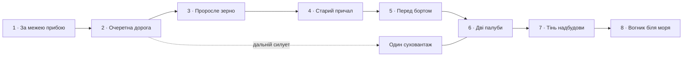

# «Берег пророслого зерна» — українське Чорне море

Дослідження: 2026-10-07. Статус: дизайн, unpublished authoring draft і перевірний прототип палубної топології. [Region](Regions/grain-coast/region-draft.json), [story metadata](Regions/grain-coast/story.json), [asset contracts](Regions/grain-coast/assets.json), [палубний контракт](Regions/grain-coast/ship-topology-draft.json), [QA](../../TestResults/black-sea-region-design-2026-10-07/REPORT_UA.md).

Вісім рівнів ведуть від піщаного берега через очерет, зернову логістику й старий причал до посадженого на мілину суховантажу. Корабель, помічений раніше, стає справжнім місцем головоломки. Завершення залишає маленький прихисток і придатний прохід; люди не відновлюють весь порт або корабель.

## Перевірена основа

| Тема | Первинне джерело / перевірений зміст | Застосування й межі |
|---|---|---|
| Небезпечний берег | ДСНС застерігає не заходити за попереджувальні знаки мінної небезпеки й не торкатися підозрілих предметів. [ДСНС, правила поводження](https://bezpeka.dsns.gov.ua/materials/vybukhonebezpechni-predmety-ta-pravyla-povodzhennya-z-nymy) | Табличка закриває небезпечну зону, не запрошує до пошуку. Гравець не знешкоджує й не збирає міни. |
| Обстежені пляжі | Одеська ОВА у повідомленнях 11 червня й 7 липня 2026 року описує погодження окремих зон після перевірок. [11 червня](https://oda.od.gov.ua/ua/news/v-odesi-vidkrili-13-bezpechnih-plyazhnih-zon-dlya-ozdorovlennya), [7 липня](https://oda.od.gov.ua/ua/news/na-odeshhini-vidkrili-shhe-9-plyazhiv) | Не все узбережжя однаково доступне. У fiction region є окремий придатний сухий маршрут і закрита вода; список реальних пляжів у гру не переноситься. |
| Морські міни | Чинний на дату перевірки MARAD advisory 2026-012 повідомляє про якірні й дрейфуючі морські міни та загрози торговельним суднам, включно з повідомленнями вересня 2026 року. [MARAD 2026-012](https://www.maritime.dot.gov/msci/2026-012-black-sea-and-sea-azov-military-combat-operations) | Не приписувати походження конкретній видимій сфері за зовнішнім виглядом. Активних mine props у регіоні немає. Старий 2025-011 скасований; не використовувати його як актуальне попередження. |
| Цивільне судноплавство | IMO 13 липня 2026 року засудила атаки на цивільні торговельні судна Чорного й Азовського морів. [IMO](https://www.imo.org/en/mediacentre/pressbriefings/pages/statement-on-attacks-in-black-sea-and-sea-of-azov.aspx) | Суховантаж — цивільний, без військового озброєння або атракціону з атакою. Конкретна причина його вигаданого пошкодження не подається як реконструкція реального удару. |
| Порти й аграрні вантажі | Повідомлення українського міністерства від 14 квітня 2026 року описує пошкодження торговельного судна, що йшло завантажувати кукурудзу, та влучання в портову інфраструктуру. [Офіційне повідомлення](https://mininfra.gov.ua/news/voroh-prodovzhuie-atakuvaty-tsyvilnu-morsku-lohistyku-odeshchyny) | Зерно, перевантажувальне обладнання й порушений цивільний маршрут мають документовану основу. Не копіювати конкретний корабель, прапор або геометрію пробоїни. |
| Експорт і відновлення руху | Міністерство 4 червня 2026 року описує зерновий експорт українським морським коридором і роботу портових/ремонтних команд. [Офіційне повідомлення](https://mininfra.gov.ua/news/ukrainskym-morskym-korydorom-perevezeno-200-milioniv-tonn-vantazhiv) | Показати не лише пошкодження, а й збережене життя та працю. Не плутати цей коридор із Black Sea Grain Initiative, яка, за [IMO](https://www.imo.org/en/mediacentre/hottopics/pages/maritimesecurityandsafetyintheblackseaandseaofazov.aspx), завершилася в липні 2023 року. |

Це датований factual review для дизайну. Beach permissions і maritime warnings змінюються; він не описує безпеку конкретного сучасного місця. Перевірені джерела не доводять, що вигаданий корабель зазнав певного реального удару. Географія, назва, посадка на мілину, масштаби руйнування, проросле зерно й дії героїв — fiction-inspired композиція. Немає реального IMO-номера, назви судна, логотипа, прапора, вигаданого бойового маркування, gore або політичного popup.

## Місце, палітра й roadmap

Берег низький, з піщаними кишенями, світлими каменями, очеретом у пріснуватих затоках, сухими травами й слідами чорнозему далі від води. Дорога з господарської частини виходить до маленького причалу. Зернові силоси, невеликий маяк і поодинокі зігнуті вітром дерева дають український прибережний контекст без точного копіювання Одеси, Чорноморська чи іншого порту.

Пора року закріплена: пізнє літо, `dry-summer`, поступовий перехід meadow → reeds → coast → civilian port edge. Дюнні трави менш зелені; очерет і окремі молоді рослини соковитіші. Проросле зерно розміщувати в підвищених кишенях ґрунту зі стоком дощової води, не як суцільну пшеницю в солоному прибою. Це артлогіка вигаданого місця, не документований факт конкретної атаки.

Світло кремове, вода приглушена блакитно-зелена, метал сіро-синій і теракотовий від корозії, рослинність солом’яна/оливкова. Не додавати суцільний чорний дим або чорну воду, щоб «пояснити війну». Сліди пошкоджень читаються завдяки обірваній функції місця: колись тут вантажили зерно, тепер маршрут частково зупинився, а люди користуються тим, що залишилося.

Hero — один великий посаджений на мілину general-cargo/bulk vessel: довгий корпус, вантажні люки, невелика кормова надбудова, пара deck cargo structures. Ніс спирається на ґрунт, частина нижнього борту у воді; суха робоча палуба лишається вище неї. Не видавати контейнеровоз із десятками stacked boxes за зерновий bulk carrier. Один-два порожні господарські cargo modules можливі, але основну впізнаваність створюють люки, winch, надбудова й вантажний маршрут.

Корабель видимий силуетом із рівня 2; на 4–5 стає зрозумілим масштаб; рівень 6 фізично проходить на ньому. На 7 гравець бачить іншу робочу ділянку того самого судна, а не другий корабель. Вузли — маленькі сцени на дорозі, причалі й сухих платформних ділянках; числа стримані. Cream header з Back/title/Story Trails; решта екрана — світ.

### Один landmark, кілька ступенів видимості

`landmarkId=grain-coast:merchant-ship`, local owner — node 6, earliest teaser — order 2. Teaser mesh містить лише корпус/надбудову, без палубних passages, реквізиту або readable markings. Локальний coarse mesh показує той самий силует із більшою деталізацією. Не ставити окремий корабель біля кожного node.

Потрібний `LandmarkPresentation` із одним володінням: hinted → silhouette → context. Координата належить world, а не екранній кнопці. Перехід proxy/local відбувається під атмосферою, не дублює hull і не переставляє його між кадрами. Proxy доступний із static mesh cache навіть якщо його локальний chunk ще не active; він не активує geometry інших майбутніх levels.

У поточному [RoadmapWorldRenderer](../../QuietCamp/Assets/QuietCamp/Scripts/Presentation/UI/RoadmapWorldRenderer.cs) far landmark прив’язаний до першого chunk наступного region. Це **не** готовий механізм «бачити судно всередині цього region із рівня 2». Тому raw draft не вмикає `farLandmarkAssetId`; окремий presentation contract описує потрібну інтеграцію. Дизайн не можна приймати як готовий рендер, поки teaser-to-ship continuity не пройшла QA.

## Перша галявина і мінна небезпека

Пісок, невелика дюна, стовпчики/мотузкова огорожа, за нею видима вода. Попереджувальна табличка: **«Обережно! Міни»**, українською в усіх локалях як частина середовища. Нижня частина опори присипана піском, краї й кріплення кородовані; слова залишаються читабельними. Не розвертати знак лицем у море або затирати слово «Міни» до декоративної плями.

Camp розташований на сухій стороні забороненої зони. Виходи ведуть назад на дорожню ділянку, не за огорожу й не до води. Геометрія water/hazard є відсутніми або permanently nonwalkable cells, незалежно від туману, wind, completion чи іншої якості. Бар’єр не можна видалити, купити доступ крізь нього або обійти «розумним» drop. Completion не робить воду безпечною й не прибирає знак.

Старі мотузки й човнові буї — реквізит на сухому безпечному боці, не інтерактивні знахідки з небезпечної зони. Буї мають очевидну форму поплавка/кільця; не використати чорну сферу з шипами, схожу на міну. Немає активних мін, деактивації, таймерів, explosive damage або нагороди за ризик. Місце красиве завдяки морю і природі, а не завдяки небезпечній забаві.

## Послідовність восьми рівнів

| ID / місце | Видимі деталі / висновок | Головоломка / маленька зміна |
|---|---|---|
| `QC_SEA001` · За межею прибою | Пісок, знак, бар’єр, видима недоступна вода; море є частиною життя й водночас має межу доступу. | 6×5, 2 гості, вільна дорога з сухого боку. Нічого не «розміновується». |
| `QC_SEA002` · Очеретна дорога | Очерет, стара прибережна дорога, дальній корабель, маяк; цікавість до місця попереду. | 6×6, 3 гості, спільний маршрут. Вітер сильніший, але не змінює правила. |
| `QC_SEA003` · Проросле зерно | Силоси, мішки, невеликі розсипи й молоді сходи на сухій землі; це був цивільний вантажний маршрут. | 7×5, 3 гості, shade від дерева, обмежене місце через каміння. Нові намети не торкаються cargo debris. |
| `QC_SEA004` · Старий причал | Пошкоджені модулі настилу, winch, стики старої й підлатаної деревини; робота зупинилася не назавжди. | 6×6, 3 гості, два видимі access points по стабільному сухому настилу. Пошкоджені секції лишаються непрохідними. |
| `QC_SEA005` · Перед бортом | Великий той самий корабель, низький gangway і придатна площадка біля нього. | 7×6, 3 гості, вузький прохід між справді позначеними cargo footprints. Камера показує, куди далі веде дорога. |
| `QC_SEA006` · Дві палуби | Суха нижня палуба, підвищена робоча площадка, надбудова, два переходи між висотами. | 6×6 lower + 3×3 upper patch у спільних X/Z, 3 гості, shade під upper structure, два exits і два explicit connectors. Висота змінює occupancy і routes. |
| `QC_SEA007` · Тінь надбудови | Інша частина того самого судна; побутові сліди тих, хто облаштував місце. | Окремий layered puzzle із narrow passages і shade від надбудови; власний witness обов’язковий. Після completion — маленький lantern на безпечній опорі. |
| `QC_SEA008` · Вогник біля моря | Корабель лишається в тлі, старий наземний маршрут має доглянуту ділянку й тимчасовий прихисток. | 7×5, 3 гості, friendship/route. Lantern, навіс і локально позначений прохід; увесь порт і судно не ремонтуються. |

Це briefs, не вісім готових `LevelData`. На first five/last level можна використати правила v2, якщо walking network і obstructions узгоджені. Ship levels 6/7 блокують publication до справжньої layered logic. Ліхтар і допомога доступні через completion, не рекламу чи покупку над пошкодженим цивільним місцем.

## Палуба: geometry, яка змінює puzzle

### Виявлена межа поточного коду

[LevelData/Placement/Cell](../../QuietCamp/Assets/QuietCamp/Scripts/Domain/LevelData.cs) і [RuleEvaluator](../../QuietCamp/Assets/QuietCamp/Scripts/Domain/RuleEvaluator.cs) оперують `x,z` без surface ID. [CampWalkability](../../QuietCamp/Assets/QuietCamp/Scripts/Domain/CampWalkability.cs) створює сусідство по X/Z, а access points теж не містять поверхні. `EnvironmentalStoryView.elevation` зміщує реквізит, не правила. Отже, просто підняти mesh або намалювати ramp означало б залишити плоский puzzle, з помилковими накладаннями/телепортацією маршрутів.

### Запропонований layered contract

Новий rule version, умовно v3, ще **не** зареєстрований у runtime. `SurfaceCell(surfaceId,x,z)` є логічною адресою; `surfaceId` додається до Placement, RouteEvidence, AccessPoint, RuleIssue, hint і witness. Висота — частина immutable authored surface, не результат Physics.Raycast у solver.

- `surfaces`: stable ID, local grid/mask, ground elevation, placement cells, walk cells, blocked cells, headroom/solid geometry, shade mask.
- `connectors`: stable ID, from/to SurfaceCell, cost, two-way/one-way; лише explicit stair/ramp. Тут два двосторонні переходи.
- `accessPoints`: SurfaceCell; всі required access points пов’язані зі спільною мережею, як у v2.
- `placement`: чотири tent cells на **одній** рівній поверхні; жодного tent footprint через stairs, отвір люка або край палуби. Connector landings і access points резервуються від footprint, але не від ходіння.
- `solids/headroom`: нижній намет не проходить крізь underside верхньої площадки. Верхня поверхня сама не означає blanket block всього під нею; доступність визначають реальні опори, вертикальний clearance й authored mask.
- `shadeBySurface`: projection надбудови на потрібну висоту; намет угорі не успадковує тінь нижньої палуби за однаковими X/Z. Sun direction сталий, пориви не змінюють правило.
- Routes не перестрибують між stacked cells або across deck gaps лише через однакові координати. Дверні клітинки й маршрути можна ділити; layer не вводить особисті коридори гостя.

Спільний finite graph використовують evaluator, solver, generator, preview і hints. Same-surface orthogonal neighbors плюс explicit connectors; water, flooded holds, заборонене узбережжя й діри взагалі не є вільними walk nodes. Вхід на борт — позначений придатний gangway, а не шлях крізь hazard beach або море.

### Конкретний topology witness для дизайну

[JSON](Regions/grain-coast/ship-topology-draft.json) описує нижню 6×6 палубу на висоті 1 і верхню 3×3 площадку на висоті 3,2. Верхня займає `x=3..5,z=3..5`. Переходи: lower `(3,2)` → upper `(3,3)` і lower `(5,2)` → upper `(5,3)`. Exits на lower `(0,5)` і `(5,0)`. Намет має висоту 1,35 і запас wind 0,08; underdeck clearance лишається достатнім.

Три design placements: lower `(0,0,rotation=0)`, lower `(4,4,rotation=3)` і upper `(4,4,rotation=3)`. Останні два мають однаковий X/Z footprint, але різний фізичний рівень, тому можуть співіснувати за достатнього clearance. Нижній у тіні площадки; верхній її не отримує. Обидва мають вихід через різні SurfaceCell `(3,5)`. Видалення обох connectors відтинає upper tent від exits; блокування одного залишає альтернативний маршрут. Так висота реально змінює логіку.

Portable reference audit перевіряє цей контракт і порівнює collapsed witness із **нинішнім** плоским RuleEvaluator. Це доказ необхідності extension і коректності описаного графа, **не** незалежний solver result майбутнього production evaluator. Вісім authored puzzles і генерація ще потребують реальної реалізації.

### Interaction і camera

`PlacementTargetProjector` повинен повернути не тільки ground point, а й обрану поверхню. Початковий drag фіксує surface поставленого намету; touch target над пальцем, камера нерухома. Для нового намету topmost видима поверхня визначається pick mesh; контур виразно лежить на ній. При накладанні палуб потрібен явний невеликий surface selector або gesture огляду, без стрибка на невидиму поверхню.

Під час вибору lower верхня площадка може спокійно ставати cutaway; під час upper видно stairs і край. Reduced motion використовує dissolve без travel. Cutaway — зміна видимості, не відключення logical solids/shade. Ніхто не може поставити намет у покритий water cell через прозорий hull. При drop повторно перевіряється та сама SurfaceCell, одна команда через CampSession; undo/redo/snapshot зберігають layer. Lost focus/pause/orientation cancel повертають розкладку.

Намети лежать на горизонтальних authored площадках, а не на качаючому rigidbody. Корабель посаджений на мілину, світова геометрія під час puzzle стала. Wind сильно відчутний у тканині й рослинності, тихо — у камері поза жестом; не переміщує occupancy або exits.

## Story framework, реквізит і completion

`fiction-inspired` catalog зв’язує повторювані civilian motifs. Окремий `verified` beat підтверджує лише принцип warning/access і природну українську форму напису; не атестує вигаданий пляж як безпечний. До roadmap bake потрапляють coarse silo/pier і один cargo ship. Warning text, мішки, зерно, winch details й care реквізит — лише level views.

Проросле зерно — returning prop, ознака життя в порушеній логістиці. Факт існування реального зернового експорту підтримують sources, але авторські сходи не є «доказом» конкретного удару. Пошкоджений корабель не одержує технічної таблички, що вигадує причину руйнування.

`ShipLevelComposer` повинен окремо зібрати hull, deck surfaces, containers, stairs, shadow casters і pick meshes з одного authored topology. Їх не слід вставляти в generic `EnvironmentalStoryVisual`, який навмисно виключає story meshes із protected board apron. Narrative props лишаються периферійними; ігрова geometry — частина board model. My Camps має відновити саме layered snapshot, а не «сплющений» старий рівень.

Care міняє лише невеликі props (`before-care/after-care`): route marker/позначений прохід, lantern, невеликий навіс. Бар’єр мінної небезпеки, затоплена частина, пробоїни, hull і основні logical routes сталі. Temporary route, необхідний для puzzle, уже існує до гри; completion лише робить його доглянутішим, інакше після завершення вийшла б інша головоломка. Дах навісу не змінює shade rule заднім числом.

## Lighting, water, wind і ambience

Один теплий main sun, м’яке sky fill й узгоджені water/metal/tent матеріали. Силоси й надбудова дають виразні тіні; тінь надбудови на deck має відповідати її `shadeBySurface`. Low зберігає hull silhouette, shade readability і живу тканину, скорочує прозорі периферійні шари й далекі дрібниці.

У проєкті вже є `Assets/ThirdParty/Stylized Water 3` і `CampWaterVisuals`. Для цього дизайну використовувати їхній мобільний шлях зі спільними матеріалами: один основний water surface, weather sky reflection, Fresnel, низькі хвилі й рідка берегова/бортова піна. Не заводити reflection-camera на корабель або node. Якість — з runtime rendering QA, не з самої присутності пакета. Воду не робити безмежною дороговартісною transparent plane над усім екраном; far water/horizon дешевший, local foam обмежений.

Погода фіксується seed: сонячна легка імла на початку, вологіший вітер біля причалу, спокійний дощовий/хмарний варіант на палубі. Сонячна позиція логічно стала протягом рівня. Tide/waterline анімація не торкається сухих placement surfaces. Море красиве й видиме, але не стає зоною рекреації за рахунок completion.

Напрямок вітру спільний для стебел, cloth, foam, pooled salt spray і audio. На відкритій upper палубі амплітуда сильніша, за надбудовою — приглушена. Судно, winch, великі cargo structures rigid. Немає хаотичного коливання всієї сцени. Camera reduced motion і placement lock мають пріоритет.

Audio: low surf, очерет, кілька віддалених чайок, cloth, приглушений канат, рідкий тихий металевий відгук. Звук надбудови екранує вітер простим zone blend, без realtime acoustic simulation. Без вибухів, сирен, бойового радіо, distress recording або постійного horror creak. Після care ліхтар дає зорове тепло, не перемикає море на урочисту музику. Один listener, один pooled sea bed, максимум 4 додаткові local voices.

## Performance, compatibility і rollout

| Частина | Acceptance target, ще не device result |
|---|---|
| Roadmap | 4 chunks по 2 nodes; максимум 3 resident chunks. 1 landmark owner, максимум 1 proxy або 1 local ship, bounded crossfade тільки без подвійного hull. |
| Geometry | Proxy ≤180 triangles, coarse ship ≤1400; ship geometry ≤18 000 triangles, narrative detail ≤4000 окремо. 12 story props/level, 24/catalog hard framework caps. |
| Матеріали | Shared atlas story; ship/deck atlas до 2048² із platform compression, максимум 2 ship materials. Wetness/cutaway через property blocks, без сотень `.material` clones. |
| Lights/cameras | 1 main shadow light; 0 additional story/reflection cameras. Lantern emissive, optional unshadowed light лише в бюджеті. |
| Effects | 1 local pool, додаткові spray/leaf particles ≤96; максимум 2 локальні foam patches і 2 haze layers на Low. Немає PS на кожний node. |
| Topology | Two sparse surfaces; adjacency/cache підготовлені до гри, не в Update/scroll. Нуль Physics calls у solver. |
| Loading | Static previews і shared cached meshes, підготовка в bounded queue; LevelData/solver не запускаються під час roadmap scroll. |

Підтримати v1/v2 як legacy flat surfaces без зміни hash старого content. v3 snapshots містять surface IDs, connectors, solids, shade і відповідний contentHash. Save migration не призначає висоту старим наметам «за найближчим renderer». LevelKit adapter/validator, generator, solver, hint routes, history, preview і album оновлюються як один vertical slice, перш ніж ship puzzles стануть доступні.

Сюжетні cues не залежать від дорожчого профілю, entitlement або реклами. Warning/access правила й silhouette не прибираються на Low. Збережена roadmap позиція не відкриває future content. Вихід/повернення з палуби відновлює progression і reveal, не скидає їх через зміну board schema.

Порядок реалізації:

1. Виготовити/перевірити ship proxy/coarse/detail, modular pier/silo/cargo і warning atlas. Не підмінювати великий суховантаж наявною маленькою `story_workboat`.
2. Реалізувати persistent landmark presentation з раннім teaser і єдиною world anchor; довести, що він доходить до playable ship node 6.
3. Реалізувати v3 layered domain і єдиний graph; прогнати design witness, негативні кейси, old v1/v2 regression, adapter/snapshot/history.
4. Реалізувати `LayeredBoardRenderer`/`ShipLevelComposer`, surface-aware projector, pick/cutaway/camera/album; тіні узгодити з per-surface mask.
5. Створити всі 8 puzzles, witnesses, незалежні solver results, previews і локалізації; лише після full validation додавати journey manifest і freeze.
6. Visual/human QA, reveal/restart/replay/return; після окремо дозволеної мобільної збірки — 20+ хвилин пристроєвих вимірювань. Дизайн не підтверджує 60 FPS.

## Definition of Done і QA

| Перевірка | Умова проходження |
|---|---|
| Factual/content | Sources актуальні на review date; відділено fiction від факту. Немає false ship identity, вигаданого weapon proof, gore/propaganda popup. Beach list не видається за актуальну карту безпеки. |
| Warning/access | Напис читається на portrait/tablet; placement, solver, preview і camera не дозволяють пройти за hazard barrier. Completion/replay/quality не знімають заборону. Нуль active mines/collectibles. |
| Landmark promise | Видимий з 2 до 6, один ship identity, одна world anchor; гравець реально грає на тому самому кораблі. Немає pop/duplicate або тільки недосяжного background prop. |
| Layered mechanics | Stacked valid tents не конфліктують лише через X/Z; cross-layer path існує тільки через explicit connector; stairs/exits не зайняті. Removed/blocked connector дає правдивий route report. |
| Geometry/clearance | Tent footprint не перетинає surfaces/holes, тканина не торкається underside; water/debris не стають walkable. Shade угорі/внизу відповідає world geometry. |
| Touch/camera | Target/drop збігаються на обраній поверхні; cutaway не змінює правила. Другий pointer, pause, focus loss, orientation cancel без команд; undo/redo і album зберігають surface. |
| Content pipeline | 8 validator + 8 witnesses + 8 незалежних solver successes; v3 round-trip і всі старі flat регресії. Timeout блокує publication. |
| Visual regression | early beach, ship teaser, grain/pier, boarding, lower/upper deck, sunny/rainy shade, care/album. 720×1600, 1080×1920, landscape/tablet, uk/en/de, 130% text, reduced motion, Low/High. |
| Human reading | 4/5 нових гравців читають цивільну зернову/морську історію, бачать межу небезпечної зони й розуміють два рівні deck без пояснення автора. Ніхто не вважає міни toy/reward. |
| Performance | 300+ synthetic route, 20+ nodes scroll, repeated entry/return, low-memory; ≤3 active chunks, bounded materials/particles, немає sync ship generation/solver у scroll. Device p95 CPU/GPU орієнтир ≤14 ms, виміряти p99/spikes/memory/thermal. |

Готове зараз: researched design, staged regional/story/asset data і executable topology reference. Не підтверджено: готові assets, early landmark renderer, production v3 evaluator/solver, playable puzzles, touch/visual/human QA або mobile FPS.
