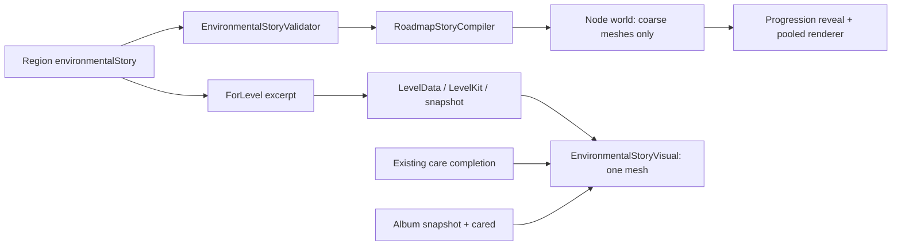

# Environmental Storytelling: контракт Quiet Camp

Система розповідає про світ через місця й речі. Roadmap показує форму та контекст; gameplay показує конкретні деталі. Жодне поле цього framework не створює пояснювального popup, лозунгу, винагороди або зміни правил головоломки. `intendedInference` — можливий висновок для дизайнерського review, не твердження, яке гра нав’язує гравцеві.

## Дані й відповідальність



`EnvironmentalStoryData` вбудовується в `RoadmapRegionData.environmentalStory`. `LevelData.environmentalStory` містить відповідний excerpt, а `LevelSummary` передає його в пам’яті для offline bake, але не серіалізує details у runtime summary catalog. `RoadmapStoryCompiler.ForLevel` відбирає тільки потрібні beats та їхні references. Об’єкти authoring вважаються immutable; для окремих snapshots використовується штатний serialize/deserialize pipeline.

| Поле beat | Значення й контракт |
|---|---|
| id | Stable ID, унікальний у story catalog |
| storyBeat | Назва/сутність спостережуваного кроку історії |
| heroLandmark | ID одного з props цього beat, не довільне ім’я моделі |
| returningProp | Символічна identity повторюваної речі; щонайменше один prop beat використовує її |
| characterFocus | Дизайнерський focus на гості/групі; не створює NPC |
| worldStateBefore | Що гравець бачить до турботи про маленьке місце |
| worldStateAfter | Локальна зміна після турботи; не автоматична відбудова великих об’єктів |
| historicalReference | ID запису reference; відсутній у повністю fictional beat |
| referenceConfidence | fictional / fiction-inspired / verified; unverified блокує validation |
| roadmapVisibility | hidden / silhouette / context |
| levelDetailVisibility | hidden / context / detail |
| levelIds | Явні bindings, максимум 32; не залежить від scroll |
| intendedInference | Який висновок можуть підтримати деталі |
| alternativeInference | Де висновок лишається неоднозначним |
| culturalContext | Чому місце й побутові деталі мають український культурний характер |
| props | Окремі representation та transforms для двох ракурсів |

`EnvironmentalStoryProp`: stable id, category, motif, returningProp, optional claimId, contentTags, appearance, roadmap/level views. Власна visibility може лише звужувати visibility beat. `inherit` бере значення beat. Hidden view має бути null. Зменшена saturation не замінює окрему coarse geometry для предметів з доказовими деталями.

View: assetId, x/z, elevation, height, yaw, sway. Це локальні одиниці від центру поля/node. `height` — висота нормалізованої baked-моделі, не uniform scale вихідного prefab. Roadmap elevation наразі 0; геометрія рівня допускає 0–12, але цей framework не додає багаторівневих walking rules. Обидва assetId повинні існувати у shared baked model library. Для нового detailed asset спочатку потрібен його offline export, а не Instantiate під час scroll.

## Категорії й український код

| category | motif vocabulary |
|---|---|
| nature | field, shelterbelt, steppe, river, sea, reeds, orchard, chernozem, hills |
| civilian | bus-stop, power-lines, road, greenhouse, fence, outbuilding, railway, pier, grain-storage, dam, rural-infrastructure |
| recovery | repaired-bridge, abandoned-structure, damaged-infrastructure, civilian-debris, memorial-trace, volunteer-repair, temporary-crossing |

`recovery` охоплює post-war та post-disaster контекст. Категорія сама не стверджує причину руйнування. Культурний код формується композицією: лісосмуга біля поля, сад із господарським парканом, звичайна зупинка, причал, сліди ремонту. Силует → людський масштаб → повторюваний предмет → маленька зміна дають зв’язність. Прапор, орнамент або текст не повинні підміняти функцію місця й побут.

Для кожного region дизайнер описує основне природне середовище, один hero landmark, 1–3 підтримувальні цивільні motifs, одну повторювану річ та локальний recovery beat. Не потрібно вводити всі категорії в кожен рівень. Зберігати ясну галявину, двері й маршрути; дрібні clues залишати на периферії без примусу розглядати їх.

## Історичні посилання та evidence

`fictional`: немає historicalReference, матеріальні clues не представляються доказами реальної події.

`fiction-inspired`: є reference з basis=fiction-inspired, джерелами та reviewer/date. Це вказує дизайнеру на реальну основу й межу вигадки. Не використовувати claimId або technical-marking як доказ конкретного злочину.

`verified`: reference має basis=documented, перевірені дизайнером sources та explicit claims. Кожний матеріальний prop з claimId/technical-marking пов’язується з конкретним claim цього reference. Claim містить statement і sourceIds. Source містить title, publisher, HTTPS URL, accessedOn та primary/authoritative classification; reference — reviewer і reviewedOn. Дати — yyyy-MM-dd.

Validator перевіряє наявність і зв’язність бібліографії. Він не завантажує сайти, не встановлює істинність claim і не визначає авторитетність видавця автоматично. `verified` — відповідальність reviewer, а не факт, доведений прапорцем. Зміна історичної geometry/маркування потребує повторного review джерела й самої моделі; source metadata без цього недостатньо. Framework не генерує написів на предметах.

Для реального контексту review має відрізняти: документований факт; інтерпретацію джерела; fiction-inspired композицію. Перевіряти точний тип об’єкта, географію, часовий період і технічні позначення. Не переносити деталь між подіями за схожістю. Невідоме лишати невідомим; не домальовувати «доказ» для бажаного висновку.

Allowed contentTags: technical-marking, civil-warning, memorial, fiction-inspired, repair, weathering. Gore, bodies, shock value, political-slogan та інші невідомі tags блокуються. Це декларативна перевірка: renderer не аналізує текстури/mesh на прихований gore чи лозунг. Перед включенням потрібен людський visual/content review моделей, текстів і всієї композиції. Активні міни/зброя не є collectible або puzzle toys.

Legacy `storyMotifs`, `storyProps` та `RoadmapHistoryData` збережені для сумісності існуючих catalogs. Вони не прирівнюються до нового evidence record. Нові історичні regions слід описувати через environmentalStory; legacy verified boolean сам по собі не є достатньою перевіркою історичного prop. У цьому етапі старі історичні fixtures не мігрували й не переатестовували.

## Completion, progress і збереження

`appearance`: always / before-care / after-care. На roadmap care appearance відображає completed стан відповідного level. У gameplay/альбомі використовується штатний care момент та saved `entry.cared`. Ніяких нових counters, unlocks або rewards. Навмисний вибір: повторний gameplay може знову показувати before-care, тоді як альбом зберігає cared композицію.

Усі пройдені й поточні node visibility лишаються під контролем ProgressionService. Story metadata не може відкрити future node. При зміні completed стану активна story scene перебудовується; native mesh лишається до готовності нового, якщо node залишається Revealed. Hidden/unknown nodes не зберігають detailed mesh. У projected presentation використовується штатна yielded mesh preparation.

Optional metadata не серіалізується, якщо null: старі LevelData snapshots не отримують нового null-поля й не змінюють canonical hash через сам факт додавання framework. LevelKit adapter передає excerpt в обидва боки; нові snapshots містять metadata. Наявні level IDs, puzzles, saves, album та косметику не змінювали.

## Authoring workflow

1. Описати beat і можливий висновок до створення meshes. Визначити, що гравець НЕ може виснувати достовірно.
2. Заповнити levelIds, видимість, coarse landmark та detail props. Для сюжетної деталі не використовувати один detailed asset на roadmap тільки з темнішим tint.
3. Для реальної основи зібрати джерела й claims; для вигаданого місця явно залишити fictional. Перевірити geometry, signage й маркування окремо.
4. Вбудувати catalog у region.environmentalStory. Вставити `ForLevel` excerpt у нові authored LevelData до freeze/hash/archive. Для вже опублікованих рівнів потрібна штатна content revision, а не виправлення snapshot заднім числом.
5. BakeAuthored виводить coarse props у node.world. LevelKit export зберігає level excerpt; summary field передає його до bake; runtime summaries не містять детальний catalog. Якщо є і region catalog, і summary excerpt, roadmap бере region catalog як authoring authority; їх узгодженість треба перевірити перед freeze.
6. Згенерувати designer brief та пройти validation, geometric QA, reveal/album tests і людський content review. Лише після цього переносити staged data до кампанії.

```bash
dotnet build tools/roadmap-pipeline/RoadmapPipeline.csproj -m:1 -p:UseSharedCompilation=false
dotnet run --no-build --project tools/roadmap-pipeline/RoadmapPipeline.csproj
dotnet run --no-build --project tools/roadmap-pipeline/RoadmapPipeline.csproj -- --story-brief QuietCamp/Assets/QuietCamp/Tests/Fixtures/Roadmap/environmental-story.json Design/Roadmap/ENVIRONMENTAL-STORY-EXAMPLE.md
```

Повністю fictional [example JSON](../../QuietCamp/Assets/QuietCamp/Tests/Fixtures/Roadmap/environmental-story.json) описує wayside shelter → timber repair → tended garden, з повторюваною patched-timber identity. [Generated brief](ENVIRONMENTAL-STORY-EXAMPLE.md) показує дизайнеру всі visibility/asset/state/claim bindings. [Region fixture](../../QuietCamp/Assets/QuietCamp/Tests/Fixtures/Roadmap/environmental-story-map.json) використовує foundation-slice. `--story-fixture` створює тільки isolated baked test map/summaries; не вмикає сюжет у main campaign.

## Технічний бюджет і перевірки

Максимум 12 beats, 24 props на catalog, 12 props на рівень, 8 references з максимум 8 sources і 16 claims кожен. Coarse props входять у штатний 80-prop node budget. Число живих roadmap chunks не збільшується.

Gameplay detail compositor використовує один Mesh/GameObject/material на level, shared baked source models, без collider, окремих lights/particles/Update. Sway props отримують per-prop root/height у UV1 для спільного wind shader; інфраструктура має rigid sentinel та не деформується. Budget — 60 000 vertices. Bounds перевіряються проти поля, маршрутів, shoreline і вже включених formal story props; небезпечна authored позиція відхиляється з diagnostic, не переноситься автоматично. Перетини з процедурними деревами/декором і фактична видимість з камерою потребують visual QA; це не доводиться лише координатами catalog.

Criteria для нового region:

- Дизайнерський brief однозначно розділяє те, що видно на roadmap і в level, і перелічує possible/alternative inference.
- Validator не має errors; усі references/claims/asset IDs існують; unverified evidence не потрапляє у staged release.
- Fresh/near-future view не показує detail-only prop; progress/replay/restart не розкривають future content.
- Care замінює локальні props, а не дублює їх; witness/rules та walking topology незмінні.
- Snapshot/LevelKit round-trip зберігають metadata; старий snapshot без неї сумісний.
- Hero/context читаються на portrait і tablet; деталі не загороджують намети, двері й виходи.
- Людський review не знаходить gore, лозунгів, фальшивого evidence або disrespectful framing. Не приписується провина лише через вигаданий напис.
- Без додаткових live cameras/particle systems/per-prop materials; device performance перевіряється окремо після дозволеної збірки.

Результати цього етапу: [QA](../../TestResults/environmental-story-2026-10-07/REPORT_UA.md).

Окремий досліджений [MH17-inspired region design](MH17-REGION-UA.md) застосовує цей framework: fiction-inspired композиція, документовані technical claims, level-only clues і один coarse landmark. Це unpublished draft із planned assets, не готовий ігровий region. Для його контрактів використовується `--mh17-design`; actual asset validation залишається блокером до виготовлення й review моделей.

[Чорноморський region design](BLACK-SEA-REGION-UA.md) застосовує framework до цивільної зернової логістики, недоступної небезпечної берегової зони й одного суховантажу. Warning/detail props залишаються в gameplay, а roadmap показує контекст. `--coast-design` перевіряє staged дані й окремий offline reference двох палуб; production layered rules, early landmark presentation, assets і всі вісім puzzles ще потребують реалізації.

[Kakhovka-inspired region design](KAKHOVKA-REGION-UA.md) розділяє drained upstream берег, downstream сліди повені й hydro context. Молоді дерева, порожні переноски, миски та локальний прихисток розповідають про адаптацію без gore або фальшивої evidence. `--water-memory-design` перевіряє unpublished authoring і offline crossing graph; дев’ять playable puzzles, landscape/landmark renderer і production layered rules не реалізовані цим дизайн-контрактом.
