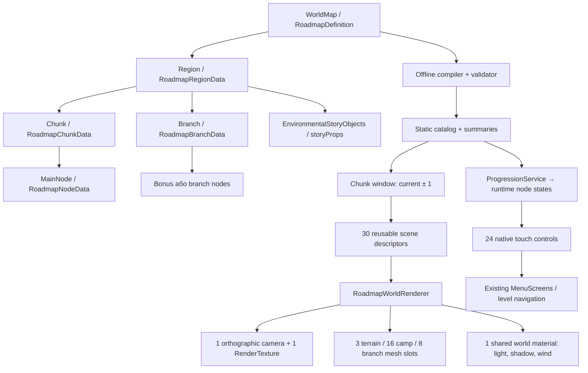

# Фундамент діорами подорожі — оновлення 2026-10-08

Цей етап додає справжній 3D renderer та універсальний vertical slice на сім **наявних** рівнів. Нових головоломок, історичних регіонів або платних продуктів немає. Основний runtime-каталог тепер використовує `world3d`: перші сім рівнів отримали authored композицію vertical slice, а всі 30 існуючих головоломок та їхні ID залишилися в кампанії. Legacy projected renderer збережений для сумісних окремих каталогів. Мобільна GPU-продуктивність цього перемикання потребує окремої перевірки. Новий renderer є звичайним runtime-кодом, а не макетом або Editor-only малюнком.

## Архітектура



Регіон і chunk — різні поняття. Регіон може містити багато chunks; `RoadmapCatalog.Chunks` індексує їхні межі та membership рівнів. У кожному chunk максимум десять рівнів. `RoadmapWindow` тримає максимум три leases незалежно від довжини регіону або кампанії. Великий каталог — це масиви легких даних, а не сотні активних об’єктів.

## Формат

- WorldMap: `schemaVersion`, `revision`, `journeyId`, `presentation`, `revealDistance`, `regions`.
- Region: `id`, `firstLevel`, `lastLevel`, `height`, `biome`, `season`, `lighting`, `weatherBias`, `vegetationProfile`, `terrainProfile`, `landmark`, `environmentalMotifs`, `transition`, `chunks`, `nodePositions`, `branches`, `storyProps`, `revealRules`.
- Chunk: `id`, `firstOrder`, `lastOrder`. Межі обчислюються між сусідніми nodes; chunks мають без пропусків і перекриттів покривати діапазон регіону.
- Node: `id`, `levelId`, `order`, `x`, `y`, `previewId`, `storyHint`, `associatedProps`, `branchLinks`, `requires`, `world`.
- Branch: `id`, `type`, `anchorNodeId`, один target (`journeyId`, `bonusId` або `targetRegionId`), `visualIdentity`, `visibilityRule`, `accessRule`, `teaserDepth`, `nodes`, `requires`, `published`.
- Story prop: `assetId`, `motif`, `x`, `y`, `height`, `yaw`, `interpretation`.

`x` головного вузла — частка ширини, `y` — відстань усередині регіону в логічних UI units. У `world.props` координати є локальними world units. Для story props історично поле `y` означає локальну координату Z; це явно враховується adapter.

Стан вузла **не зберігається в authoring**. `RoadmapNodeState` обчислюється через `ProgressionService`: Completed, Current, Next, Locked, Unknown. Scroll не може сам змінити цей стан. Старі ID та save schemas не змінюються.

`presentation: "projected"` залишає legacy. `presentation: "world3d"` вмикає новий renderer. `RoadmapCompiler.BuildWorld` автоматично розбиває вихідні summaries на chunks до шести рівнів. Це pipeline для 300+, а не ручна генерація 300 головоломок.

## Rendering та interaction

Новий renderer використовує baked geometry тих самих моделей, що й гра, їхні face colors і seasonal adaptation. Меші згруповані за chunk/галявиною, не за окремою травинкою. Модель не створює prefabs, colliders або незалежні materials для кожного предмета.

Є один viewport RenderTexture та одна orthographic camera. Світ рендериться на зарезервованому layer 28; underlying menu camera тимчасово виключає цей layer, після виходу її mask відновлюється. Власне directional light підставляється тільки на час рендерингу цієї камери, зі збереженням попереднього `RenderSettings.sun`. Повторний mount передає право на відображення новому owner і вимикає попередню камеру.

Один opaque shader має forward lighting та shadow pass з однаковим shader wind. Корені не рухаються. Поверхня землі отримує тіні; дерева у terrain batch також їх відкидають. Вершинні кольори переведені у linear space, щоб URP не робив картину надто блідою. Легкий периферійний haze обчислюється без додаткових прозорих layers.

Geometry preparation відбувається порціями в coroutine; готовий mesh кешується. Scroll callback змінює anchor/window і не генерує geometry. Стабільна галявина не перебудовується щокадру. Resize скасовує незавершену побудову і перебудовує тільки обмежені slots. RenderTexture замінюється лише при зміні розміру/quality.

Камера і touch targets мають спільну проєкцію. Малий номер є другорядною позначкою біля сцени, але touch rect залишається 96×96 логічних units. Header нового slice містить тільки Back, назву й Story Trails. Branch landmarks та стежки відображаються у світі, назва — компактним cream badge.

## Vertical slice

Authoring: `QuietCamp/Assets/QuietCamp/Authoring/Roadmap/foundation-slice.json`.

При двох завершених рівнях показано completed 1–2, current 3, next 4, locked 5; 6–7 залишаються unknown. Є один bonus teaser та один story branch teaser. Великий дерев’яний shelter — універсальний fictional landmark. Він створений для цього slice процедурною власною геометрією; реальних історичних подій не зображає.

Бонус і journey використовують вже наявні staging targets. Їх публікація, оплати й entitlement не вмикаються цим етапом. Карта не показує ціни.

## Як перевірити

Із кореня репозиторію, послідовно:

```sh
dotnet build tools/roadmap-pipeline/RoadmapPipeline.csproj -m:1 -p:UseSharedCompilation=false
dotnet run --no-build --project tools/roadmap-pipeline/RoadmapPipeline.csproj -- --export
python3 tools/verify_monetization.py --include-editor
```

У Unity Test Runner → PlayMode запустити `QuietCamp.Tests.RoadmapFoundationPlayModeTests`. Тест `MainUsesAuthoredOpeningAndOneBounded3DWorld` використовує справжні Boot → Main Menu → Roadmap, звичайний `RoadmapRepository.Main` без preview override та RAM-only save; збереження гравця не чіпає. Окремий seven-level каталог залишається fixture для ізольованих сценаріїв.

Знімки перевіряють не лише PNG resolution, а й фактичні `Screen.width/height`. У власному ізольованому Editor-прогоні helper закриває Device Simulator, щоб його screen shim не підміняв Game View; layout резервується й відновлюється після завершення прогону.

Перший тест збирає знімки portrait/tablet, перевіряє projection, states, повторні входи, мови, text scale, memory trim і camera teardown. Другий проходить synthetic `benchmark-world360`, далекі jumps та 40-секундний traversal. Це Editor workload, не мобільний FPS-тест.

Повний набір даних з 360 рівнів створюється командою `--export` із наявних summaries. `benchmark-world360.json` — статична stress fixture; її ID не потрапляють у кампанію або save.

## Межі цього етапу

Progress reveal, region blending та compact branch presentation використовують спільні системи, описані в сусідніх документах. Наявність access vocabulary не означає підключення рекламного, billing або subscription SDK. Optional content лишається неопублікованим. Сім opening levels є існуючими gameplay puzzles; повна художня переробка наступних 23 рівнів, вода та мобільне GPU-профілювання не сертифіковані цим етапом.

300+ підтверджується validation, chunk planner та native bounded-pool workload. Для обіцянки стабільних 60 FPS потрібні окремо дозволена player-збірка й вимірювання на конкретних телефонах.

## Rollout і кеш — 2026-10-08

Основний authoring `main.json` має revision `world-foundation-2`, п’ять регіонів та вісім chunks. Перший регіон: 1–3 / 4–5; другий: 6–7 / 8–13 / 14–15; решта містять по п’ять рівнів. Stable node IDs, region IDs, порядок, prerequisites та puzzle content hashes збережені. Нових головоломок чи entitlement grants немає. Малий bonus preview першого регіону — неопублікована заготовка з наявним bonus target; не раннє відкриття бонусного рівня.

При заміні chunk window старий однопрохідний allocator міг віддати слот новому першому запиту до того, як зустрічав кешовану сцену пізніше в тому самому кадрі. Це викликало зайві `Mesh.Clear`/preparation. `RoadmapSlotPlan` спочатку резервує **всі** cache hits, потім розміщує misses. Власні масиви виділяються один раз. Native control pool також резервує всі видимі identity перед recycling. Current node має forest-green підкладку, cream номер та золотистий кант, а не збільшений level number.

Для targeted export main presentation:

```sh
dotnet run --no-build --project tools/roadmap-pipeline/RoadmapPipeline.csproj -- --export-main
```

Ця команда проходить portable contracts і змінює тільки `roadmap_regions.json`; не експортує historical fixtures, не змінює пазли чи збереження. Перевірки слотів охоплюють leading miss, reverse traversal, дублікати, перевищення бюджету та 10 000 zero-allocation window changes.

Editor QA поточного rollout: [звіт](../../TestResults/roadmap-foundation-2026-10-08/REPORT_UA.md). Старий QA 2026-10-07 залишається історичним результатом попередньої версії.
