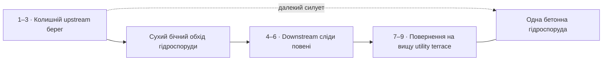

# «Береги, що пам’ятають воду» — Kakhovka-inspired region

Дата дослідження: 2026-10-07. Статус: researched design, unpublished authoring і offline crossing reference. [Region](Regions/water-memory/region-draft.json), [story metadata](Regions/water-memory/story.json), [asset/presentation contracts](Regions/water-memory/assets.json), [crossing topology](Regions/water-memory/crossing-topology-draft.json), [QA](../../TestResults/kakhovka-region-design-2026-10-07/REPORT_UA.md).

Дев’ять галявин ведуть від колишнього берега великої водної системи через затоплений у минулому двір і тимчасову переправу до сухої тераси біля зруйнованої гідроспоруди. На початку берег виглядає незрозуміло: причальний човен стоїть далеко від вузької нинішньої річки. Згодом з’являються сліди евакуації, допомоги тваринам і місцевого догляду. Фінал залишає маленький прихисток для наступних людей. Масштабна втрата не зникає за проходженням головоломки.

## Джерела й межі реконструкції

| Предмет перевірки | Первинна основа | Висновок для дизайну |
|---|---|---|
| Географія, flooding / reservoir loss | [NASA Earth Observatory, 27.07.2023](https://science.nasa.gov/earth/earth-observatory/canals-in-ukraine-are-drying-up-151622/) описує повінь нижче греблі та втрату подачі води до каналів після осушення водосховища. | Колишній широкий upstream берег і downstream сліди високої води — різні місця. Не намалювати всю долину однаково затопленою або повністю без річки. |
| Екологічна шкода | [UNEP, Rapid Environmental Assessment, жовтень 2023, executive summary і §3.5.2](https://ukraine.un.org/sites/default/files/2023-10/Kakhovka_Dam_Breach_Ukraine_Assessment.pdf) описує зміни водних/прибережних оселищ, перенесення наносів і debris, втрати видів та забруднення. Оцінка була попередньою, доступ до територій обмежений. | Оголені береги, пошкоджені дерева, розірвана водна система; без вигаданих точних підрахунків загиблих тварин і без твердження, що вода стала безпечною. |
| Громади й переміщення людей | [UNHCR, 16.06.2023](https://www.unhcr.org/ua/en/news/responding-kakhovka-dam-emergency) повідомляє про евакуацію, підтримку переміщених громад, доставлення водних ємностей, ламп і укриттів. Текст перевірено через індекс джерела; прямий fetch повертав 429. [Аналітична записка ООН, 09.06.2023](https://ukraine.un.org/en/235545-potential-long-term-impact-destruction-kakhovka-dam) підтверджує довготривалий суспільний вплив. | Відсутність людей у дворі, сухі припаси, перенесені речі й маленьке укриття показують порушене життя. Не приписувати предмети конкретним реальним мешканцям. |
| Порятунок тварин | [МВС, підсумок реагування 31.12.2023](https://mvs.gov.ua/news/2023-plani-diyi-rezultati-podolannia-naslidkiv-pidrivu-vorogom-kaxovskoyi-ges-video) підтверджує евакуацію людей і тварин. | Відкрита порожня переноска, миски, весло й мотузка — авторська мова порятунку. Не копія конкретної операції, не доказ загибелі тварини, не cage collectible. |
| Інфраструктура | [UNDP, 20.06.2023](https://www.undp.org/ukraine/press-releases/undp-energy-damage-assessment-ukraine-reveals-continued-vulnerabilities) описує наслідки для нижчерозташованих систем електропостачання, тепла, води й санітарії. [PDNA, 17.10.2023](https://ukraine.un.org/en/248860-post-disaster-needs-assessment-report-kakhovka-dam-disaster) підтверджує спільну державну/ООН оцінку; перевірено publication landing, не весь PDF. | Видно порушені цивільні utility structures; не виводити секторні числові збитки з непрочитаних розділів. |
| Повернення рослинності | [Tutova та ін., Studia Biologica 19(3), 2025](https://publications.lnu.edu.ua/journals/index.php/biology/article/view/7356): польові ділянки квітня 2025 року біля Хортиці, молоді willow/poplar communities на оголеному ложі. Автори зазначають, що вони не компенсують втрату колишнього водного біорізноманіття. | Молоді верби у вологих пониженнях, тополі на сухіших підвищеннях. Не миттєвий зрілий ліс і не «природа все виправила». Це локальний польовий результат, не опис кожної точки всього водосховища. |

Назва, географія, двір, човен, переноска, структура бетонних секцій і дії гостей вигадані. Матеріальні деталі не є реконструкцією доказів причини руйнування або конкретної людської/тваринної втрати. Не створювати написи з іменами жертв, фальшиві memorial dates, серійні номери чи «історичні» сліди вибухів. Джерела пояснюють основу дизайнеру; гравець не отримує документальний popup.

Не імпортувати фотографії/карти з джерел як ігрові текстури. Моделі — власна low-poly композиція. Source review не означає готовий artwork review, геотехнічну оцінку вигаданого місця чи підтвердження безпеки відвідування реальної території.

## Один світ, три просторові етапи

Пора — пізня весна, закріплена за рівнями, після кількох періодів росту від вигаданої катастрофи. Точний календар не відтворюється. Усі три етапи існують одночасно: перехід між ними означає подорож, а не перемотування катастрофи або різку зміну року.

**A · Former Shore, рівні 1–3.** Upstream. Звивиста вузька річка лежить далеко в колишній широкій водній чаші. Старий берег читається за mooring support, темною нижньою смугою, залишком причалу й човном на сухому місці. Частина поверхні світла, з висохлими наносами; ближче до русла — волога сіро-коричнева земля, очерет і молоді верби. Старі рослини пошкоджені нерівномірно, не суцільні мертві силуети. За легким туманом — велика перервана бетонна лінія.

**B · Flood Trace, рівні 4–6.** Downstream. Дорога огинає гідроспоруду сухим бічним підвищенням, спускається до колишньої зони повені й повертає уздовж берега. Вода вже відступила. Смуги на стінах, нахилені паркани, зміщені господарські речі, відкриті переноски й сліди rescue equipment відрізняють цей етап від осушеного upstream ложа. Пошкоджений старий перехід поруч із придатною маленькою тимчасовою переправою.

**C · Dam Area, рівні 7–9.** Маршрут повертає на стабільну підвищену utility terrace біля бічної частини гідроспоруди. Видно великі бетонні секції, порушені gate bays, старі сервісні будівлі, перервану лінію переходу і нинішню течію внизу. Camp стоїть на сухій площадці поруч, не на нависаючому уламку й не під непідпертою плитою. Рослини повертаються в ґрунтові кишені; ruin outline лишається читабельним.

Географія стиснута для діорами, не копіює берег 1:1. Layout має показати обхід і повернення дороги через рельєф; сусідство viewport nodes саме по собі не доводить гідрологію. Не класти downstream flood mark біля upstream висохлого причалу без видимого просторового розділення. Landmark, русло, край колишнього ложа й route використовують спільну world anchor/composition.

## Roadmap composition і reveal

Світ займає екран; cream header містить Back/title/Story Trails. Немає додаткових catastrophe panels, casualty counters, політичних або благодійних purchase popups. Назви рівнів — навігація, не пояснення події.

На roadmap видно колишній широкий basin, нинішню вужчу течію, один stranded boat context, групи пошкоджених/молодих дерев, стару дорогу, малий цивільний двір і далеку гідроспоруду. Не видно переноски, миски, особистих речей, фактурних водних позначок, engineering evidence або підпису «Каховка».

`landmarkId=water-memory:hydro-structure`, earliest teaser — order 2, local owner — order 8. Один simplified compound має перервану бетонну горизонталь і gate rhythm; proxy не показує технічних деталей. Уточнення на рівнях 7–8 підтверджує, що це той самий об’єкт. Власник не дублює структуру біля всіх майбутніх nodes.

У поточному `RoadmapWorldRenderer` far landmark належить першому chunk наступного region. Він ще не підтримує описаний ранній proxy усередині цього region. Тому draft має `farLandmarkAssetId=null`; asset manifest зберігає presentation contract, а не удає готовий teaser.

ProgressionService визначає completed/current/near-future/unknown. Перші 1–2 майбутні main nodes читаються як ділянки подорожі; решта прихована river mist, lower contrast, foreground trees і basin relief. Далекий hydro proxy — атмосферний контекст, без clickable destination, previews або unlock деталей. Scroll не розкриває решту шляху. Після completion туман відступає й невелика нова частина дороги проявляється; reduced motion використовує коротке спокійне розчинення.

Зберігати node IDs, progression/reveal та один landmark identity. Replay старої галявини не переводить світ назад у момент руйнування. My Camps показує локальний care snapshot і ті самі season/weather/shoreline, без нової греблі чи повного водосховища.

## Дев’ять рівнів і механіки

| ID / назва | Сцена й висновок без тексту | Puzzle brief / care |
|---|---|---|
| `QC_WATER001` · Старий берег | Широке сухе ложе, нинішня річка далеко, колишні mooring traces. | 6×5, 2 гості, простий dry route; camp на стабільній верхній смузі, не на сирому ложі. |
| `QC_WATER002` · Човен на суші | Порожній цивільний човен далеко від води, вологі смуги нижче, hydro silhouette. | 6×6, 3 гості, shared route і boundary access. Човен поза footprint, не moving puzzle toy. |
| `QC_WATER003` · Молоді верби | Молоді групи біля нинішнього русла, окремі пошкоджені дерева, стара дорога з обхідною стежкою. | 7×5, 3 гості, shade від стійкого живого дерева й спільні двері; коротка трава на полі. |
| `QC_WATER004` · Риска на стіні | Downstream courtyard: піднятий слід води, паркани, пошкоджений сарай. | 6×6, 3 гості, два сухі access points; wall debris займає заявлені cells, ніхто не виходить у rubble. |
| `QC_WATER005` · Тихий двір | Відкрита переноска, миски, м’яка підстилка, rescue rope/paddle; не показано, що сталося з конкретною твариною. | 7×6, 3 гості, тиша й shade; narrative bowls/carrier не noise sources і не objectives. |
| `QC_WATER006` · Тимчасова переправа | Старий зламаний проліт і два невеликі готові тимчасові переходи над narrow channel. | Two 4×6 banks + higher 4×6 terrace, sparse cells, 3 гості, 3 access points, 2 альтернативні bridge connectors + ridge ramp. Висота й розрив дійсно змінюють graph. |
| `QC_WATER007` · Вище течії | Суха вища площадка, короткий підйом, нинішня течія нижче; масштаб повертається. | Layered v3 brief, 3 гості; маршрут між terraces, обмежений прохід і shade на обраній поверхні. Без довільного переходу по X/Z. |
| `QC_WATER008` · Бетонний обрій | Велика пошкоджена hydro structure, utility bays, порушена стара дорога, зелень у ґрунтових кишенях. | Layered v3 brief, 3 гості, два придатні сухі access points, repaired local passage; camps далеко від unsupported concrete. |
| `QC_WATER009` · Для тих, хто прийде | Маленький сухий прихисток, молоді дерева, сліди допомоги; hydro silhouette не «полагоджено». | 6×6, 3 гості, зрозуміла спільна дорога. Після completion — lamp, transport water/food, small shelter і tidy markers. |

Це briefs, а не створені LevelData або незалежно розв’язані puzzles. Рівні 6–8 не можна сплющувати до v2 й оголошувати висоту тільки декором. Flat v1/v2 продовжують працювати зі своїми snapshots.

### Перевірний crossing reference

[Topology draft](Regions/water-memory/crossing-topology-draft.json) має три поверхні зі stable IDs: `west` і `east` на висоті 0,8 та `ridge` на 2,3. `worldOriginXZ` розділяє сухі площадки; world X=4 — river gap, не placement surface. Два reserved landings з кожного боку прив’язані до `north-bridge` і `south-bridge`. Ridge доступна лише через explicit `ridge-ramp`. Немає walkable water cells або переходу «за найближчим mesh».

Declared arrangement містить три намети з дійсними дверима, shape із `RuleEvaluator.Footprint/Door`, per-surface shade і трьома доступними виходами. Вимкнення одних bridge connectors залишає альтернативний шлях; обох — від’єднує east/ridge. Вимкнення ramp від’єднує ridge незалежно від її близькості на екрані. Tent footprint не займає міст, landing, void чи великий solid.

Offline reference перевіряє reachability, а не будівельну міцність, hydraulic simulation, shortest weighted routes, friends/noise rules або повний solver. Connector costs зарезервовані для майбутньої domain моделі; поточний BFS доводить тільки існування шляху.

Production потребує тієї самої `SurfaceCell(surfaceId,x,z)`/explicit portal основи, що описана для [чорноморських палуб](BLACK-SEA-REGION-UA.md). Один versioned graph використовують evaluator, generator, solver, hints, preview, access-point checks і saves. `LayeredBoardRenderer` будує actual dry surfaces/bridges/pick meshes із цієї topology, а не з narrative prop позицій. Тіні, door markers і exit paths мають ту саму поверхню.

## Detail props і локальне відновлення

Дрібні предмети — fiction-inspired, не «історичні докази». Пошкоджена чашка/відро, тканина й сліди води показують порушену буденність без імен або нав’язаного пояснення. Returning motif — молоді дерева: рання невелика група, потім життя навколо доглянутого прихистку. Не вирощувати дерева за одну секунду completion.

Відкрита переноска порожня, суха, з підстилкою; ні carcass, ні animation загибелі, ні крику. Миски відрізняються від нагород/кнопок, не іскрять і не збираються. Поруч може бути відновлене маленьке укриття. Для додавання живої тварини потрібні окремі pooled assets і людський tone review; поточний draft її не створює.

`EnvironmentalStoryVisual` тримає narrative props поза protected board apron. Велика structure — peripheral context; playable platforms, bridge slabs, stairs, solids і shade не вставляються в generic story mesh. Для них потрібен окремий terrain/board composer, узгоджений із graph. Dam/detail chunk завантажується тільки біля відповідного рівня.

До гри logical temporary passage вже існує й читається як придатний. Після completion герої закріплюють/доглядають його маленькі видимі елементи, додають помітний маршрут, залишають transported clean water/food і light, облаштовують shelter. Це не будівельна інженерна мінігра. Occupancy/access/shade masks залишаються тими самими; новий навіс за полем не змінює puzzle shade заднім числом.

Broken dam, dangerous rubble, river course і колишній basin лишаються. Жодного заповнення водосховища, запуску турбіни, повернення поселення або катастрофічного потоку після check. Вода з річки не набирається для пиття: clean supplies приходять у закритій ємності. Completion не позначає забруднений ґрунт, raw water або реальну місцевість безпечними.

## Світло, вода, рослинність, звук і камера

Палітра: кремове sky fill, теплий сіро-піщаний висохлий нанос, коричнева волога земля, оливково-зелені молоді крони, спокійна сіро-блакитна річка, світлий weathered concrete. Damage читається формою й порушеною функцією, не суцільною чорною обводкою.

Один м’який sun і невисока water reflection. Вологість збільшує низьку імлу в западинах; playable surface, двері та landings читаються на Low. Haze приховує далекі подробиці, не затьмарює все поле. Local mist адаптується до сезону й висоти. При сонці rays рідкі й проходять крізь верби; біля великих бетонних секцій світло стабільне, без dramatic catastrophe spotlight.

Один shared mobile water surface для local river, дешевший far-water silhouette. Використовувати наявні `CampWaterVisuals`/Stylized Water 3, без додаткової reflection camera. Foam тільки біля підтриманих banks/bridge piles, не біля кожного уламка. Current/water level візуально рухаються, але не змінюють playable masks під час puzzle. Дощ не запускає нову повінь. Немає hydraulic debris simulation.

Рослинність групами: молоді верби в низинах, тополі на сухіших мікропідвищеннях, очерет біля води, низька трава й стримані квіти на стабільних верхніх terraces. Відкриті проходи не обмотані вінком дерев. Корені й бетон rigid; листя/стебла використовують shared shader wind. Струм повітря на terrace сильніший, за двором і бетонною структурою слабший; без per-tree MonoBehaviour/матеріалів.

Audio sequence: A — рідкий очерет/далекі птахи/вітер над відкритим ложем; B — тихі звуки двору, тканина, канат, не distress voices; C — вода внизу й приглушений вітер за бетоном. Максимум 4 додаткові local voices, один listener і shared pools. Не звучать «працюючі турбіни» біля неробочої structure, сирени, записи реальних рятувальних операцій або переможний fanfare після догляду.

Камера дивиться з придатного берега. Човен/переноска не запускають attraction zoom. Big structure лишається на периферії під час puzzle; camera framing не робить її веселим playground. Placement target над пальцем; camera pose фіксована під час drag. Terrace selection явно підсвічує surface/landing, без зміни висоти за випадковим drop. Inspection/cutaway не змінюють graph. Reduced motion прибирає travel і близькі leaf/bird flights.

## Pipeline, бюджет і сумісність

| Частина | Planned acceptance budget, не measured result |
|---|---|
| Roadmap | 3 chunks × 3 nodes; у довгій кампанії максимум 3 resident chunks, решта static metadata/proxy. Один hydro owner. |
| Models | Hydro proxy ≤160 triangles; coarse ≤1600; detail ≤6500. Narrative ≤9000 triangles/стан, board geometry ≤3000 окремо. Actual bounds/LOD ще перевірити. |
| Objects/materials | ≤12 story props/level, ≤24/catalog. Shared story atlas, ≤2 додаткових story materials; без `.material` clones на props. |
| Камери/світло | 0 додаткових story/reflection cameras, 1 основне shadow light; lantern переважно emissive. |
| Particles/audio | ≤64 додаткові локальні particles, ≤4 story voices; без PS/Update на кожному рівні або carrier. |
| Loading | Cached meshes/static previews, bounded async preparation поза scroll hot path. Ніякого generator/solver при прокручуванні. |
| Graph | Authored adjacency/cache до початку puzzle. Physics не використовується в solver; river/solids і access masks ті самі на всіх quality tiers. |

Реальний широкий basin вимагає region terrain/water composition; `biome: river-wetland` сам по собі не створить колишнє водосховище. Так само props coordinate не гарантує readable shoreline або реальний bridge clearance. Planned scenery не слід подавати як уже згенеровану сцену.

Дані живуть поза runtime Resources і journey manifest. Labels uk/en/de — draft navigation copy, не повний localization review. Нові IDs не замінюють main levels або старі journey IDs. Old v1/v2 snapshots/contentHash залишаються чинними; production v3 snapshot має містити surface IDs, connectors, solids і власні masks. Album зберігає local care, не перебудовує всю історію з поточного main progress.

Rollout:

1. Зіставити finished concept із джерелами й провести geography/tone review; зберегти різницю upstream/downstream.
2. Виготовити coarse/proxy/detail hydro, boat, banks, modular bridge/courtyard/care models. Один landmark identity, без фальшивої documentary evidence.
3. Реалізувати region basin/river placement і persistent within-region teaser; перевірити scroll/reveal без duplicate structure.
4. Реалізувати спільну layered domain основу, renderer/picking/shade/bridges, save/LevelKit/history/hints, legacy regressions.
5. Авторити всі дев’ять puzzles, actual witnesses та незалежні solver results, previews; publication тільки після full validation.
6. Пройти render/touch/human QA, album/replay/restart. Device profiling — тільки після окремо дозволеної мобільної збірки.

## Definition of Done і приймання

| Перевірка | Умова проходження |
|---|---|
| Research | Авторитетні sources/date/scope доступні; fiction props не видані за реальну evidence. Попередні оцінки не перетворені на точні завершені висновки. |
| Geography | Глядач розрізняє drained upstream і downstream flood trace; river flow/old basin/road bypass читаються як одна система, не random swamp. |
| Reveal | Fresh view не показує весь двір, rescue clues й dam details; короткий silhouette викликає цікавість. Progress/restart/replay зберігають дозволену дальність. |
| Layered puzzle | Без connector не пройти water/height gap. Bridge/ramp landings, exits, doors, solids, shade і drop користуються одним graph; alternate route реально існує. |
| Care | Постійний dam damage і masks; лише малий dry shelter/route/supplies/light. Нуль river drinking, whole-dam restoration або unsafe rubble objectives. |
| Content | 9 valid LevelData, 9 actual witnesses, 9 independent solver successes; timeout блокує freeze. V3 round-trip і старі saves пройшли. |
| Visual set | Former shore, boat/old water band, pioneer trees, flood courtyard, carrier/bowls, crossing/ridge, distant/local hydro, care, album return; portrait/tablet/landscape, uk/en/de, 130% text, Low/High/reduced motion. |
| Human reading | 4/5 нових гравців без автора розуміють втрату великої водної системи та місцевий порятунок/адаптацію. Для українських учасників записати spontaneous historical analogue, не підказувати «Каховка». Ніхто не читає предмети як gore, animal loot або доказ конкретної смерті. |
| Performance | 300+ route dataset, 20+ nodes scroll, repeat entry/return, low-memory; bounded chunks/materials/particles. Device p95 CPU/GPU target ≤14 ms із вимірюванням p99/spikes/memory/thermal; 60 FPS не заявляються з offline checks. |

Поточний етап створює дизайн і виконувані contracts. Assets, production layered rules, playable content, renders і людське/мобільне приймання ще не виконані. Відомі блокери записані у QA; регіон не активований у грі.
