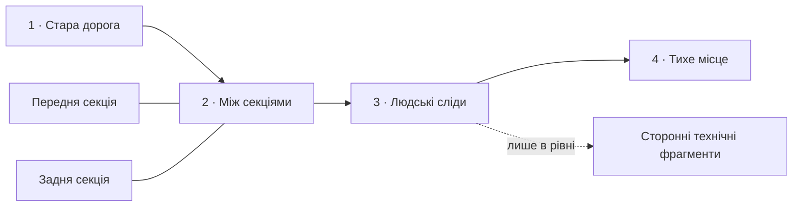

# «Поле тихої пам’яті» — MH17-inspired region

Дата дослідження: 2026-10-07. Статус: завершений дизайн і staged authoring contract; не ігровий реліз. [Дані](Regions/quiet-field/region-draft.json), [story catalog](Regions/quiet-field/story.json), [контракт моделей](Regions/quiet-field/assets.json), [перевірки](../../TestResults/mh17-region-design-2026-10-07/REPORT_UA.md).

Це чотири спокійні camp puzzles у вигаданій місцевості після трагедії цивільного літака. Гравці облаштовують прихисток поруч із місцем пам’яті, не досліджують злочин і не використовують уламки як майданчик. Roadmap передає масштаб і контекст; рівень — людські речі й кілька документованих технічних підказок. Розміщення наметів не вимагає розпізнавати історичний аналог.

## Перевірена основа і межа вигадки

| Питання | Перевірений факт | Наслідок для дизайну |
|---|---|---|
| Подія і причина | DSB описує катастрофу MH17 17 липня 2014 року та висновок про боєголовку 9N314M ракети 9M38-series, запущеної з Buk. [DSB, підсумок розслідування](https://onderzoeksraad.nl/en/onderzoek/crash-mh17-17-july-2014/) | Технічний reference — Buk/9M38-series; S-300 не використовується. Не показувати запуск, вибух або загибель людей. |
| Судове підтвердження | Суд у Гаазі 17 листопада 2022 року визнав доведеним ураження MH17 ракетою Buk, запущеною з поля біля Первомайського. [Офіційний підсумок суду](https://www.courtmh17.com/en/summaries-and-news/news/summary-of-the-day-in-court-17-november-2022-judgment.htm) | Не подавати встановлений тип зброї як неперевірену теорію. Водночас вигадана композиція сцени не є доказом конкретної події. |
| Форми сторонніх деталей | DSB публікує сопло, частину стабілізатора та кабель; їхню форму зіставлено з 9M38-series. [DSB, §2.12.2.8 / figure 36](https://onderzoeksraad.nl/en/found-buk-missile-parts-in-final-report-dutch-safety-board/) | Для level-only деталей допустимі частина стабілізатора та реконструйований фрагмент корпусу двигуна. Не робити універсальний уламок «будь-якої ракети». |
| Маркування | JIT пов’язує позначення двигуна «9д 131» із 9M38/9M38M1. У публікації 24 травня 2018 року прямо залишалася невизначеність щодо належності показаних корпусу й сопла саме запущеній ракеті. [JIT, update 2018](https://www.prosecutionservice.nl/latest/news/2018/05/24/update-in-criminal-investigation-mh17-disaster) | Один невеликий напис типу двигуна; без придуманого серійного номера, гасла чи висновку про оператора лише з напису. Датовану обмовку не видавати за оцінку всіх судових доказів 2022 року. |
| Збереження уламків | DSB описує зібрану в Gilze-Rijen реконструкцію передньої частини літака. [DSB, Reconstruction](https://onderzoeksraad.nl/en/onderzoek/crash-mh17-17-july-2014/) | Зарослі секції в грі — художній часовий і географічний монтаж. Це не твердження, що справжні уламки досі лежать так на місці катастрофи. |

Це підсумок наведених первинних джерел для артдизайну, не нове розслідування. Точні масштаби, взаємне розташування секцій, рослинність, речі вигаданих пасажирів, кемпінг, меморіальна композиція та дії героїв — fiction-inspired. Не відтворювати імена, документи, портрети, багажні адреси чи особисті речі справжніх загиблих. Порожні сидіння і валіза означають цивільне життя, а не реконструкцію біографії.

### Technical art reference

Оглянуто [офіційне фото корпусу двигуна JIT](https://www.prosecutionservice.nl/site/binaries/content/gallery/site-content/content-afbeeldingen/omhulsel-van-de-raketmotor-casing.jpg): темний вигнутий корпус і трафаретне маркування. Для художнього фрагмента дозволений лише префікс **9Д131**, із формою кириличної Д за фото. Регістр тут описує гліф на фото; у тексті JIT тип записаний «9д 131». Решта реального номера не копіюється й не дописується. Край фрагмента обриває область напису: не створювати фальшивий «новий» номер.

Позначення наноситься тільки на відповідний вигнутий корпус двигуна, не на обшивку літака, сидіння чи довільний метал. Другий сторонній фрагмент — неповна пластина стабілізатора без напису, за figure 36 DSB. Їх не називають справжніми експонатами справи. Їхня видима форма — підказка для подальшого пошуку, не достатня судово-технічна ідентифікація. Жодних прапорів, лозунгів, назви держави, монтажу «ракета пробиває літак», реконструкції слідів у тілах або навмисно вигаданих схем пробоїн.

Правило `referenceConfidence=verified` застосоване лише до документованого типу/маркування в technical beat. Воно не означає, що авторська модель або її координати є історичним доказом. Перед випуском потрібне окреме зіставлення готової geometry/atlas із джерелами; зараз моделей ще немає. Фотографії джерел не включаються до гри.

## Географія і roadmap composition

Один відкритий ландшафт: чорнозем, стара польова дорога, нерегулярні лісосмуги, довга трава. Поле спокійно огортає уламки, але вони зберігають вагу, масштаб і впізнаваність цивільного літака. Не робити симетричний декоративний вінок із дерев або ідеально відрізаний корпус.

Hero landmark — **одна** композиція рознесених передньої та задньої секцій. Передня частина має ряд пасажирських вікон, зламані кільцеві шпангоути й залишок носової форми. Задня — ряд вікон і характерний вертикальний хвіст. Це широкий цивільний пасажирський літак, не військовий борт. Фарбування зношене біле/сіре, без логотипу конкретної авіакомпанії; торці нерегулярні, без кривавих деталей.

Один coarse compound mesh містить обидві секції та належить вузлу 2. Решта вузлів не дублюють літак. Номер рівня — маленька навігаційна ознака біля сцени. Дорога обминає уламки; вузли лежать на придатних для життя просвітах, не на фюзеляжі.

Ранній teaser — той самий landmark як дальній низькоконтрастний силует. Під час наближення proxy і локальна coarse модель повинні передавати володіння одним landmark ID, без одночасних двох літаків. Це integration requirement: наявний story compiler перевіряє розділення coarse/detail, але не реалізує сам таку передачу distant proxy. Якщо готового handoff немає, дальній proxy не включати: reveal локального landmark достатній для першої версії.

Roadmap містить тільки літак, поле, дорогу, траву й дерева. Ні корпусу двигуна, ні стабілізатора, ні сидінь, ні багажу, ні читабельних написів, ні explanatory popup. Навіть zoom/landscape/збережена позиція скролу не можуть відкрити detail-only props. Авторські `storyHint` — внутрішні design notes, не текст поверх світу.

Region має 4 власні стабільні ID, 2 chunks по 2 nodes. `firstLevel/lastLevel=1..4` — локальний порядок окремого journey; точка приєднання до main campaign ще не призначена. Near future = 2, branch teaser = 1; completed/current визначає ProgressionService, не scroll. Верхня межа активної roadmap — штатні current chunk і сусіди, максимум 3; кількість рівнів кампанії не впливає на бюджет.

## Gameplay composition і предмети

Центр — читабельна земля під намети. Великі секції лежать по різні боки, з проходом між ними й достатнім відступом від дошки. Намети не ставляться всередині корпусу, на крилі, у сидіннях або на валізах. Уламки не можна підбирати, рухати, продавати чи використовувати для отримання нагороди.

Орієнтири staged transforms у координатах землі: передня секція `(-14,-7)`, задня `(14,-6)`, сидіння/обшивка/багаж біля `x=-9..-10`, технічні фрагменти біля `x=9..10`, місце пам’яті `(-9,7)`. Це початкова композиція, **не** підтверджені mesh bounds. Для поля максимум 7×6 залишити захищений apron 2,5 клітинки; footprint моделей, шляхи, великі предмети й процедурні дерева перевіряти після появи assets. Просте потрапляння координати за межі поля не доводить відсутність перетину.

| Роль | Предмет | Презентація |
|---|---|---|
| Hero | Передня й задня секції | Coarse compound на roadmap; окремі detail meshes у рівні. Торці й матеріали спокійні, без ефекту атракціону. |
| Civilian evidence | 1–2 закриті валізи; частина ряду сидінь; фрагмент внутрішньої обшивки | На периферії другого/третього рівня. Зношення, різні матеріали й отвори кріплень; без readable personal data. |
| Technical clue | Вигнутий корпус двигуна з частковим `9Д131`; частина стабілізатора | Тільки третій рівень. Дрібні, без блиску, outline, collectible sparkle, tooltip чи примусового zoom. |
| Memory | Скромний камінь/підставка без напису, квіти | Четвертий рівень, поза footprint і маршрутом. Не стилізувати під підтверджений реальний меморіал. |
| Care | Невеликий букет, ліхтар, чистий клаптик землі поруч | Після справжнього completion. Уламки, валізи й технічні деталі не змінюються. |

Періферійні props не резервують клітинки правилами, якщо вони за полем. Якщо під час authoring великий об’єкт переноситься на дошку, його footprint має потрапити в `LevelData.objects/blocked` до solver/witness перевірки. Візуальний торець секції не створює невидимого проходу або додаткової тіні правила `shade`.

## Story sequence і puzzles

| Галявина | Що бачимо / висновок | Camp puzzle | Що лишається після completion |
|---|---|---|---|
| `QC_MEM001` · Стара дорога | Наближення до цивільного літака серед трави; природа живе після втрати. | 6×5, 2 гості, лише прохід; один очевидний вихід на стару дорогу. Дати безпечне входження в тему. | Звичайний облаштований прихисток; без реакції уламків. |
| `QC_MEM002` · Між секціями | Великі частини одного літака й звичайні речі людей. | 7×6, 3 гості, спільний маршрут, одна shade потреба. Логічну тінь дає дерево, не неперевірена renderer-тінь уламків. | Намети м’яко закриваються, camp лишається придатним для інших подорожніх. |
| `QC_MEM003` · Людські сліди | Непоказні сторонні технічні частини поруч із цивільними; уважний гравець може впізнати reference. | 6×6, 3 гості, 2 явні connected access points, спільні дверні клітинки й обмеження місця природною групою каміння. Її footprint має бути в blocked даних. Clues не є механікою розв’язання. | Відкритий безпечний шлях; технічні предмети нерухомі. |
| `QC_MEM004` · Тихе місце | Невелика турбота поруч із тим, чого не можна виправити. | 7×5, 3 гості, дружба та вільний прохід до дороги; простіше за попередній рівень. | Квіти, ліхтар і доглянута земля. Літак не ремонтується і не зникає. |

Це briefs майбутніх puzzles, не solver-certified LevelData. Жоден із цих ID зараз не замінює основну кампанію. До freeze створити реальні blocked/exteriorWalkable/shade/noise дані, witness і незалежні solver результати для кожної галявини. Тихе місце пам’яті не є виходом, дверима або обов’язковою клітинкою для перевірки.

Повторювана деталь — доглянута маленька ділянка землі, а не вигадана річ реального пасажира. `worldStateBefore/After` відділяє зміни героїв від незмінних залишків трагедії. Completion не вмикає конфеті, феєрверк, танцюючий aircraft prop або рекламний заклик поверх меморіалу. Ігрове підтвердження успіху лишається коротким і теплим, без святкового акценту на уламках.

## Світло, погода і ambience

Закріплена рання осінь: зелень ще присутня, солом’яна трава й поодинокі жовті крони. Це художній час після події, не погода 17 липня 2014 року. Сусідній region переходить через early-autumn profile; нічого не перемикається hard switch на межі chunk.

Сонце низьке, збоку від галявини; стартовий art target — 25–35° над горизонтом і теплий нейтральний відтінок близько 4800–5200 K, без суцільного помаранчевого фільтра. Ambient fill робить внутрішній торець видимим, але не освітлює його як вітрину. Один main light; ліхтар після care — emissive із слабкою локальною підсвіткою лише за дозволеного бюджету, без власної shadow map. Light direction і маска `shade` сталі протягом puzzle.

Легкий туман за лісосмугою зменшує контраст дальнього металу. Не приховувати ним двері й клітинки. Sun shafts рідкі, біля просвітів дерев, без «божественного променя», який указує на clue. Вітер гойдає траву нерівномірно; велика важка обшивка нерухома. Невеликий дощ може робити тканину й метал мокрими, не запускати драматичну грозу. Вогонь не ставити поруч із уламками/місцем пам’яті.

Звук: м’який польовий вітер, шелест сухих стебел, далекі птахи; близька тканина, земля під ногами, стриманий звук постановки намету. Без криків, записів катастрофи, сирен, пролітного пасажирського літака, удару ракети або нав’язливого скрипу металу. Музика рідка й не диктує емоцію; тишу можна чути. Один biome bed плюс pooled one-shots, максимум 4 story voices, дистанційне послаблення без нових AudioListeners. Знижені рухи й вимкнена камера не змінюють зміст сцени.

## Камера, reveal і navigation

- Штатна ізометрична камера; під час drag зафіксована, contour/drop походять від однієї цілі над пальцем.
- Перший ракурс дає зрозуміти масштаб літака, але зберігає головною галявину. Торець не перекриває намети на portrait, landscape і tablet.
- Не можна пролетіти камерою крізь літак, спуститися в корпус або примусово наблизитися до напису. Для уважного гравця потрібен необов’язковий огляд периферії: натискання на землю біля невеликого предмета плавно наближає ту саму камеру до безпечної ground target. Це не evidence quest: без highlight, автопідказки чи історичного tooltip. Під час placement цей gesture недоступний. Back повертає попереднє кадрування; puzzle, pointer capture й history не змінюються. Орієнтир читабельності префікса — висота гліфа від 14 dp на 720×1600, без штучного збільшення самого уламка. Огляд потребує окремої реалізації та touch QA; зараз його немає.
- Revealed/current показують coarse scene; near future — атмосферний контекст/силует. Detail metadata не завантажується заради скролу. Невідомі вузли обмежені progression/reveal; proxy не розкриває предмети.
- Main Menu → Roadmap → Level → Roadmap використовує ті самі cream/forest-green навігацію і сезонну палітру. Немає нового history popup.
- My Camps показує snapshot саме цього рівня і care стан, один активний світ. Перемикання приховує зміну м’якою вуаллю; яркість не зростає на широкому екрані.

## Performance і шлях до реалізації

Бюджети нижче — acceptance targets, не виміряні результати. Важливість силуету літака однакова на Low/High; зменшувати дрібну далеку деталізацію, прозорі шари й частинки, не погіршувати читабельність або освітлення.

| Система | Початковий ліміт |
|---|---|
| Roadmap | Не більш ніж 3 active chunks; один compound aircraft landmark на весь region. Coarse mesh до 1100 triangles, distant proxy до 160, без cockpit/cabin detail. |
| Gameplay story geometry | До 13 000 triangles після об’єднання, 60 000 vertices hard framework limit; до 12 story props на рівень. Секції 6000 + 3000 triangles; решта — малі групи. |
| Матеріали | Один story atlas/material на level, спільні foliage/ground матеріали. Немає `renderer.material` на кожній валізі/уламку. Atlas 1024², platform compression; важливий частковий напис одержує достатню texel density. |
| Камери | Нуль додаткових story cameras/RenderTextures. Штатний roadmap renderer і gameplay camera. |
| Ефекти | Не створювати story ParticleSystem на кожний node; один локальний pool, до 64 додаткових leaf/dust particles; до 2 видимих haze layers на Low. |
| Audio | До 4 story voices, shared clips/один listener. Clue props не мають постійного звукового emitter. |
| Підготовка | Atlas/mesh cache і static catalog; geometry bake поза scroll frame, lazy activation і bounded queue. Деталі підвантажуються лише під час входу в рівень. |

Великі секції rigid; shader wind деформує тільки рослинність/тканину. Main/shadow pass використовують однакову деформацію. Bounds охоплюють усю compound geometry, а не тільки node marker; distant object не відсікається, якщо його тінь видима. Це особливо важливо для великого хвоста на краю екрана.

Наявний `EnvironmentalStoryVisual` об’єднує story props в один mesh, але потребує готових baked models і безпечних фактичних bounds. Наявний generic framework **не** доводить continuity великого landmark, реалізовані puzzles, якість конкретного маркування або FPS. Не видавати JSON shape validation за перевірку рендера.

Послідовність реалізації:

1. Затвердити mesh/atlas за [asset contract](Regions/quiet-field/assets.json), technical source review і respectful visual review. Жодних downloaded evidence photos у runtime assets.
2. Виготовити coarse compound та окремі detail секції з узгодженими origins; перевірити один landmark, scale/footprint, culling на портреті й планшеті.
3. Створити 4 puzzles за briefs; validator, witness, незалежний solver. Усі проходи відповідають видимій дорозі й не закінчуються у великому об’єкті.
4. Зробити `ForLevel` excerpts із story catalog; пройти LevelKit/snapshot round-trip, додати реальні previews/localization і staged journey manifest, реалізувати необов’язковий ground inspection тією самою камерою. Архівувати змінюваний вміст перед freeze.
5. Перевірити reveal/proxy handoff без detail leakage, scroll/return/replay/album care і shader/wind/rain variants. Лише після цього дозволити release authoring.
6. Після окремого дозволу на player build — 20-хвилинний device run, frame time/GC/memory/thermal measurement. 60 FPS не підтверджувати Editor-рендерами.

## Критерії приймання

| Перевірка | Умова проходження |
|---|---|
| Фактологічний review | Тип, форма і префікс звірені з офіційними sources; немає S-300, унікального вигаданого номера, лозунгу, атрибуції оператора за одним написом. Художній монтаж явно відділений від фактів у authoring notes. |
| Roadmap disclosure | Bake усіх чотирьох nodes містить рівно один aircraft compound; немає baggage, cabin, missile parts, text або detailed models. Fresh/restart/replay не обходять reveal. |
| Care | Перед/після незмінні секції, сторонні деталі, puzzles і маршрути; з’являються тільки локальні flowers/light/soil. Album зберігає care, replay не дублює props. |
| Geometry | Жоден великий mesh чи реквізит не перекриває protected apron, вихід, tent doorway, інший mesh або water. Перевірка фактичних bounds, не тільки origin. |
| Puzzle | 4 validator passes, 4 коректні witnesses, 4 independent solver successes; timeout блокує freeze. |
| Human reading | З 5 людей без контексту щонайменше 4 впізнають трагедію цивільного літака; ніхто не вважає wreckage атракціоном. З 3 уважних reviewers щонайменше 2 можуть знайти історичний аналог через clue, без popup. |
| Respectful tone | Окремий human review знаходить нуль gore, shock effects, personalization реальних загиблих або «переможного ремонту». Якщо tone тест не пройдено, переглянути композицію до release. |
| Visual QA | Portrait 720×1600/1080×1920, landscape, tablet, Low/Balanced/High, reduced motion; знімки approach/map, field/detail, before/after care, My Camps return. |
| Optional inspection | Напис читається без підміни типографіки; після огляду відновлюються camera pose і puzzle state. Не запускається під час drag, не перехоплює другий pointer, не створює команд або додаткової камери. |
| Performance | 20+ nodes scroll у великому dataset, repeated entry і return: active chunks ≤3, без synchronous story geometry на scroll, після прогріву відсутні story allocations у steady-state scroll. Device p95 CPU/GPU орієнтир ≤14 ms; виміряти spikes/p99/memory й thermal, не обіцяти універсальний FPS. |

Досягнуте на цьому етапі: factual research, повний дизайнерський brief, staged дані й перевірка authoring/розділення roadmap/detail. Art review, рендери, реальні puzzles, людське сприйняття та device performance ще не підтверджені.
