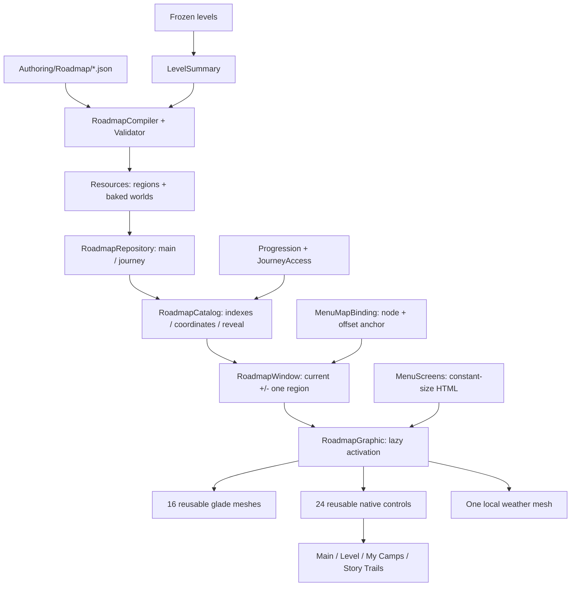

# Roadmap: регіональна система й pipeline

Стан роботи: інтегровано streaming замість повної активної мапи. Приймання потребує нативних Editor результатів і окремого мобільного профілювання. Число 360 у fixtures — синтетичне навантаження, не нова кампанія.

## Власники даних та ресурсів



Каталог тримає статичні DTO всіх вузлів. Повноцінні `Scene` існують лише в трьох сусідніх регіонах, до 10 рівнів у кожному. Зовнішні HTML-елементи не ростуть із кількістю рівнів. Заміна вікна лише змінює leases; дані одного вузла активуються на кадр у coroutine. Scroll callback не викликає solver, generator, JSON, Resources.Load або Instantiate.

Основний і story-маршрут мають окремі каталоги; `ForJourney` завантажує маршрут при першому вході. Загальний solver і правила рівнів не змінювалися. Статична модельна бібліотека, шейдер вітру й матеріал canopy спільні. Додатково пул із 30 керованих Scene та 92 Prop на Scene повторно використовує декор і буфери shadow hull; активація починається з найближчого до viewport вузла. Кнопки зберігають поточний ID під час повторного використання. Preview блокує map input і зберігає вже створений map root.

## Авторський формат

Джерела: `QuietCamp/Assets/QuietCamp/Authoring/Roadmap/main.json`, `lighthouse.json`. `Resources/.../roadmap_regions.json` і `Roadmaps/<journey>.json` — похідний результат; не редагувати його вручну. `node.world` у джерелі може бути `null`: exporter відновлює геометрію із summary, зберігаючи авторський layout та metadata.

| Поле регіону | Значення / контракт |
|---|---|
| `id` | Стабільний унікальний ключ регіону |
| `firstLevel`, `lastLevel` | Порядок у конкретному маршруті, до 10 рівнів у регіоні |
| `biome`, `season` | Біом та пора року; season збігається зі frozen level |
| `transition` | from/to, довжина, `blend` для сусідніх сезонів або явний `chapter` |
| `landmark`, `previewId`, `titleKey` | Модель, preview та локалізована назва |
| `height` | Висота регіону в одиницях UI |
| `nodePositions` | id, levelId, order, x `[.15,.85]`, локальний y, radius, requires |
| `branches` | anchorNodeId; bonusId, journeyId або targetRegionId; requires; published; teaserState |
| `teaserState` | hidden / silhouette / visible; teaser не відкриває доступ до рівня |
| `storyProps` | До 12 статичних моделей: assetId, motif, x/y на землі, height, fictional interpretation |
| `historical` | contextId, inspired/fictional, verified, primary sources, перевірені claims, cultureKey |
| `performanceTier` | low / balanced / high; верхня межа ефектів регіону, додатково обмежена ручною/автоматичною якістю гри |

Для 300+ рівнів заморозити відповідні puzzles, експортувати summaries, розділити на регіони, додати ID до campaign/journey catalog і зробити authoring. Не додавати GameObject кожному ID. Довгі story-гілки — самостійні маршрути, не сотні одночасно активних діорам у main.

`requires` вузлів посилаються на попередні рівні; branch unlock не може залежати від майбутнього рівня відносно anchor. Доступ до гри остаточно перевіряє `GameServices.CanStart`; published у presentation не обходить entitlement. Lighthouse залишається unpublished staging.

## Reveal й переходи

Frontier зберігає сумісність із наявними завершеннями з пропусками. До frontier сцени відкриті, наступні два вузли — дешеві silhouettes, далі — приховані; їхні повні scenes не активуються. Культурні деталі також не видно до відкриття регіону.

Позиція зберігається як node ID + offset окремо для кожного маршруту. Відновлення чекає виміряної висоти viewport/content. Зміна розміру viewport відновлює anchor; повернення з gameplay встановлює відповідний journey. Main Menu → Level Path відкриває main. My Camps зберігає власні snapshots і одну активну діораму.

## Перевірки та бюджети

Validator перевіряє ID, діапазони/порядок, перекриття та bounds, finite координати, branch anchors/targets/prerequisites, teaser, сезонні переходи, preview, локалізацію, моделі, historical attribution й бюджети. Callback-перевірки посилань обов’язкові в release pipeline. `ValidateReveal` перевіряє поточний рівень і витік майбутнього контенту.

Бюджети: максимум 3 leases / 30 scenes, 16 glade graphics, 24 native controls, 1 weather graphic, 80 props/вузол, 12 story props/регіон, 4 branches/регіон. Canvas mesh кожної галявини залишається нижче 60k vertices; нуль truncated models — умова приймання. Число матеріалів не повинно рости з відвіданими регіонами. Low-memory callback на десять секунд відпускає невидимі scene leases й очищає невидимі renderer meshes. Сусідній регіон залишається, якщо його геометрія чи тіні можуть потрапляти у viewport.

Планувальник і renderer — різні вимірювання. .NET тест із нульовими allocations не доводить нуль GC у Canvas. Native benchmark записує frame time, main thread, GC, draw calls, Canvas.BuildBatch, memory delta й census активних GameObjects/CanvasRenderers/materials. `-1` означає недоступний counter. Global counters включають Editor та instrumentation; GPU/mobile FPS ними не підтверджується.

Команди без player build:

```bash
dotnet build tools/roadmap-pipeline/RoadmapPipeline.csproj -m:1 -p:UseSharedCompilation=false
dotnet run --no-build --project tools/roadmap-pipeline/RoadmapPipeline.csproj -- --export
python3 tools/verify_monetization.py --include-editor
```

Editor: `QuietCamp/QA/Open Roadmap 360 Benchmark` → Play. Типовий прогін 180 с; для тривалого навантаження встановити `durationSeconds=1200`. PlayMode tests: `RoadmapStreamingPlayModeTests`, `ProceduralRoadmapPlayModeTests`, `BonusRoadmapPlayModeTests`. SaveAdapter(memoryOnly) й окремий locale path захищають реальні збереження; не запускати старі destructive save tests у звичайному профілі.

## Історичний контекст

MH17 fixture використовує лише перевірений факт: катастрофа 17 липня 2014 року в Донецькій області України. Джерело: [Dutch Safety Board](https://onderzoeksraad.nl/en/onderzoek/crash-mh17-17-july-2014/). Сад пам’яті — вигаданий образ, не місце аварії, не речі конкретних загиблих і не реконструкція доказів.

Kakhovka fixture: руйнування дамби у червні 2023 року й екологічні наслідки, оцінені [UNEP](https://www.unep.org/resources/report/rapid-environmental-assessment-kakhovka-dam-breach-ukraine-2023). Заплава та залишок фундаменту — вигадані мотиви; не доказ реальної будівлі чи конкретної долі людини. Black Sea і workboat — вигаданий берег і човен без тверджень про реальну історичну подію.

Профілі лежать у Tests/Fixtures, не у campaign. Немає gore, політичного popup, жертв як декору чи вигаданих «доказів». Поле verified означає виконану редакційну перевірку, не автоматичний фактчек: validator може перевірити структуру посилань, але не істинність claim. Перед публікацією кожен новий реальний контекст потребує перевірки першоджерел.

Native сценарії й очікувані captures: [REGRESSION-SET-UA.md](REGRESSION-SET-UA.md). Поточні вимірювання та непройдені gates фіксуються окремо в QA-звіті; їх не можна замінювати planner timing.
