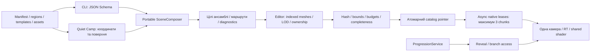

# Семантична композиція roadmap

## Межа впровадження

Система композиції додана всередині Quiet Camp. Нативні ресурси та їхня художня якість ще потребують першого Editor-прогону. Чинний каталог залишається legacy до успішного bake. Це не зміна головоломок, прогресу чи публікація UPM.

## Потік даних

Авторські документи — компактні наміри в `Authoring/Roadmap/Composition`. Довгі масиви вершин і transforms є результатом, а не інтерфейсом редагування. Метри й загальні asset IDs належать portable ядру. Координати scroll, прив'язка nodes, сезонний sampler і підтримка поверхні належать адаптеру гри.

## Географія та ансамблі

П'ять документів зберігають усі 30 stable node IDs. Спільний світ компонується до поділу на chunks. Усі галявини, landmarks і вже прийняті ділянки враховуються при пошуку місця, включно з сусідніми регіонами.

Садиба складається з хати, криниці, власної межі, воріт і садових дерев. Ролі мають metric footprints; oriented intersection перевіряє перекриття. Boundary asset вимагає owner навіть після перейменування ролі. Ворота лежать на межі та мають підхід до іменованої дороги. Planner перевіряє підтримку всього підходу ще до приймання ансамблю. Непридатне місце запускає наступного кандидата; вичерпання пошуку блокує bake без залишків паркану.

Масиви лісу, луки й поля задаються зв'язними прямокутними зонами. Сезонний sampler змінює палітру, голі дерева, сніг і видові ваги без зміни географії. Узлісся й дрібне наповнення готуються offline, з виключенням підходів, коридорів та галявин. Це перша версія зон; довільні полігони не реалізовані.

Дорога йде через опорні точки і з'єднується між регіонами через `nextRoute` з однаковим кінцевим/початковим endpoint. Високовольтна ЛЕП існує лише в обраних регіонах і має географічний маршрут із поворотом. Окремі проводи отримують справжні conductor sockets. Village distribution і transmission мають різні support kinds та не з'єднуються автоматично.

## Offline та runtime

Bake готує Low/High terrain, detail/completed/silhouette node meshes і branch variants. Ідентичні variants ділять один subasset. UV, vertex colors, restrained AO й wind masks зберігаються в native indexed meshes; основний і shadow passes рухаються однаково. Дані source models не парсяться новим native roadmap renderer під час scroll.

Кожний chunk отримує власний hash і immutable resource ID. Hash включає relevant recipes, фактичні placements, клімат, asset/model metadata і код baker/geometry/shader. Повторний bake перевикористовує незмінні ресурси. Catalog pointer змінюється лише після перевірки всього набору; зміна джерела чи опублікованого каталогу під час bake скасовує публікацію.

Runtime має 3 terrain slots, 16 node slots і 8 branch slots, одну камеру, одну RT та shared material. Chunk leases обмежені трьома. Завантаження асинхронне; призначення слотів рознесено по кадрах. Скасований запит звільняється після завершення, а reference-counted shared lease захищає негайний повторний вхід від unload старим callback. Повторні помилки одного вікна не створюють log/load storm.

Консервативні caps: 15 MiB на chunk, RT до 2 Mi pixels (~16 MiB), сумарна presentation estimate до 64 MiB з 1 MiB резерву metadata. Це не підтверджена фактична пам'ять Unity/драйвера. Також async load не доводить відсутність GPU upload spike. Обидва показники потребують native benchmark.

Після revision зміни scroll відновлюється за stable node ID; застарілий offset скидається. Pinch 1–1,8× змінює кадрування й зберігає центр жесту, не reveal чи географію. Gameplay/save IDs не мігруються.

## Робочий цикл

`inspect → patch із expected-hash → validate → compose --dry-run → Editor bake → native render → compare`.

Editor-вікно показує native meshes, вид зверху, IDs, footprints, entrances, зони, connections та ownership. PNG має sidecar із entity IDs і projected bounds. Метрики preview рахують усі показані mesh parts, а не лише terrain. Це не вимір draw calls або GPU.

[Quick start](../../tools/scene-composition/README.md) містить CLI й три приклади. [Діагностики](../../tools/scene-composition/DIAGNOSTICS.md) пояснюють точні причини відмови.

## Межі та наступна перевірка

Нове оточення ще не прийняте художньо: потрібні opening seven, усі сезонні ділянки, seams, reveal, branch teaser, tablet/portrait/Low/High/reduced motion. Static preview не замінює Game View чи human review.

Літак і корабель адаптовані в anonymous fictional staging із ліцензіями й provenance; вони не вводять історичних puzzles або unlocks. Розрізи літака та staging вода потребують окремої художньої перевірки. `ua.water-crossing` зараз визначає anchor, а не завершений міст. Стан abandoned/partly-reclaimed дає restrained tint; повний набір пошкоджених variants не реалізований.

360-node dataset використовує 60 logical regions та alias-ресурси основних 30 рівнів. Він перевіряє bounded navigation/residency; не є 360 різними художніми місцями. Portable planner timing не є FPS native renderer. Gallery/benchmark/навігаційні tests підготовлені, але ще не виконані на новому bake.

Immutable старі revision assets не видаляються автоматично. Перед окремо дозволеним player build потрібно карантинувати непотрібні revisions за межі Resources, щоб вони не збільшували розмір пакування. На цьому етапі player builds не запускаються.
