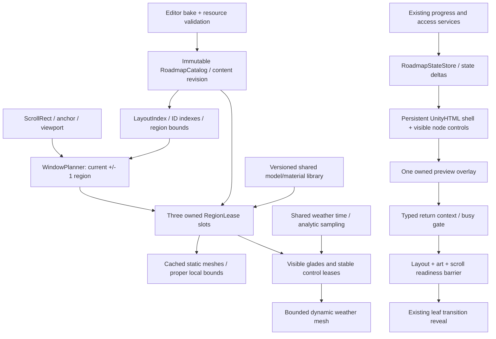

# Roadmap: запропонована архітектура для 300+ рівнів

Статус: **проєкт архітектури після дослідження коду; не реалізований redesign**. База і докази — [аудит](AUDIT-2026-10-07-UA.md). Склад кампейну, оформлення і gameplay rules на етапі переходу не змінювати.

## Контракти системи

1. У RAM може бути легкий immutable каталог усіх ID/summaries/layout metadata. Це не повноцінна активна геометрія світу.
2. Нативна геометрія, контролери й повні descriptors існують лише в **поточному регіоні та одному сусідньому з кожного боку**. Максимум три region leases, біля початку/кінця — менше.
3. Усередині цих регіонів малюються лише видимі glades із bounds-aware overscan. Native buttons також virtualized. При звичайному русі лише одна нова галявина замінює одну стару; збережені IDs не перепризначаються.
4. Звичайний scroll після warmup не завантажує JSON/Resources, не викликає solver/full level generation, не Instantiate/Destroy controls і не створює material на node.
5. Art, node button, bonus card, weather і preview використовують один layout snapshot / content revision. Помилка даних не може залишити напівініціалізовану активну мапу.
6. Прогрес та право запуску рівня залишаються authoritative у існуючих application services. Мапа не видає права, не купує контент і не пише save через render.

## 1. Дані та індекси

`RoadmapCatalog` містить stable `levelId`, journey ID, order, region ID, dimensions, seed, environment, access/shore/story descriptors, challenge flags і мінімальні джерела heat/noise для візуального паритету. `catalogRevision`, schema version і source content hash входять до fingerprint. Published bonus має реальний level summary; draft slot має окремий тип `BonusPlaceholder`, без удаваного playable level.

Індекси `ByLevelId`, `JourneyByLevelId`, `OrderByLevelId`, `RegionByNodeId` будуються один раз. Доступ до summaries й progression presentation — O(1) lookup; існуючі правила послідовного unlock зберігаються. Каталог validates duplicates, порядок, невідомі models, finite arrays, порожні meshes, dimensions і невідповідні hashes перед публікацією. Невдала нова revision не замінює останню валідну.

`RoadmapStateStore` підписується на completion/entitlement/catalog deltas. Один `AccessSnapshot` для node використовується UI, preview і navigator; Pro та bonus requirements не оцінюються різними шляхами. Router повторно перевіряє authoritative access перед запуском. Data state не залежить від того, чи зараз node має native GameObject.

Для всіх Journeys використовувати той самий каталог і window planner. Main і Story Trails не повинні мати паралельні несумісні unlock/return-context реалізації. Перенесення unpublished Journey content у мапу не входить до цього етапу.

## 2. Layout і scroll

`RoadmapLayoutIndex` готує prefix offsets для main/bonus rows, Y intervals регіонів, projected art bounds і hit rectangles. Перша migration зберігає сьогоднішні Step/BonusGap/NodeX без redesign. Генеративний layout надалі є окремою стратегією, але renderer не дублює його математику.

Binary search за visible range знаходить поточний регіон за O(log R). Пошук градацій terrain і відрізків стежки починається з видимого interval; обсяг не росте з N. Висота scroll content лишається загальною, порожні ділянки представлені metadata, а не тисячами невидимих children.

Початковий кандидат регіону — 10 основних рівнів із бонусним stop після них. Реальні межі враховують висоту viewport, tall canopies, shore, projected shadows і wind padding. Якщо найширший/найвищий viewport або майбутній zoom-out одночасно показує більше трьох таких регіонів, не додавати четвертий full region: змінити grouping або показувати coarse overview LOD без повних descriptors. Цей випадок треба перевірити до фіксації region size.

Scroll anchor: `{journeyId, nodeId, localOffset, catalogRevision}`. Після rotation/localization/revision layout відновлює anchor, а не старий normalized fraction. First open використовує current playable node. RAM-return і restart persistence — явно окремі політики; migration не починає непомітно писати нове save при кожному scroll callback.

Готовність є сигналом: viewport виміряний, anchor застосовано, видимі meshes committed, input targets відповідають snapshot. Жодного `_frames=3`. До готовності transition cover або loading shell лишається активним; malformed/missing viewport дає not-ready/fallback, а не whole-map culling.

## 3. Window planner та ownership

Planner обчислює desired set `{current-1,current,current+1}`. Region leases зберігають stable region ID. При русі вперед дві leases зберігаються, одна звільняється і одна готується. Jump спочатку invalidates попередній request token; старі async results не можуть замінити останній вибір.

Нова region preparation проходить `requested → preparing → ready → committed`. Descriptor arrays, meshes, controls і material handles стають видимими лише одним commit. Failure віддає retry/fallback без часткового `_painter`-ready marker. Повторний mount/disable/dispose має idempotent контракт.

Pure managed preparation можна розбити на малий main-thread budget або виконувати поза main thread. Unity APIs, Canvas/mesh upload, GameObjects — тільки main thread. Паралелізація не є вимогою і не виправдовує три одночасні повні 3D build jobs. Початковий budget preparation — до 2 мс/frame; це proposed budget, перевіряється trace.

Native ownership:

| Власник | Ресурси | Звільнення |
|---|---|---|
| Scene roadmap host | UI shell, ScrollRect, три region slots, clocks | Один Dispose при виході |
| Shared model library | Versioned model arrays/baked meshes, shared materials | Reference-counted handles або чіткий scene/session lifetime |
| RegionLease | Static geometry та descriptor subset регіону | На recycle/ревізії/cancel; offscreen region не тримає full geometry |
| Visible glade/control lease | Local mesh buffers, callback ID, highlight | Rebind тільки при зміні stable ID; listeners відписуються один раз |
| Preview lease | Один preview world/mesh та overlay | Закриття або останній selection token; roadmap shell не руйнується |

Немає власного material на prop. Stencil variants належать стандартному UI lifecycle, але custom resource handles не ховаються в ReactUnity text pool. Не залишати native components під orphan/pool roots після document replacement.

## 4. Rendering та погода

Для migration можна лишити 2.5D CPU backend; chunk-streaming не вимагає одразу повного 3D redesign. Renderer interface дозволяє пізніше інший backend без зміни каталогу/progress/scroll. `AlbumDiorama.BuildCamp` не підставляється під кожний node.

Static terrain/props/projected shadows кешуються за `{contentHash, projection, quality, season}`. Story meshes бажано bake у Editor разом із моделями; cached immutable bounds/hulls не відтворюються кожного repaint. Model arrays не зберігають непотрібні raw duplicates після valid decode.

SnowDepth для дерева — один sample на prop; grid — shared 17×17 samples. Corridor geometry підготовлена один раз, а не обчислюється через iterator walk на кожен triangle. Heat data має відповідати gameplay fire. Surroundings і основні props проходять однакові seasonal rules.

Meshes розбиваються за explicit vertex budget. Budget overflow робить deterministic LOD/split або diagnostic fallback, а не тихо відрізає останні об’єкти. Bounds містять ground, props, projected shadows, wind displacement та погодні margins; local RectTransform відповідає локальному art, не всій висоті кампейну. Painter-order/depth контракт перевіряється окремо для дерев/берегів/сусідніх регіонів.

Weather має єдиний clock. Неактивний рівень отримує стан аналітично за seed/time/profile при вході, без frame-by-frame Advance для всіх N. В активному вікні weather mesh оновлюється тільки для видимих effects із bounded cadence. Wind, lights/color modulation через shader uniforms не інвалідують static meshes щосекунди. Reduced motion/static idle — жодного структурного rebuild без зміни даних/viewport/quality.

Розділити static art, dynamic weather та controls так, щоб dirty dynamic vertices не примушували весь UI shell проходити великий layout. Окремий Canvas допустимий лише після вимірювання draw calls/stencil/overlap; не плодити canvases на кожний вузол.

## 5. UI, preview і навігація

UnityHTML shell зберігає однакові keys/parents між Levels і BonusPreview. Модальний overlay є sibling над ним; зміна preview не замінює root мапи. `UpdateRegions` використовується для конкретних видимих controls/status changes; shell/CSS/font references не перевидаються через весь каталог.

Одночасно існує один preview. Для draft bonus використовувати ізольований placeholder presenter; для published — summary реального level. Journey 3D-preview готується на вимогу, володіє camera/world state і скасовується при закритті. Немає прихованої preview камери на всі регіони.

Навігація передає typed `MapReturnContext` із journey/anchor/revision. Дія «до рівнів» встановлює цей контекст незалежно від того, чи гравець прийшов із Main Continue, альбому чи мапи. Completion змінює state, зберігає save через існуючий service, потім presenter застосовує delta.

Busy/input gate та error recovery `ScreenRouter` залишаються. Reveal transition чекає конкретну active roadmap readiness, а не тільки MenuSceneHost.IsReady. Menu background можна готувати тільки коли він справді потрібний; це окреме lifecycle покращення, не привід змінювати арт.

## Масштаб і межі доказу

| Вартість | Зараз | Ціль |
|---|---|---|
| Lightweight catalog | O(N) | O(N), прийнятно |
| Повні scene descriptors | O(N) | O(levels у максимум трьох регіонах) |
| Native buttons | O(N) | O(visible + bounded overscan) |
| Frame visibility/weather walk | O(N) | O(active/visible) |
| Background path rebuild | O(N) + lookups | O(visible interval) |
| Node lookup | Лінійний, повторюється | Indexed O(1) |
| Region selection | Full scan | O(log R) |
| Warm scroll allocations | Є lazy growth і transient props | Нуль roadmap-owned managed allocations у звичайному warm scroll |

Ізольована simulation підтвердила invariant максимум трьох leases для 30/300/1000 metadata та 10 000 випадкових jumps у кожному наборі. Вона **не** підтверджує Unity memory plateau, frame time, culling чи geometry readiness. Це закривається [перевірками міграції](MIGRATION-PLAN-UA.md).
