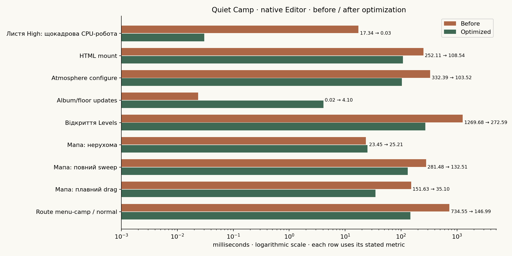
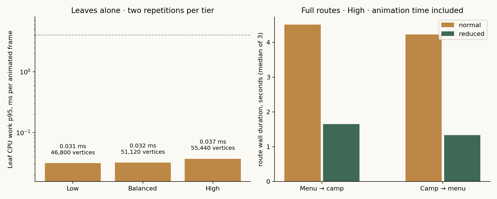
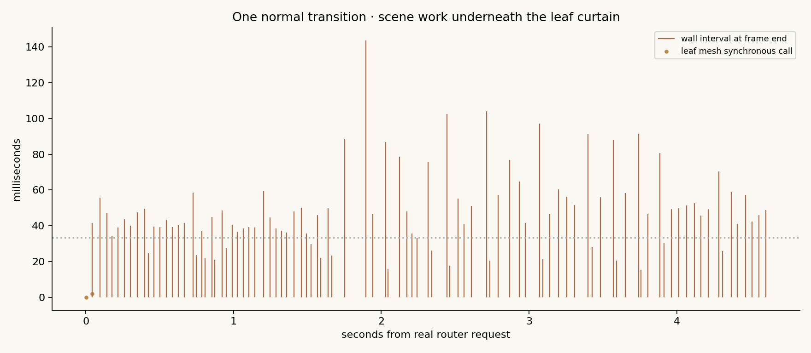

[← Головна](README.md) · [Довідник](docs/README.md) · [Карта коду](docs/project-map.md) · [Стан](docs/status.md) · [Інтерактивні виміри](https://kruty1918dev-ai.github.io/quiet-camp/performance.html)

# Карта продуктивності Quiet Camp · 09.10.2026

**Перший раунд оптимізації виконано й переміряно в тому самому Unity Editor.** Рух листя перенесено в GPU shader, створення світу розподілено між кадрами, мапа кешує проєктну геометрію й створює кнопки лише для видимого вікна зі стабільними IDs, HTML UI використовує згенеровані вузькі стилі та один dirty-document pass на кадр.

Фінальна native PlayMode матриця **Passed**: **7 386 кадрів, 55 198 scoped вимірів**; додатковий замір мапи **Passed** (669 кадрів). Регресії: **14 EditMode** ([receipt](docs/performance/2026-10-09/optimized/editor-contracts.json)) і **13 PlayMode** ([receipt](docs/performance/2026-10-09/optimized/runtime-regressions.json)). Passed означає завершені сценарії та assertions; **частина performance budgets усе ще не пройдена** — див. таблицю нижче. Початковий аудит до оптимізації збережено в [BASELINE-UA.md](docs/performance/2026-10-09/BASELINE-UA.md).



## Виміряні зміни · baseline → оптимізовано

Метрики з [comparison.json](docs/performance/2026-10-09/optimized/comparison.json); кожен рядок має власне визначення. Бюджет — редакційна мета на цьому стенді, не вимога пристрою.

| Дія | До, мс | Після, мс | Зміна | Бюджет | Стан |
| --- | --- | --- | --- | --- | --- |
| Листя High: щокадрова CPU-робота | 17.34 | 0.03 | **−99.8 %** | p95 ≤4 мс | Виконано |
| HTML mount | 252.11 | 108.54 | −56.9 % | p95 ≤100 мс | Трохи вище бюджету |
| Atmosphere configure | 332.39 | 103.52 | −68.9 % | p95 ≤100 мс | Трохи вище бюджету |
| Album/floor updates | 0.02 | 4.10 | регрес | p95 ≤2 мс | Відкрито |
| Відкриття Levels | 1 269.68 | 272.59 | −78.5 % | max ≤100 мс | Відкрито |
| Мапа: нерухома | 23.45 | 25.21 | +7.5 % | p95 ≤33.33 мс | Виконано |
| Мапа: повний sweep | 281.48 | 132.51 | −52.9 % | p95 ≤33.33 мс | Відкрито |
| Мапа: плавний drag | 151.63 | 35.10 | −76.9 % | p95 ≤33.33 мс | Майже в бюджеті |
| Route menu→camp / normal | 734.55 | 146.99 | −80.0 % | max ≤100 мс | Відкрито |
| Route menu→camp / reduced | 781.10 | 140.19 | −82.1 % | max ≤100 мс | Відкрито |
| Route camp→menu / normal | 959.03 | 237.05 | −75.3 % | max ≤100 мс | Відкрито |
| Route camp→menu / reduced | 960.44 | 212.68 | −77.9 % | max ≤100 мс | Відкрито |
| camp.summer.tier2.solved | 58.41 | 38.11 | −34.7 % | p95 ≤33.33 мс | Відкрито |
| camp.spring.high.solved | 82.34 | 38.24 | −53.6 % | p95 ≤33.33 мс | Відкрито |
| camp.autumn.high.solved | 56.47 | 33.55 | −40.6 % | p95 ≤33.33 мс | Відкрито |
| camp.winter.high.solved | 50.14 | 37.58 | −25.1 % | p95 ≤33.33 мс | Відкрито |
| camp.late-haven.high.solved | 62.48 | 44.50 | −28.8 % | p95 ≤33.33 мс | Відкрито |

`Host Start` scopes більше не покривають повну композицію після staged initialization, тому їх вилучено з method-порівнянь; орієнтир — сумарні route intervals і завершені кадри. Ініціалізація forest floor вимірюється окремими per-tile scopes, тому рядок «Album/floor updates» порівнює іншу межу інструментування, ніж у baseline.

## Черга виправлень

| Пріоритет / стан | Вузьке місце й доказ | Файл / наступне виправлення | Критерій повторної перевірки |
| --- | --- | --- | --- |
| **P0 · закрито** | Листя: було p95 **14.87 / 15.90 / 17.34 мс** на Low/Balanced/High, по одному mesh rebuild на активний кадр. | [LeafCurtainGraphic](QuietCamp/Assets/QuietCamp/Scripts/Presentation/LeafCurtainGraphic.cs), [FoliageDiveTransition](QuietCamp/Assets/QuietCamp/Scripts/Presentation/FoliageDiveTransition.cs): форма/топологія кешована, рух у GPU shader; лише 3 mesh calls на 194 анімовані кадри. | Виконано: p95 0.03 мс. Окремий холодний rebuild max **132.15 мс** відбувся один раз — див. наступний рядок. |
| **P0 · частково** | Створення сцени: найдовші кадри routes зменшені до **140–237 мс** (було 598–960). `CampAtmosphere.Configure` p95 **103.52 мс**, холодна побудова листя **132.15 мс** — разом це залишкові activation spikes. | [CampSceneHost](QuietCamp/Assets/QuietCamp/Scripts/Presentation/World/CampSceneHost.cs), [MenuSceneHost](QuietCamp/Assets/QuietCamp/Scripts/Presentation/World/MenuSceneHost.cs), [CampAtmosphere](QuietCamp/Assets/QuietCamp/Scripts/Presentation/World/CampAtmosphere.cs): прогрів atmosphere/leaf mesh у фазі підготовки, shared materials, щільніший per-frame budget. | Жодного activation frame >100 мс у повторних routes; over100 лічильники (нині 3–6 на серію) → 0. |
| **P0 · частково** | HTML mount: p95 **108.54 мс** (було 252.11); перше відкриття Levels **272.59 мс** max (було 1 269.68). | [HtmlSurface](QuietCamp/Assets/QuietCamp/Scripts/Presentation/UI/HtmlSurface.cs), [MenuScreens](QuietCamp/Assets/QuietCamp/Scripts/Presentation/UI/MenuScreens.cs): один dirty-document pass, derived scoped CSS, stable IDs вже впроваджено. Далі — інкрементальний mount Levels та прогрів першого layout. | Відкриття панелі без frame >100 мс; UI readiness підтверджено до reveal. |
| **P1 · частково** | Мапа: sweep p95 **132.51 / max 153.2 мс** (було 281.48/299.56), плавний drag p95 **35.10 / max 116.2 мс** (було 151.63/225.05). Нерухома мапа в бюджеті (p95 25.21). | [RoadmapGraphic](https://github.com/kruty1918dev-ai/quiet-camp/blob/bf6d015/QuietCamp/Assets/QuietCamp/Scripts/Presentation/UI/RoadmapGraphic.cs), [RoadmapGladeGraphic](https://github.com/kruty1918dev-ai/quiet-camp/blob/bf6d015/QuietCamp/Assets/QuietCamp/Scripts/Presentation/UI/RoadmapGladeGraphic.cs), [RoadmapPainter](https://github.com/kruty1918dev-ai/quiet-camp/blob/bf6d015/QuietCamp/Assets/QuietCamp/Scripts/Presentation/UI/RoadmapPainter.cs): кешована геометрія й віртуальні кнопки впроваджені; далі — bounded warm-up сусідніх glades і легший far-field repaint. | Gentle drag p95 ≤33.33 мс стабільно; швидкий sweep без frame >100 мс. |
| **P1 · відкрито** | Сталі High вікна покращили до p95 **33.55–44.50 мс** (було 50.14–82.34), але бюджет 33.33 мс не досягнуто. Меню High steady p95 **58.6 мс**. У settings/journeys рендериться складний фон меню. | [EnvironmentComposer](QuietCamp/Assets/QuietCamp/Scripts/Presentation/World/EnvironmentComposer.cs), [VisibleForestFloor](QuietCamp/Assets/QuietCamp/Scripts/Presentation/World/VisibleForestFloor.cs), [MenuSceneHost](QuietCamp/Assets/QuietCamp/Scripts/Presentation/World/MenuSceneHost.cs): quality-specific geometry, background visibility, shared materials; далі GPU/Frame Debugger audit на окремому стенді. | Спочатку стабільний p95 ≤33.33 мс на цьому Editor-стенді; бюджет 16.67 мс для цілі 60 Hz перевіряти окремо на target device. |
| **P1 · потребує attribution** | Повернення в меню: global `GC Allocated In Frame` близько **224 MiB** у важкому кадрі; `GC.Collect` **129–158 мс** у повторних routes. Показник із baseline; у фінальному прогоні attribution не оновлено. | Native Profiler allocation call stacks окремо для UI/model loading/world composition. Поточний counter включає Editor та audit; його не можна цілком приписати одному методу чи грі. | Менші повторні allocation spikes у тому самому QA flow; довга серія routes з memory snapshots до/після повного GC. |
| **P2 · відкрито** | Поворот альбому: `VisibleForestFloor.LateUpdate` p95 **4.10 мс** у фінальному прогоні (за новою per-tile межею виміру; baseline мав 0.02 мс за старою). | [VisibleForestFloor](QuietCamp/Assets/QuietCamp/Scripts/Presentation/World/VisibleForestFloor.cs): відокремити зміни camera pose від rebuild ground cover, кеш/пул проміжної геометрії. | Ground-cover update p95 ≤2 мс, без повного rebuild кожного повороту. |
| **P2 · перевірити cold path** | `SaveAdapter.Save`: перший QA save **149.94 мс**, інші з дев'яти sampled saves **5.38–12.03 мс** (baseline). | [SaveAdapter](QuietCamp/Assets/QuietCamp/Scripts/Infrastructure/SaveAdapter.cs): виміряти serialization/disk окремо, coalesce writes після дій гравця. Ці samples походять переважно з Boot, не доводять save hitch на кожному переході. | Cold/warm saves і реальні Check/undo/pause paths виміряні окремо; атомарність і recovery збережені. |

## Перехід із листям



У [transition.json](QuietCamp/Assets/QuietCamp/Resources/QuietCamp/transition.json) задано cover **1.50 с**, minimum hold **0.08 с**, palette change **0.24 с**, reveal **1.40 с**. Отже, звичайний перехід має приблизно **3.22 с запланованого руху/паузи** ще до додаткової роботи завантаження — це оцінюється окремо від зависань кадрів і пояснює, чому сумарний elapsed routes (p50 **4.32 / 4.60 с**) майже не змінився.

| Реальний маршрут · High · 3 повторення кожного режиму | Звичайний: median загального часу | Reduced: median загального часу | Найдовші кадри звичайний / reduced (було → стало) |
| --- | --- | --- | --- |
| Меню → QC007 | **4.32 с** | **1.38 с** | **734.6 → 147.0 / 781.1 → 140.2 мс** |
| QC007 → меню | **4.60 с** | **1.50 с** | **959.0 → 237.0 / 960.4 → 212.7 мс** |



Листя тепер керується shader time (GPU); CPU робота на анімований кадр — лише `SetFrame` без перебудови mesh. З 194 анімованих High кадрів лише **3 mesh calls** (проти 169 раніше); єдиний холодний rebuild коштував **132.15 мс** — це наступна ціль для прогріву.

## Сталі сцени й панелі

Короткі вікна після warm-up, 120–180 кадрів кожне. **Wall interval** включає Editor, render/wait і ОС — не device FPS.

| Сценарій | Wall p50 / p95 до, мс | Wall p50 / p95 після, мс |
| --- | --- | --- |
| Меню High | 39.2 / 65.2 | 27.1 / 58.6 |
| Літо, solved, High | 40.3 / 58.4 | 29.0 / 38.1 |
| Весна, solved, High | 49.9 / 82.3 | 28.2 / 38.2 |
| Осінь, solved, High | 35.3 / 56.5 | 27.6 / 33.6 |
| Зима, solved, High | 32.9 / 50.1 | 28.5 / 37.6 |
| Late haven, solved, High | 37.6 / 62.5 | 36.9 / 44.5 |

Сталі сцени покращили на 25–54 %, але p95 залишається вище 33.33 мс; фон меню у settings/journeys і renderers/SetPass склад сцени — наступні цілі render audit. **GPU bottleneck цими прогонами не встановлено.**

## Додатковий замір мапи

Окремий native PlayMode test **Passed**, **669 кадрів**, новий QA-профіль, High, той самий rendered Editor. [Receipt](docs/performance/2026-10-09/optimized/roadmap/native-result.json) · [детальна summary](docs/performance/2026-10-09/optimized/roadmap/summary.json) · [raw gzip](docs/performance/2026-10-09/optimized/roadmap/editor-audit.json.gz).

| Дія | Кадри | Wall p50 / p95 / max, мс (було → стало) |
| --- | --- | --- |
| Перше відкриття Levels | 30 | p95 144.33 → **107.7**, max 1 376.81 → **303.1** |
| Нерухома мапа | 120 | 15.13 / 23.45 / 91.52 → **17.5 / 25.2 / 28.8** |
| Повна дорога за 90 кроків | 89 valid samples | p95 281.48 → **132.5**, max 299.56 → **153.2** |
| 5% довжини мапи за 120 кроків | 120 | p95 151.63 → **35.1**, max 225.05 → **116.2** |
| Reposition | 30 | — / **16.0 / 42.5 / 132.6** |
| Після прокручування | 120 | p95 28.26 → **27.4**, max 166.81 → **41.5** |

Прокрутки програмні через справжній `ScrollRect`. Стабільні IDs рядків зберігають native identity кнопок при зсуві вікна; кешована glade-геометрія прибрала повторні projections, але far-field repaint і великі sweeps ще виходять за 33.33 мс.

## Середовище, методика й межі

- Звіт датовано **09.10.2026 Europe/Berlin**. Baseline matrix: **08.10.2026 21:59–22:04 UTC**, 309.46 с, checkpoint `c9c7bf5`. Фінальний оптимізований прогін: **09.10.2026 00:13–00:17 UTC**, 245.36 с, checkpoint [`e8dd7a0`](https://github.com/kruty1918dev-ai/quiet-camp/commit/e8dd7a00d146d10bc2283dffe6b5c0b4524a10e9). [Baseline receipt](docs/performance/2026-10-09/native-result.json) · [final receipt](docs/performance/2026-10-09/optimized/native-result.json) · [14 EditMode](docs/performance/2026-10-09/optimized/editor-contracts.json) · [13 PlayMode](docs/performance/2026-10-09/optimized/runtime-regressions.json).
- Unity **6000.6.2f1**, portrait Game View **720 × 1600**, OpenGLCore; Intel **i7-2600**, NVIDIA **GT 730**, близько **16 GiB RAM**. Один існуючий Editor, Jobs worker count 1, vSync 0, target 60, adaptive quality вимкнено для порівняння tiers; master audio muted.
- Проміжні проходи збережено для атрибуції: [pass1](docs/performance/2026-10-09/optimized/pass1/comparison.json), pass2/roadmap, [pass4](docs/performance/2026-10-09/optimized/pass4/summary.json), [pass5](docs/performance/2026-10-09/optimized/pass5/comparison.json), [pass6](docs/performance/2026-10-09/optimized/pass6/summary.json). До/після — послідовні прогони у зайнятій desktop-сесії, не рандомізований device A/B.
- Окрема QA product/save identity, synthetic progress і solved witnesses. Оригінальні game save hashes та ProjectSettings bytes збережено; ADB process identity і shared kill preferences не змінені. Нових Editor, ADB commands або player builds не було.
- Deep Profiling вимкнено. Scoped instrumentation і frame collector мають власний overhead; global allocation/memory counters включають його та Editor. `GPU Frame Time`, Render Thread і method-local allocations недоступні — їх не використовуємо для висновків.
- Не охоплено всі рівні, gameplay drag/check/undo під навантаженням, landscape/resolution matrix, тривалий soak, thermal throttling, GPU timings чи реальний телефон. Native Editor корисний для пошуку проблем, але target-device профіль має окремі витрати. [Unity: Editor vs Play profiling](https://docs.unity.com/en-us/engine/6000.6/manual/analysis/profiler/play-edit-samples).

## Дані й повторення

[Інтерактивна таблиця, порівняння й timeline](https://kruty1918dev-ai.github.io/quiet-camp/performance.html) · [final summary.json](docs/performance/2026-10-09/optimized/summary.json) · [frames.csv](docs/performance/2026-10-09/optimized/frames.csv) · [operations.csv](docs/performance/2026-10-09/optimized/operations.csv) · [повний raw JSON, gzip](docs/performance/2026-10-09/optimized/editor-audit.json.gz) · [comparison.json](docs/performance/2026-10-09/optimized/comparison.json).

```bash
python3 tools/analyze_performance.py docs/performance/2026-10-09/optimized/editor-audit.json.gz /tmp/qc-performance-summary
# Порівняння до/після (PNG потребує matplotlib):
python3 tools/compare_performance.py --plots
python3 tools/verify_performance.py
```

[Native workflow](tools/qa/PERFORMANCE-AUDIT-UA.md) пояснює запуск у вже відкритому Editor, QA storage і cleanup. Автоматичного Editor/ADB/player launch немає. Наступний цикл: прогрів atmosphere/leaf mesh і Levels mount → render audit фону меню → окрема дозволена target-device перевірка.
