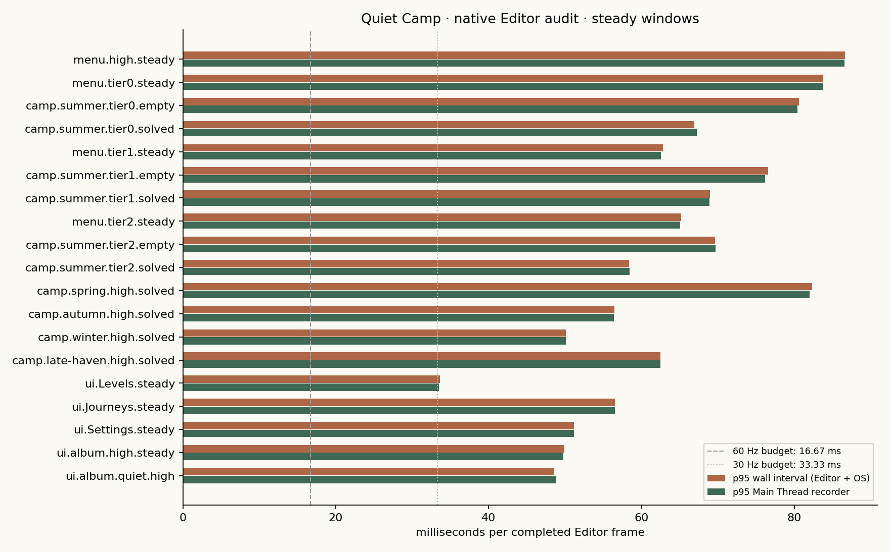
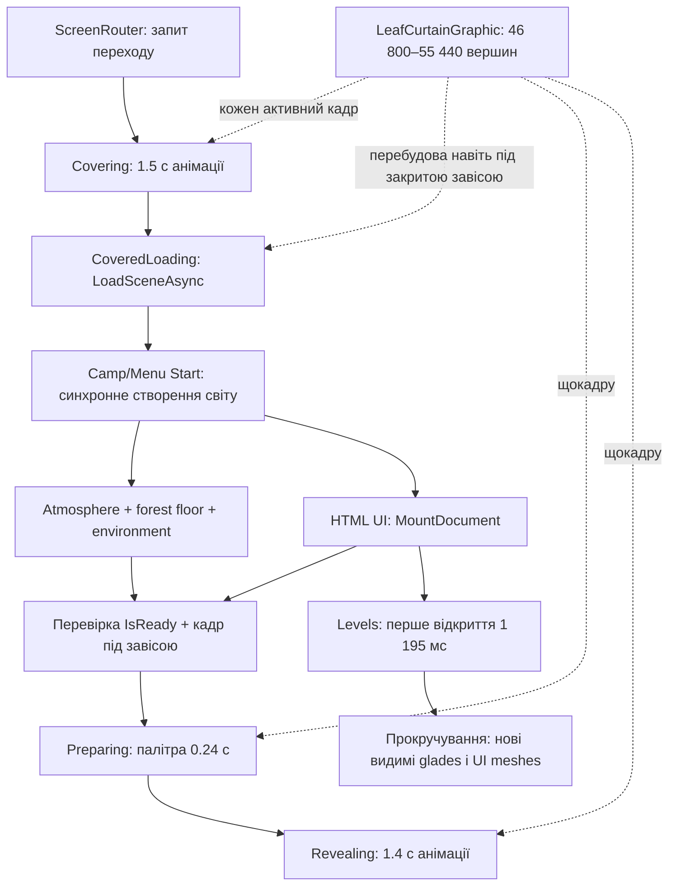
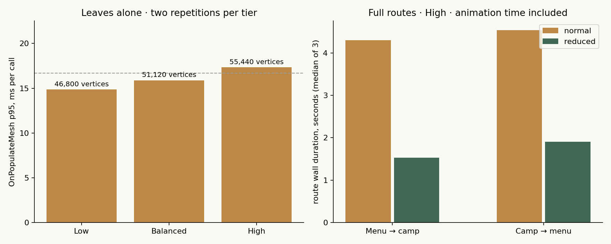
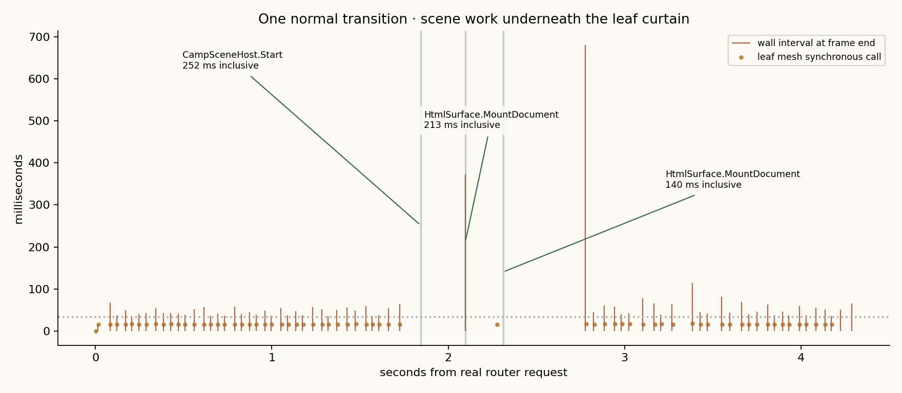

[← Головна](README.md) · [Довідник](docs/README.md) · [Карта коду](docs/project-map.md) · [Стан](docs/status.md) · [Інтерактивні виміри](https://kruty1918dev-ai.github.io/quiet-camp/performance.html)

# Карта продуктивності Quiet Camp · 09.10.2026

**Зависання під час переходу відтворено в Unity Editor.** Є дві підтверджені витрати: щокадрова перебудова листя та синхронне створення світу/HTML UI під закритою завісою. Скорочений режим прибирає геометрію листя, але зберігає довгі кадри створення сцени. Окремо знайдено затримку відкриття мапи та просідання її прокручування.

Це діагностичний звіт і черга виправлень. Оптимізації зі списку нижче ще не виконано. Native PlayMode матриця **Passed**: **6 140 кадрів, 34 576 scoped вимірів, 35 операцій**; п'ять regression tests переходу також **Passed**. Passed означає, що сценарії та їхні assertions завершились; performance budgets не пройдені.



## Мапа причин



`LoadSceneAsync` не переносить `Start`, побудову mesh та HTML mount у фоновий потік. Scope times нижче — wall time синхронних методів; вони вкладені, тому їх **не можна додавати** як незалежні витрати кадру.

## Черга виправлень

| Пріоритет / стан | Вузьке місце й доказ | Файл / наступне виправлення | Критерій повторної перевірки |
| --- | --- | --- | --- |
| **P0 · відкрито** | Листя: p95 **14.87 / 15.90 / 17.34 мс** на Low/Balanced/High; **46 800 / 51 120 / 55 440** UI-вершин. | [LeafCurtainGraphic](QuietCamp/Assets/QuietCamp/Scripts/Presentation/LeafCurtainGraphic.cs), [FoliageDiveTransition](QuietCamp/Assets/QuietCamp/Scripts/Presentation/FoliageDiveTransition.cs): кешувати форму/топологію, зменшити щільність для Low, прибрати CPU rebuild у закритій фазі; оцінити shader animation. | p95 leaf mesh ≤2 мс Low / ≤3 мс High на цьому стенді; суцільне покриття, reveal, input lease й recovery збережені. |
| **P0 · відкрито** | Створення сцени на реальних routes: Camp `Start` **160–366 мс**, Menu `Start` **292–386 мс**. У повторних High routes є кадри **598–960 мс** навіть зі reduced motion. | [CampSceneHost](QuietCamp/Assets/QuietCamp/Scripts/Presentation/World/CampSceneHost.cs), [MenuSceneHost](QuietCamp/Assets/QuietCamp/Scripts/Presentation/World/MenuSceneHost.cs), [CampAtmosphere](QuietCamp/Assets/QuietCamp/Scripts/Presentation/World/CampAtmosphere.cs): кеш/пул world objects, shared materials, поетапна композиція з бюджетом на кадр. | Жодного activation frame >100 мс у 20 routes; створення розбите на кадри без порожнього reveal. |
| **P0 · відкрито** | HTML mount: median **150 мс**, p95 **252 мс**; Levels mount **1 195 мс**, відповідний кадр **1 270 мс** в основній матриці. | [HtmlSurface](QuietCamp/Assets/QuietCamp/Scripts/Presentation/UI/HtmlSurface.cs), [MenuScreens](QuietCamp/Assets/QuietCamp/Scripts/Presentation/UI/MenuScreens.cs): інкрементальні updates, кеш markup/styles/model data, bounded first layout. Router наразі чекає `IsReady`, хоча hosts мають окремий `UiReady`. | Відкриття панелі без frame >100 мс; UI readiness підтверджено до reveal. Саме очікування `UiReady` не усуває важкої роботи. |
| **P1 · відкрито** | Повний sweep мапи: p95 кадру **283 мс**, max **335 мс** в основній матриці. Додатковий повільніший scroll: p95 **152 мс**; 5–6 glade rebuilds у sampled moving frames. | [RoadmapGraphic](QuietCamp/Assets/QuietCamp/Scripts/Presentation/UI/RoadmapGraphic.cs), [RoadmapGladeGraphic](QuietCamp/Assets/QuietCamp/Scripts/Presentation/UI/RoadmapGladeGraphic.cs), [RoadmapPainter](QuietCamp/Assets/QuietCamp/Scripts/Presentation/UI/RoadmapPainter.cs): кеш projected mesh, bounded warm-up сусідніх glades, розділити статичну геометрію й weather. Детальний додатковий замір — нижче. | Gentle drag p95 ≤33.33 мс; швидкий sweep без frame >100 мс. |
| **P1 · відкрито** | Сталі High вікна: summer solved p95 **58.4 мс**, spring **82.3 мс**, autumn **56.5 мс**, winter **50.1 мс**. У settings/journeys продовжує рендеритися складний фон меню. | [EnvironmentComposer](QuietCamp/Assets/QuietCamp/Scripts/Presentation/World/EnvironmentComposer.cs), [VisibleForestFloor](QuietCamp/Assets/QuietCamp/Scripts/Presentation/World/VisibleForestFloor.cs), [MenuSceneHost](QuietCamp/Assets/QuietCamp/Scripts/Presentation/World/MenuSceneHost.cs): quality-specific geometry, background visibility, shared materials; далі GPU/Frame Debugger audit на окремому стенді. | Спочатку стабільний p95 ≤33.33 мс на цьому Editor-стенді; бюджет 16.67 мс для цілі 60 Hz перевіряти окремо на target device. |
| **P1 · потребує attribution** | Повернення в меню: global `GC Allocated In Frame` близько **224 MiB** у важкому кадрі; `GC.Collect` **129–158 мс** у повторних routes. | Native Profiler allocation call stacks окремо для UI/model loading/world composition. Поточний counter включає Editor та audit; його не можна цілком приписати одному методу чи грі. | Менші повторні allocation spikes у тому самому QA flow; довга серія routes з memory snapshots до/після повного GC. |
| **P2 · відкрито** | Поворот альбому: `VisibleForestFloor.LateUpdate` max **31.49 мс**; allocation counter p95 близько **130 KiB/кадр**, проти близько 17 KiB у нерухомому audit-вікні. | [VisibleForestFloor](QuietCamp/Assets/QuietCamp/Scripts/Presentation/World/VisibleForestFloor.cs): відокремити зміни camera pose від rebuild ground cover, кеш/пул проміжної геометрії. | Ground-cover update p95 ≤2 мс, без повного rebuild кожного повороту. |
| **P2 · перевірити cold path** | `SaveAdapter.Save`: перший QA save **149.94 мс**, інші з дев'яти sampled saves **5.38–12.03 мс**. | [SaveAdapter](QuietCamp/Assets/QuietCamp/Scripts/Infrastructure/SaveAdapter.cs): виміряти serialization/disk окремо, coalesce writes після дій гравця. Ці samples походять переважно з Boot, не доводять save hitch на кожному переході. | Cold/warm saves і реальні Check/undo/pause paths виміряні окремо; атомарність і recovery збережені. |

## Перехід із листям



У [transition.json](QuietCamp/Assets/QuietCamp/Resources/QuietCamp/transition.json) задано cover **1.50 с**, minimum hold **0.08 с**, palette change **0.24 с**, reveal **1.40 с**. Отже, звичайний перехід має приблизно **3.22 с запланованого руху/паузи** ще до додаткової роботи завантаження. Це треба оцінювати окремо від зависань кадрів. Reduced motion має коротку завісу без leaf mesh.

| Реальний маршрут · High · 3 повторення кожного режиму | Звичайний: median загального часу | Reduced: median загального часу | Найдовші кадри у звичайному / reduced режимах |
| --- | --- | --- | --- |
| Меню → QC007 | **4.30 с** | **1.53 с** | **636–735 / 598–781 мс** |
| QC007 → меню | **4.53 с** | **1.91 с** | **813–959 / 874–960 мс** |

Зменшення загальної тривалості очікуване: reduced mode коротший за дизайном. Довгі кадри в обох режимах підтверджують, що оптимізувати треба також scene activation/UI.



`SetFrame` змінює breeze time, викликає `SetVerticesDirty`, а `OnPopulateMesh` знову рахує форму, тіні, жилки й смуги всіх листків. Це відбувається також у `CoveredLoading`/`Preparing`. Low змінює кількість сегментів, але залишає щільну сітку листків. `leafLow/leafBalanced/leafHigh` із config використовуються як умова ввімкнення; вони не задають фактичну кількість листків у mesh.

## Сталі сцени й панелі

Це короткі вікна після warm-up, 120–180 кадрів кожне. **Wall interval** включає Editor, render/wait і ОС. **Main Thread recorder** — окремий Unity counter; його не трактуємо як чистий час game scripts або як device FPS.

| Сценарій | Wall p50 / p95, мс | Main Thread p95, мс | Triangles median | SetPass median |
| --- | --- | --- | --- | --- |
| Меню Low | 46.4 / 83.8 | 83.7 | 243 142 | 89 |
| Меню Balanced | 34.0 / 62.9 | 62.5 | 244 469 | 92 |
| Меню High | 39.2 / 65.2 | 65.1 | 245 193 | 99 |
| Літо, solved, Low | 40.1 / 66.9 | 67.2 | 191 677 | 79 |
| Літо, solved, High | 40.3 / 58.4 | 58.4 | 194 352 | 88 |
| Весна, solved, High | 49.9 / 82.3 | 82.0 | 166 726 | 73 |
| Осінь, solved, High | 35.3 / 56.5 | 56.4 | 83 537 | 82 |
| Зима, solved, High | 32.9 / 50.1 | 50.1 | 64 040 | 72 |
| Late haven, solved, High | 37.6 / 62.5 | 62.5 | 210 224 | 82 |
| Мапа, нерухома | 18.7 / 33.7 | 33.5 | 19 602 | 92 |
| Подорожі, нерухомі | 40.7 / 56.5 | 56.6 | 251 717 | 95 |
| Налаштування, нерухомі | 39.2 / 51.2 | 51.2 | 248 295 | 117 |
| Альбом | 37.0 / 49.9 | 49.8 | 224 802 | 91 |
| Альбом, тихий режим | 35.1 / 48.6 | 48.8 | 180 227 | 83 |

Quality tiers проходили послідовно у зайнятій desktop-сесії. Low/High цифри не є рандомізованим A/B доказом впливу quality: склад сцени, попередні caches і навантаження ОС змінювалися. Водночас leaf-only method measurements і повторні routes дають конкретні місця для виправлення.

Нерухомий scene snapshot містить 154–236 renderers і 78–98 unique materials у sampled solved High camps. Settings/journeys мають 219 renderers фону меню; Levels приховує 3D background. Висока кількість об'єктів, SetPass і геометрії — напрям для render audit; **GPU bottleneck цим прогоном не встановлено**.

## Додатковий замір мапи

Окремий native PlayMode test **Passed**, 45.99 с, **640 кадрів / 98 964 scopes** із 11 додатковими markers. Новий QA-профіль, High, той самий rendered Editor; виконано після import/domain reload. [Receipt](docs/performance/2026-10-09/roadmap/native-result.json) · [детальна summary](docs/performance/2026-10-09/roadmap/summary.json) · [raw gzip](docs/performance/2026-10-09/roadmap/editor-audit.json.gz).

| Дія | Кадри | Wall p50 / p95 / max, мс | Власні UI mesh scopes |
| --- | --- | --- | --- |
| Перше відкриття Levels | 30 | 15.06 / 144.33 / **1 376.81** | HTML mount max **1 283.52 мс**; `EnsureData` max 47.41 мс. |
| Нерухома мапа | 120 | 15.13 / 23.45 / 91.52 | Periodic refresh має rebuild spikes; під час повної відсутності scroll більшість кадрів легкі. |
| Повна дорога за 90 кроків | 89 valid samples | 135.01 / **281.48** / 299.56 | 453 glade mesh calls; p95 одного **53.23 мс**. |
| 5% довжини мапи за 120 кроків | 120 | 113.58 / **151.63** / 225.05 | 560 glade mesh calls; p95 одного **13.60 мс**, кілька в одному кадрі. |
| Після прокручування | 120 | 15.33 / 28.26 / 166.81 | Спорадичний periodic rebuild лишається. |

Обидві прокрутки програмні через справжній `ScrollRect`, а не запис фізичного touch. Сума **невкладених** leaf-level UI scopes — glade meshes + base roadmap mesh + weather — має p95 приблизно **231 мс** для sweep та **100 мс** для повільнішого scroll серед кадрів із mesh work. Це підтверджує значну CPU-вартість procedural map geometry. `PaintGlade` і `RoadmapGladeGraphic.OnPopulateMesh` вкладені та описують ту саму роботу: їх не додавали двічі.

`RoadmapSceneGenerator.Generate` p95 **0.39 мс** на 131 виклик, weather mesh p95 **0.62 мс** на 281 виклик. На цьому зрізі основний scroll bottleneck — малювання геометрії glades/model projection, а не генератор даних або weather overlay. Часті per-model markers додають overhead у додатковому run; основна матриця без них теж показала великий scroll hitch.

## Середовище, методика й межі

- Звіт датовано **09.10.2026 Europe/Berlin**. Основний native test: **08.10.2026 21:59:14–22:04:24 UTC**, 309.46 с. [Passed receipt і guards](docs/performance/2026-10-09/native-result.json), [п'ять foliage tests](docs/performance/2026-10-09/foliage-tests.json).
- Unity **6000.6.2f1**, portrait Game View **720 × 1600**, OpenGLCore; Intel **i7-2600**, NVIDIA **GT 730**, близько **16 GiB RAM**. Один існуючий Editor, Jobs worker count 1, vSync 0, target 60, adaptive quality вимкнено для порівняння tiers; master audio muted.
- Runtime checkpoint [`c9c7bf5`](https://github.com/kruty1918dev-ai/quiet-camp/commit/c9c7bf55df486a0d33d008e875431c6225b78aa7), audit source/evidence checkpoint [`235804a`](https://github.com/kruty1918dev-ai/quiet-camp/commit/235804a). Початкові локальні `level_summaries.json` та URP settings збережено; їхні hashes є в raw provenance. Це вимір відкритої конфігурації, не clean-clone benchmark.
- Окрема QA product/save identity, synthetic progress і solved witnesses. Оригінальні game save hashes та ProjectSettings bytes збережено. ADB має той самий process identity; shared ADB kill preferences не змінювались. Нового Editor, ADB commands або player builds не було.
- Deep Profiling вимкнено. Scoped instrumentation і frame collector створюють власний overhead; global allocation/memory counters включають його та Editor. Thread-local allocation API повертав нулі навіть у важких методах: **method allocations недоступні**, це не доказ zero allocation.
- `GPU Frame Time`, `EditorLoop`, `Gfx.WaitForPresentOnGfxThread`, Draw Calls та Batches повертали лише нулі; Render Thread counter не був доступний. Їх не використовуємо для висновків. Render vertices/triangles/SetPass працювали.
- Profiler counters читаються в наступному Update для завершеного кадру; границі labels мають frame-level похибку. Method scopes мають власні timestamp/frame/stage. Whole-frame samples із diagnostic object scans виключено; власні method scopes у тих самих кадрах збережено. Перший run зупинився на стандартному 180-секундному timeout; його partial data не використано для опублікованих чисел.
- Managed heap snapshots зростали приблизно **91 → 336 MiB** і знижувались після GC; Unity allocated snapshots близько **432 → 491 MiB**. Це Editor/QA/trace процес із кешами. **Витік пам'яті не доведено**: потрібні довгі цикли, повний GC та object ownership snapshots.
- Не охоплено всі рівні, gameplay drag/check/undo під навантаженням, landscape/resolution matrix, тривалий soak, thermal throttling, GPU timings чи реальний телефон. Native Editor корисний для пошуку проблем, але target-device профіль має окремі витрати. [Unity: Editor vs Play profiling](https://docs.unity.com/en-us/engine/6000.6/manual/analysis/profiler/play-edit-samples).

## Дані й повторення

[Інтерактивна таблиця й timeline](https://kruty1918dev-ai.github.io/quiet-camp/performance.html) · [summary.json](docs/performance/2026-10-09/summary.json) · [frames.csv](docs/performance/2026-10-09/frames.csv) · [operations.csv](docs/performance/2026-10-09/operations.csv) · [повний raw JSON, gzip](docs/performance/2026-10-09/editor-audit.json.gz).

```bash
python3 tools/analyze_performance.py docs/performance/2026-10-09/editor-audit.json.gz /tmp/qc-performance-summary
# Для повторного створення PNG потрібен matplotlib:
python3 tools/analyze_performance.py docs/performance/2026-10-09/editor-audit.json.gz /tmp/qc-performance-summary --plots
```

[Native workflow](tools/qa/PERFORMANCE-AUDIT-UA.md) пояснює запуск у вже відкритому Editor, QA storage і cleanup. Автоматичного Editor/ADB/player launch немає. Наступний цикл: P0 leaf mesh + scene composition + UI mount → той самий audit → порівняння з цим baseline → окрема дозволена target-device перевірка.
