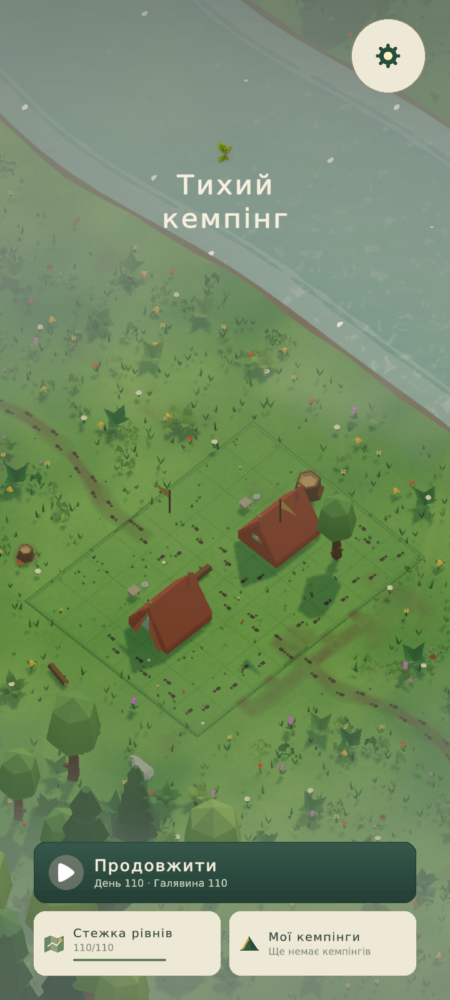
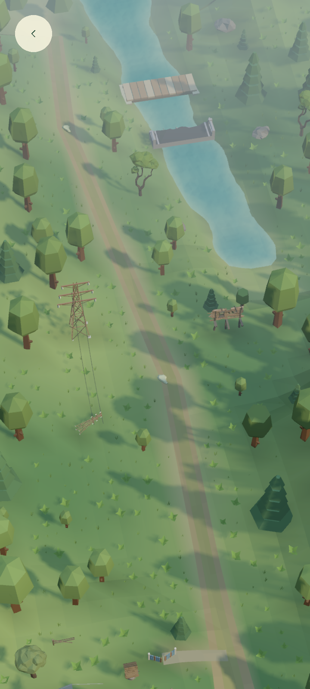
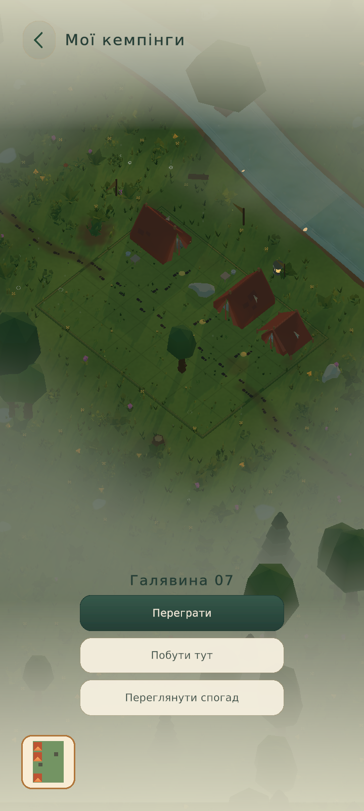
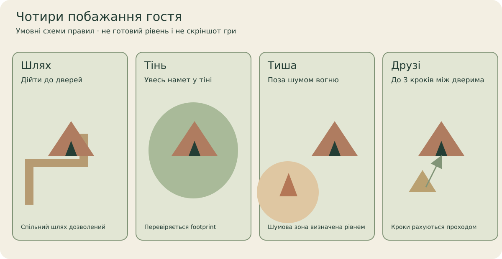
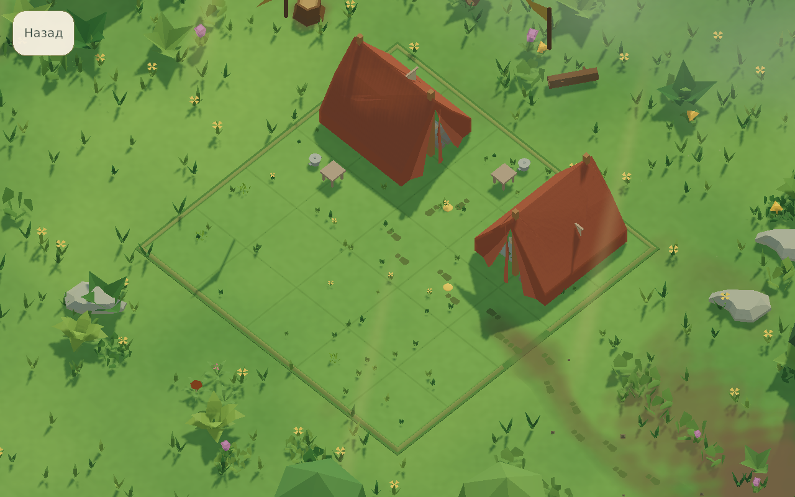
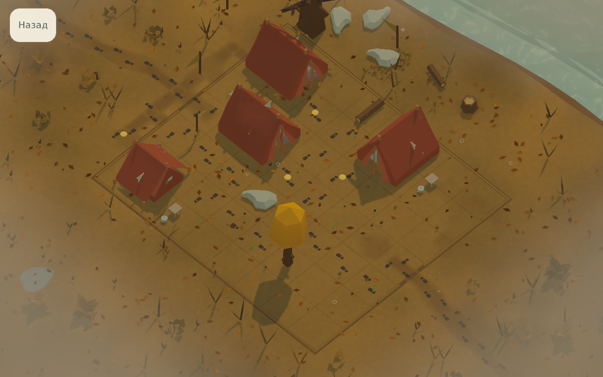

  

<h1 align="center">Quiet Camp · Тихий кемпінг</h1>

<strong>Знайди місце для кожного гостя. Збережи табір, до якого хочеться повернутись.</strong> 
Спокійна просторова головоломка у власному low poly світі — з лісом, чотирма сезонами й маленькими спогадами.

Unity 6 / URP · Offline-first · Українська / English / Deutsch · Android development project

  <a href="https://kruty1918dev-ai.github.io/quiet-camp/">Сайт гри</a> ·
  <a href="docs/README.md">Довідник</a> ·
  <a href="docs/gameplay.md">Як грати</a> ·
  <a href="docs/screens.md">Меню й панелі</a> ·
  <a href="docs/world.md">Світ</a> ·
  <a href="docs/gallery.md">Галерея</a> ·
  <a href="docs/development.md">Відкрити проєкт</a> ·
  <a href="docs/project-map.md">Карта коду</a>
  · <a href="PERFORMANCE_MAP.md">Продуктивність</a>

Для продовження на іншому ноутбуці: [пакет перенесення, звіт та план роботи · 09.10.2026](docs/TRANSFER-2026-10-09-UA.md).

[Застосування передачі · 09.10.2026](docs/transfer/2026-10-09/IMPORT-UA.md):
donor packages розкладені локально й імпортовані Unity Editor у погодженій
ізоляції; власні моделі та композиційний pipeline додані до проєкту.
Під час передачі було збережено мапу на 110 місць і підготовлений авторинг на 30.
10.10.2026 чинну реалізацію замінено пілотом QC001–QC005; повні дані кампанії збережено.

[Перші 12 українських діорам · 10.10.2026](Design/Roadmap/DioramaStudies/2026-10-10/index.html)
підготовлені як окремі Editor досліди стилю з новими моделями.
[План дизайну мапи](Design/Roadmap/DIORAMA-DESIGN-UA.md) та
[каталог усіх 1 210 візуально переглянутих моделей](Design/Roadmap/ModelCatalogue/README-UA.md)
містять описи, provenance і карту застосування. Діорами не створюють
нових пазлів; активна мапа використовує окремий безперервний світ QC001–QC005.

*Кадри довідника: Unity Game View, 2026-10-08, окремий QA-профіль із synthetic progress. [Середовище, source hashes і статус перевірок](docs/status.md).*

## Місце для кожного

Гості хочуть різного: проходу до дверей, тіні, тихого куточка або друга поруч. Обери намет, поверни його й знайди місце на галявині. Маленькі рішення складаються в цілий табір — із деревами, водою, вогнем і звуками природи. Таймера завершення рівня немає.

Завершений табір лишається у **Моїх кемпінгах**. Його можна роздивитися, обернути, повторити puzzle або прибрати основні панелі й просто залишитись на мить. Світ змінюється із сезонами; decorative weather зберігає правила puzzle.

**Quiet Camp** is a calm, offline-first campsite puzzle. Arrange tents around paths, shade, quiet and friendship, then revisit your saved seasonal 3D camps. This repository contains the development project and its illustrated guide.

## Подивись, перш ніж читати код

| Головне меню | Мапа місць | Твій кемпінг |
| --- | --- | --- |
|  |  |  |

Меню: Unity QA capture **09.10.2026**; нова мапа: **10.10.2026**, ізольований QA-профіль; альбом: **08.10.2026**. [Походження меню](docs/performance/2026-10-09/optimized/images/manifest.json) · [докази нової мапи](Design/Roadmap/CinematicPilot/2026-10-10/acceptance-receipt.json).

Роадмапа — [безперервна 3D-долина для QC001–QC005](Design/Roadmap/CinematicPilot/2026-10-10/index.html): заросла Україна, п’ять дорожніх каменів і одна кнопка виходу. Камера на 45% далі показує околиці; світ рухається за пальцем, колесо й trackpad працюють послідовно. Stylized Water 3 додає хвилі, рух відблисків і контакт із берегом. [Добір моделей і порівняння до / після](Design/Roadmap/ModelRefinement/2026-10-10/index.html) показує нові силуети, суцільну дорогу та посадки з відступами. [Дорога біля зупинки — до / після](Design/Roadmap/StopRoad/2026-10-10/index.html): дві смуги, розмітка, узбіччя та заїзна кишеня з майданчиком. Усі тверді об’єкти й рослинність мають тіні від одного сонця; сітки мають на 22,6–22,9% менше вершин зі збереженням моделей. [Рельєф і світло — до / після](Design/Roadmap/DepthReview/2026-10-10/index.html): видимі схили, низька заплава, тепле бокове сонце й прохолодне світло неба додають глибини; стики дальньої землі закриті. Native-композиції та свіжий повний Game View integration пройшли перевірку; [receipts і межі вимірів](Design/Roadmap/CinematicPilot/2026-10-10/README.md).

Кожен екран має власне пояснення в [атласі меню й панелей](docs/screens.md): як відкрити, що робить кожна область і де знайти реалізацію. [Галерея](docs/gallery.md) містить повні PNG та JSON sidecars.

## Чотири прості побажання

| Шлях | Тінь | Тиша | Друзі |
| --- | --- | --- | --- |
| Двері доступні мережею проходів. | Увесь footprint намету в заданій тіні. | Намет поза зоною шуму багаття. | Між дверима друзів до трьох кроків проходом. |

Drag, поворот, undo/redo, список гостей і placement preview допомагають скласти розташування. Перевірка зʼявляється, коли всі намети на місці. [Правила, керування й ресурсна модель →](docs/gameplay.md)

## Світ, до якого повертаєшся

| Весняна галявина | Осінній табір |
| --- | --- |
|  |  |

Поточний main content catalog задає **110 місць головної дороги**, 15 districts і окремі journey branches. Це кількість у source catalog; visual/puzzle/device acceptance має власний перевірений обсяг. [Світ, зима, подорожі та staging →](docs/world.md)

Навчання з Остапом, три мови, text scale, contrast, reduced motion, calm pacing, audio/haptics і portrait/landscape settings дають грати у своєму темпі. [Налаштування з ілюстраціями →](docs/screens.md#налаштування)

## Знайди потрібне в репозиторії

| Для кого | Почати тут |
| --- | --- |
| Хочу зрозуміти гру | [Ілюстрований довідник](docs/README.md), [правила](docs/gameplay.md), [екрани](docs/screens.md). |
| Хочу подивитися весь інтерфейс | [Галерея](docs/gallery.md), [атлас меню](docs/screens.md). |
| Відкриваю Unity вперше | [Перший запуск і залежності](docs/development.md#перший-запуск). |
| Шукаю файл/систему | [Карта проєкту](docs/project-map.md), [scripts](QuietCamp/Assets/QuietCamp/Scripts), [resources](QuietCamp/Assets/QuietCamp/Resources/QuietCamp). |
| Працюю над art/story/UI | [Design index](Design/README.md), [technical documentation](Documentation/README.md), [campaign roadmap](CAMPAIGN_ROADMAP.md). |
| Потрібні докази готовності | [Стан і перевірки](docs/status.md), [capture workflow](tools/qa/DOCS-CAPTURE-UA.md), [workspace rules](AGENTS.md). |
| Шукаю причини зависань | [Карта продуктивності](PERFORMANCE_MAP.md), [інтерактивні кадри й methods](https://kruty1918dev-ai.github.io/quiet-camp/performance.html). |

## Відкрити локально

1. Використовуй **Unity 6000.6.2f1**, revision `770e33f6875c`.
2. З кореня repo виконай `python3 tools/verify_portability.py` (Windows: `py -3 tools/verify_portability.py`).
3. Відкрий у Unity Hub папку **QuietCamp/**, дочекайся package resolution/import.
4. Відкрий `Assets/QuietCamp/Scenes/Boot.unity` і використовуй Editor Play Mode у дозволеній сесії.

Custom local UPM packages включені в [Packages](QuietCamp/Packages/README.md); сусідні repositories і копія старої Library не потрібні. Registry/Git packages мають exact pins і потребують internet для першого resolve. Для .NET probe потрібен SDK 10. [Повна інструкція, architecture й checks →](docs/development.md)

## Поточний статус

**Проєкт у розробці; store release не заявляється.** Main має campsite gameplay, scene routing, локальні saves, навчання, UI й album. Default configuration offline-first, без обовʼязкового account/cloud save та enabled advertising/analytics providers.

Життя, підказки, currency exchanges, Pro і purchase-state contracts — prototype integrations. Новий профіль починає з трьох hints і пʼяти lives; incorrect Check витрачає життя й очищає arrangement/history. Реальні покупки та rewarded ads не підключені. [Ресурси й Pro](docs/screens.md#ресурси-та-pro).

Усі гілки об’єднано в **main 10.10.2026**: оптимізація, довідник, імпорт моделей, composition tools і 12 діорам тепер мають спільну історію. [Збережені commits гілок і перевірки об’єднання](docs/maintenance/2026-10-10-main-consolidation.md).

Нова forest/village/power/aircraft/dam roadmap composition зберігається в [авторингу main](QuietCamp/Assets/QuietCamp/Authoring/Roadmap/Composition). Її runtime catalog ще не активовано новим native bake; кадри довідника показують чинний renderer. Device performance, store/restore/ad acceptance та staging publication мають окремі наступні checks. [Точний стан доказів →](docs/status.md)

Оптимізація **09.10.2026**: листя рухається в GPU shader, світ готується між кадрами, мапа кешує геометрію й створює кнопки для видимої ділянки, HTML UI використовує коротші стилі та stable IDs. **14 EditMode / 13 PlayMode tests Passed**. Повторні native виміри, точне порівняння до/після та залишкові просідання — у [карті продуктивності](PERFORMANCE_MAP.md) і [інтерактивному звіті](https://kruty1918dev-ai.github.io/quiet-camp/performance.html).

Ліцензії art/audio/vendor sources зберігають власні умови та attribution; [asset notes](docs/development.md#assets-і-ліцензії). Концепти й store mockups позначені окремо в [архіві галереї](docs/gallery.md#архів-та-концепти).
