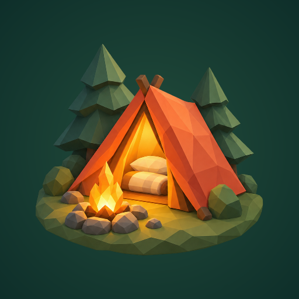
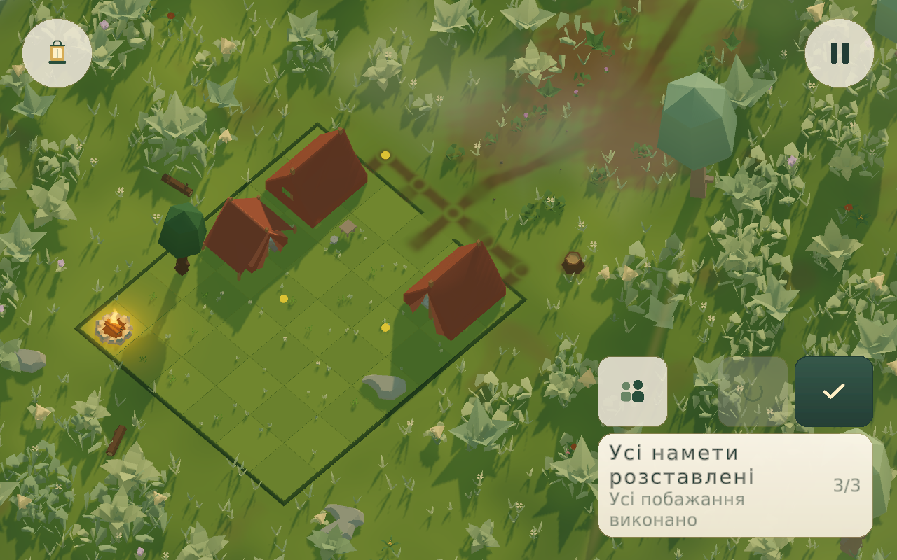
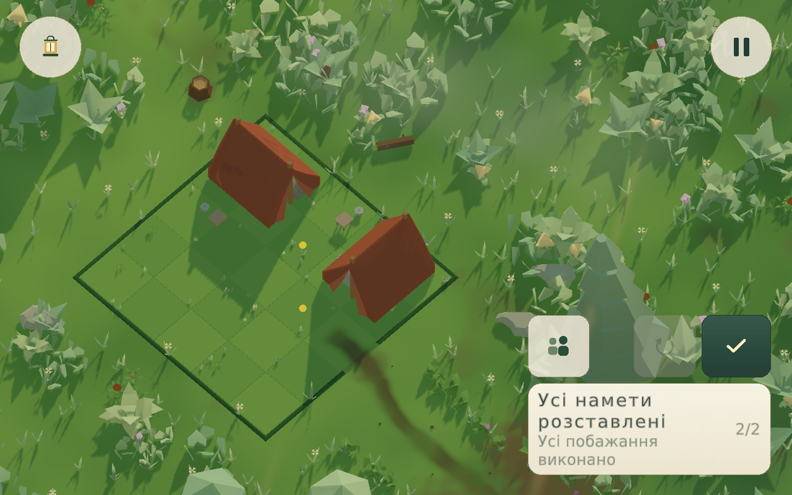
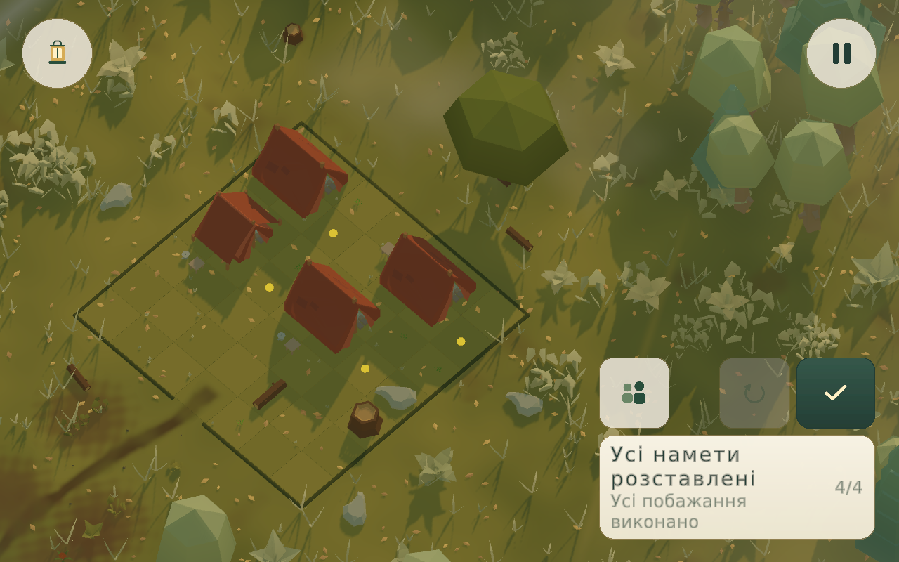
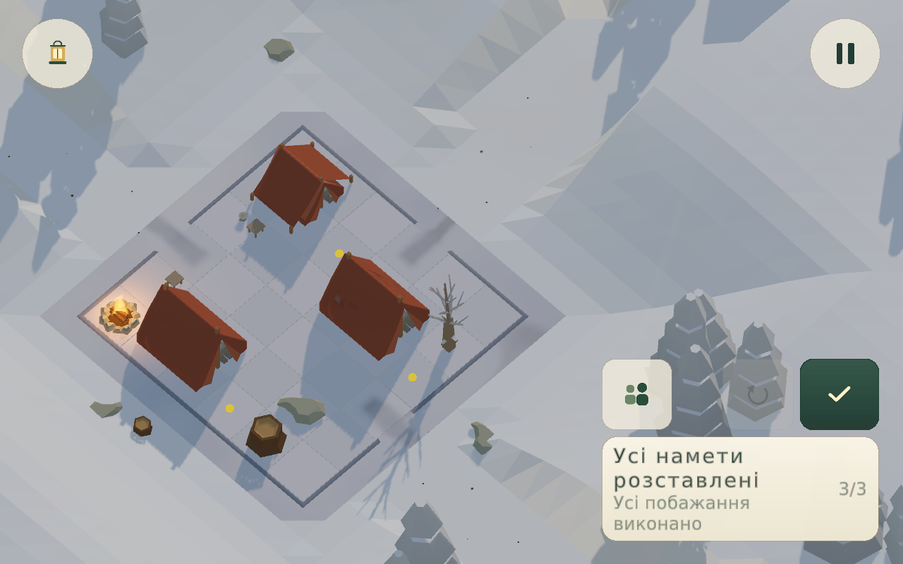
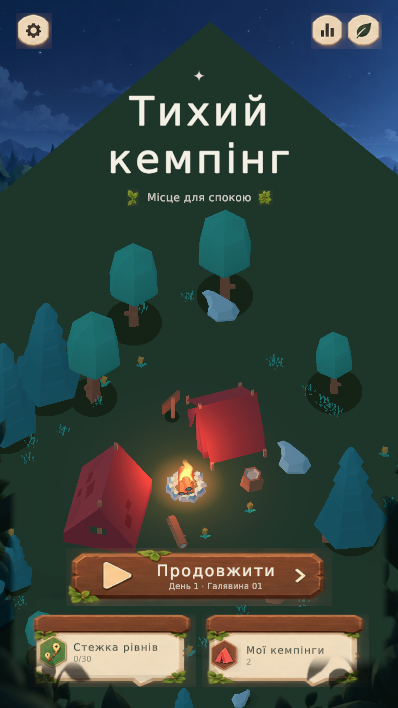
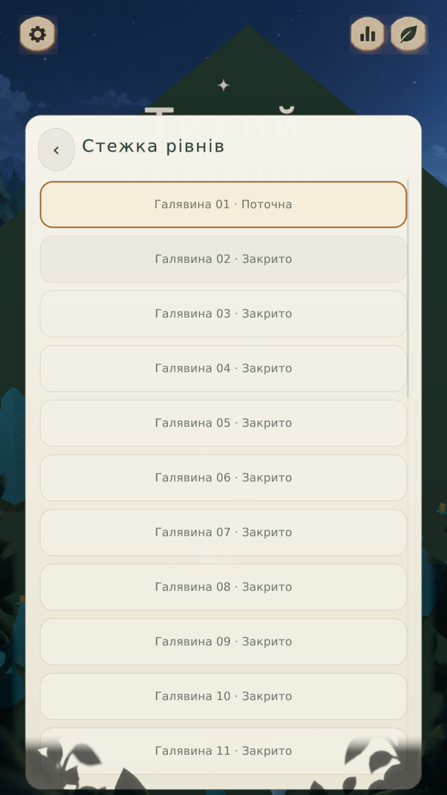

<p align="center">
  
</p>

<h1 align="center">Quiet Camp · Тихий кемпінг</h1>

<p align="center"><strong>A place for every guest. A camp worth returning to.</strong><br />
A cozy, offline-first campsite puzzle for Android, built with Unity 6 and URP.</p>

<p align="center">30-glade campaign · Four seasons · Saved 3D camps · Ukrainian / English / German</p>



## Make a clearing feel like home

Arrange tents for travelers who want different things: an open path to their door, a little shade, a quiet corner, or a friend nearby. Each clearing is a small spatial puzzle, framed by a living forest, changing weather and the sound of water and fire.

Completing a camp leaves a visible memory. Small belongings, a second cup and sheltered cloth make the place feel lived in. Your own arrangement stays in **My Camps**, where you can rotate the scene, hide the main interface and spend a moment there again.

**Тихий кемпінг** — гра про турботу через прості просторові рішення: знайти місце для кожного гостя, облаштувати прихисток і зберегти табір, до якого хочеться повернутися.

## The experience

- **A complete main journey.** Thirty authored, frozen glades across six seasonal chapters, with validated layouts rather than an endless runtime-generated campaign.
- **Four readable rules.** Paths, shade, quiet and friendship combine into different campsite compositions. A path can be shared; a doorway must remain reachable.
- **A world around the puzzle.** Spring flowers, summer shores, autumn rain and winter snow share the same scene data in gameplay, the map and the album. Decorative weather never rewrites the puzzle rules.
- **Personal places to revisit.** Saved tent placements, level snapshots, lighting and story rewards reconstruct your completed camps.
- **Responsive touch controls.** Select, drag, rotate, undo and redo, with a placement preview and contextual explanations. There is no level-completion timer.
- **Comfort settings.** Reduced motion, calmer animation pacing, contrast, text scaling, audio controls, haptics and portrait/landscape orientation.
- **Offline-first by default.** The current configuration has no account requirement, no cloud save, and no enabled advertising or analytics provider.

### Gameplay at a glance

| Rule | What the guest needs |
| --- | --- |
| **Path** | A clear walking route from the clearing's access network to the tent door. |
| **Shade** | The whole tent footprint inside the authored shade area. |
| **Quiet** | Enough distance from the campfire's noise zone. |
| **Friends** | At most three walking steps between the friends' doors. |

In the current economy prototype, players start with **three hints and five lives**. An incorrect **Check** costs one life and clears the arrangement and undo history; a correct check does not cost a life. If saving fails, the failed-attempt reset and resource debit are rolled back. Pro removes resource limits and opens all published levels. These systems are implemented locally; **real purchases and rewarded ads are not connected**.

## From the game

The seasonal frames below are actual **2026-10-05 Unity Editor captures** at High quality, 1280×800, OpenGLCore. They are copied without color correction from the existing isolated QA capture. They show valid witness arrangements and the real HUD, not concept art or mock store screens. The older menu/map captures are retained separately below.

**These are not new renders of the latest commit:** the economy and UI have changed since the capture. The prior visual acceptance was partial, and Editor images do not establish measured Android performance.

| Spring | Autumn |
| --- | --- |
|  |  |

| Summer | Winter |
| --- | --- |
|  |  |

<details>
<summary>Main menu and campaign map</summary>
<br />
<p>
  
  
</p>
</details>

## Development status

**Playable development project — not a store release.** The main campaign, campsite presentation, native UI, local saves, accessibility options and camp memories are present in the source.

Additional journeys are a separate content layer. **Light of the Old Lighthouse** has eight frozen puzzle resources, localized story beats, a pier and a lighthouse landmark. It remains **unpublished staging content** until visual and product acceptance. **A Garden After Winter** and **Autumn at the Old Station** are catalog concepts, not playable released DLC.

The wallet, hint/life exchanges, Pro entitlement and purchase-state machinery are prototype integrations with isolated fake-provider tests. Default store calls return unavailable. Do not enable real-money products from these local caches without authoritative verification and the required store/backend work.

Before release, the project still needs device input and performance acceptance, real billing/restore/ad tests where applicable, a human gameplay pilot, publisher/contact details and regional publication review. The 60 FPS target is a design goal, **not a claim that every supported phone has passed**.

## Run locally

### Requirements

- **Unity 6000.6.2f1** with Android Build Support, Android SDK/NDK and OpenJDK.
- **Android target:** ARM64, IL2CPP, OpenGLES3, minimum API 26; the current target API is 35 and must be reviewed before a future store submission.
- **.NET SDK 10** for the editor-independent verification probe; Python 3 for authoring and QA tools.
- Access to the sibling UPM repositories used by the checked-in manifest: `agentverify`, `atmos`, `levelgen` and `level-kit`.

Expected workspace layout:

```text
workspace/
├── quiet-camp/
│   └── QuietCamp/
├── agentverify/
├── atmos/
├── levelgen/
└── level-kit/
```

1. Open **`QuietCamp/`**, not the repository root, in Unity Hub.
2. Let Unity resolve the manifest's exact package pins and import the assets.
3. Open `Assets/QuietCamp/Scenes/Boot.unity` and enter Play Mode.
4. For an isolated QA run, use the existing `tools/live_qa.py` helper and a distinct QA product name. Do not point destructive save fixtures at a player's real storage.

The project uses URP 17.6.0, Input System 1.20.0, uGUI 2.6.0, Newtonsoft JSON 3.2.2 and commit-pinned UnityHTML, haptics, tutorial and gameplay-viewport packages. No npm frontend build or browser runtime is required.

Android development and release APK entry points are in `QuietCamp.Editor.QuietCampBuild`; the profiles live under `Assets/Settings/Build Profiles/`. Release signing credentials stay outside the repository. Consult workspace instructions before launching a player build; a build does not authorize installation or publishing.

## Architecture

| Layer | Responsibility |
| --- | --- |
| **Domain** | Pure C# board state, walking topology, rules, solver, content validation and deterministic authoring. |
| **Application** | Session commands, progression, tutorial, hints, economy, story memory, journey access and purchase contracts. |
| **Infrastructure** | Frozen level loading, content revisions, asset/audio catalogs, modular atomic saves and optional-provider configuration. |
| **Presentation** | Composition roots, scene routing, UnityHTML screens, pointer input, campsite rendering, seasons, soundscapes and camera framing. |

`CampSession` owns board mutations. Authored JSON is the puzzle source of truth; the map reads lightweight summaries and never invokes a solver. Gameplay and album reconstruction use one scene-data model. The album keeps one active diorama and reuses its camera instead of rendering every saved camp at once.

## Verification

Run the following sequentially from the repository root:

```sh
dotnet build tools/MonetizationProbe.csproj -m:1 -p:UseSharedCompilation=false
dotnet run --no-build --project tools/MonetizationProbe.csproj
python3 tools/verify_monetization.py
python3 tools/test_legal_site.py
```

The .NET probe exercises the actual domain, session and save pipeline with platform doubles and synthetic temporary slots. It checks resource rollback, duplicate delivery, pending purchases, restoration, Pro behavior, memory persistence, future-version protection and all **30 main + 8 lighthouse** puzzle resources.

The compiler helper uses existing Unity Bee response files and cached references. It checks current runtime and test source compatibility; it does **not** run Unity scenes, render frames, build Android, prove real SDK behavior or measure device FPS.

Unity EditMode/PlayMode suites live in `Assets/QuietCamp/Tests/`. `ScreenshotPlayModeTest.CaptureProjectShowcase` captures the gallery from a rendered Game View in an isolated QA project; visual capture is skipped in batch mode.

## Project notes

- [Seasonal rendering and shared quality](Design/Atmosphere/SEASONAL-RENDERING-UA.md)
- [Campaign story and cozy world](Design/Story/COZY-LORE-UA.md)
- [Native HTML UI](Documentation/HTML-UI.md)
- [Tutorial and first camps](Design/Tutorial/IMPLEMENTATION_UA.md)
- [Journey and monetization implementation plan](Design/Monetization/IMPLEMENTATION-UA.md)
- [Privacy and publication preparation](Design/Legal/README-UA.md)
- [Device testing guide](README_TEST_UA.md)

Local build logs, device captures and raw QA results are intentionally not published as source. Read test status with its date and environment: a compiled test assembly is not a passed runtime test.

## Assets and licensing

This is a **private game-development repository**, not an open-source asset distribution.

Kenney artwork and the Poly Haven lighting source are CC0; provenance for the lighting is kept in [PolyHavenLighting/SOURCE.md](QuietCamp/Assets/QuietCamp/ThirdParty/PolyHavenLighting/SOURCE.md). DOTween, audio packs and **Stylized Water 3** retain their respective vendor licenses. The [water integration note](QuietCamp/Assets/ThirdParty/Stylized%20Water%203/QUIET-CAMP-INTEGRATION.md) documents its private-project use. Do not redistribute commercial vendor sources in public templates, tutorials or packages.
