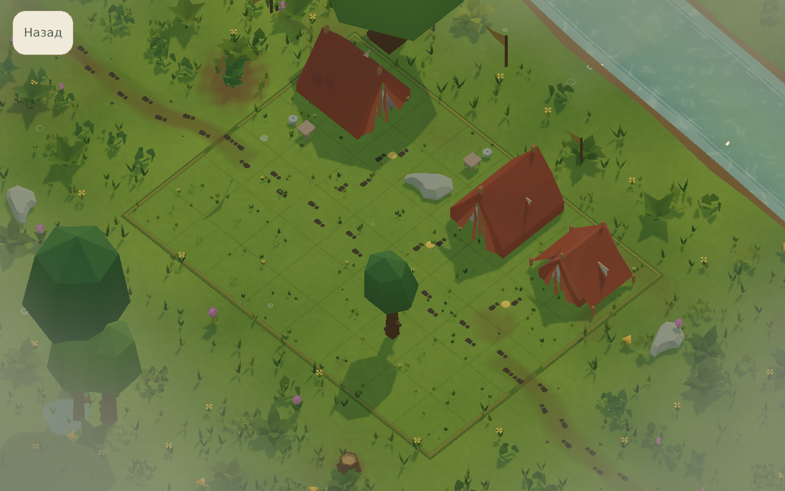
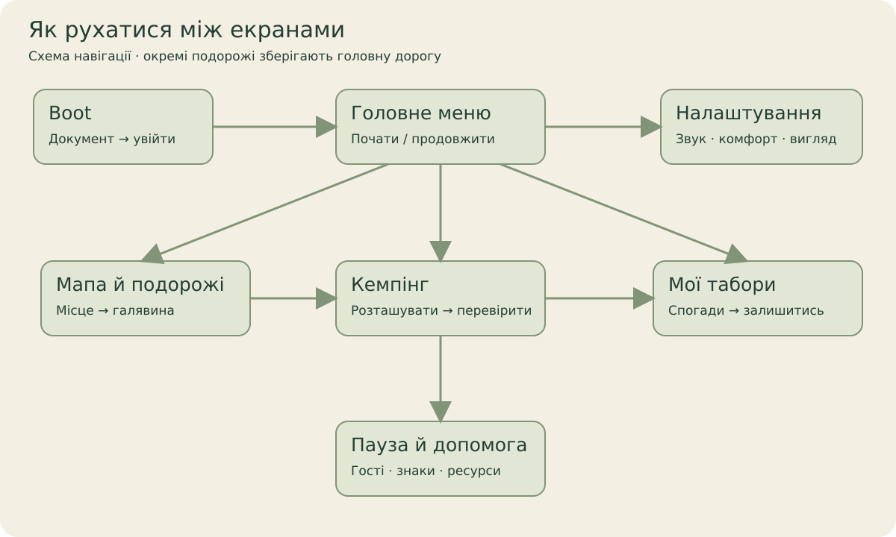

[← Головна](../README.md) · [Довідник](README.md) · [Екрани](screens.md) · [Галерея](gallery.md) · [Розробка](development.md) · [Стан](status.md)

# Quiet Camp — ілюстрований довідник

[Сайт гри: пошук екранів, UA/EN/DE й повні кадри →](https://kruty1918dev-ai.github.io/quiet-camp/)

Спокійна просторова головоломка про місце для кожного гостя. Тут можна пройти шлях гравця, роздивитися інтерфейс і знайти відповідний код без пошуку по всьому репозиторію.

| Хочу… | Куди перейти | Що побачу |
| --- | --- | --- |
| Зрозуміти гру | [Правила й керування](gameplay.md) | Шлях, тінь, тиша, друзі; розміщення та перевірка. |
| Розібрати меню або панель | [Атлас екранів](screens.md) | Boot, меню, мапа, HUD, пауза, альбом, налаштування й ресурси. |
| Дізнатися про світ | [Світ і подорожі](world.md) | Сезони, головна дорога, сюжетні гілки та їхній статус. |
| Подивитися кадри | [Галерея](gallery.md) | Справжні Game View PNG і metadata; архів окремо. |
| Відкрити проєкт | [Початок розробки](development.md) | Exact Unity, packages, Boot, checks і capture workflow. |
| Знайти реалізацію | [Карта проєкту](project-map.md) | Шари, папки, UI presenters, дані, тести й design notes. |
| Оцінити готовність | [Стан і докази](status.md) | Що виконано, що є prototype/staging і що ще не перевірено. |
| Знайти просідання | [Карта продуктивності](../PERFORMANCE_MAP.md), [interactive audit](performance.html) | Native Editor frame timings, листя, scene/UI activation, мапа та черга виправлень. |

Кадри цього довідника мають власні sidecars і використовують synthetic QA saves. Деталі середовища — у [стані перевірок](status.md); концепти й старі кадри не підміняють нові Unity captures.
