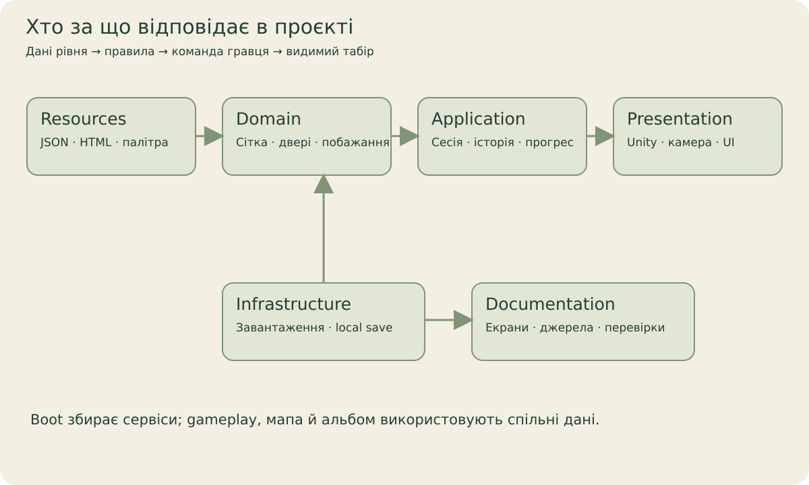

[← Головна](../README.md) · [Довідник](README.md) · [Екрани](screens.md) · [Галерея](gallery.md) · [Розробка](development.md) · [Стан](status.md)

# Карта реалізації

## Де шукати

| Папка | Вміст | Почати з |
| --- | --- | --- |
| [Domain](../QuietCamp/Assets/QuietCamp/Scripts/Domain) | Level/board data, footprint, walking rules, solver та validators. | Правила не залежать від Unity UI. |
| [Application](../QuietCamp/Assets/QuietCamp/Scripts/Application) | CampSession, progression, tutorial, journeys, economy й save DTO contracts. | [CampSession](../QuietCamp/Assets/QuietCamp/Scripts/Application/CampSession.cs), [TutorialDirector](../QuietCamp/Assets/QuietCamp/Scripts/Application/TutorialDirector.cs). |
| [Infrastructure](../QuietCamp/Assets/QuietCamp/Scripts/Infrastructure) | JSON loading, model/audio catalogs, adapters і atomic save modules. | [LevelLoader](../QuietCamp/Assets/QuietCamp/Scripts/Infrastructure/LevelLoader.cs), [SaveAdapter](../QuietCamp/Assets/QuietCamp/Scripts/Infrastructure/SaveAdapter.cs). |
| [Presentation](../QuietCamp/Assets/QuietCamp/Scripts/Presentation) | Bootstrap, routing, input, native world, HTML UI, sound й camera. | [QuietCampBootstrap](../QuietCamp/Assets/QuietCamp/Scripts/Presentation/QuietCampBootstrap.cs). |
| [Editor](../QuietCamp/Assets/QuietCamp/Editor) | Import/setup/content tooling; працює в Editor. | Запускати лише потрібний інструмент за workspace rules. |
| [Resources](../QuietCamp/Assets/QuietCamp/Resources/QuietCamp) | Frozen levels, campaign, monetization, localization, HTML/CSS. | [campaign.json](../QuietCamp/Assets/QuietCamp/Resources/QuietCamp/campaign.json), [Html](../QuietCamp/Assets/QuietCamp/Resources/QuietCamp/Html). |
| [Packages](../QuietCamp/Packages) | Exact manifest/lock pins і embedded custom UPM sources. | [manifest.json](../QuietCamp/Packages/manifest.json), [VENDORED](../QuietCamp/Packages/README.md). |
| [Tests](../QuietCamp/Assets/QuietCamp/Tests) | Editor і PlayMode contracts, UI/input/render fixtures. | [Capture workflow](../tools/qa/DOCS-CAPTURE-UA.md). |
| [tools](../tools) | Portable probes, content authoring, legal/site tooling і QA scripts. | [Перевірки](development.md#перевірки). |
| [Design](../Design/README.md) | Системи, атмосфера, story, UI art, legal й roadmap plans. | Індекс тем із позначеним статусом. |
| [Documentation](../Documentation/README.md) | Архітектурні й UX-пояснення та плани початкових рівнів. | HTML UI і live camp notes. |
| [docs](README.md) | Вхід для читача GitHub: екрани, gallery, навігація й evidence. | [Атлас](screens.md). |

## З екрана до source owner

| Екран/поведінка | Реалізація |
| --- | --- |
| Меню, мапа, journeys, альбом | [MenuScreens](../QuietCamp/Assets/QuietCamp/Scripts/Presentation/UI/MenuScreens.cs). |
| Камера й native campsite меню | [MenuSceneHost](../QuietCamp/Assets/QuietCamp/Scripts/Presentation/World/MenuSceneHost.cs). |
| Галявина, input та placements | [CampSceneHost](../QuietCamp/Assets/QuietCamp/Scripts/Presentation/World/CampSceneHost.cs). |
| HUD, гості, пауза, hints/completion | [CampHud](../QuietCamp/Assets/QuietCamp/Scripts/Presentation/UI/CampHud.cs). |
| Налаштування й privacy | [SettingsPanel](../QuietCamp/Assets/QuietCamp/Scripts/Presentation/UI/SettingsPanel.cs), [PrivacyPanel](../QuietCamp/Assets/QuietCamp/Scripts/Presentation/UI/PrivacyPanel.cs). |
| Ресурси й purchase state | [EconomyPanel](../QuietCamp/Assets/QuietCamp/Scripts/Presentation/UI/EconomyPanel.cs). |
| HTML reconciliation, native callbacks | [HtmlSurface](../QuietCamp/Assets/QuietCamp/Scripts/Presentation/UI/HtmlSurface.cs), [HTML-UI guide](../Documentation/HTML-UI.md). |
| Сезони/атмосфера | [World](../QuietCamp/Assets/QuietCamp/Scripts/Presentation/World), [Seasonal notes](../Design/Atmosphere/SEASONAL-RENDERING-UA.md). |
| Альбом і reconstruction | [AlbumDiorama](../QuietCamp/Assets/QuietCamp/Scripts/Presentation/World/AlbumDiorama.cs). |
| Доступ до journey/bonus | [Application](../QuietCamp/Assets/QuietCamp/Scripts/Application), [World/content status](world.md). |
| Зависання переходів, мапи, UI | [Performance map](../PERFORMANCE_MAP.md), [opt-in audit helper](../QuietCamp/Assets/QuietCamp/Scripts/Infrastructure/PerformanceAudit.cs), [native workflow](../tools/qa/PERFORMANCE-AUDIT-UA.md). |

У цьому project немає npm frontend, browser game runtime або окремої копії правил у HTML. Кнопка надсилає команду через action router; `CampSession` змінює puzzle state. Мапа читає summaries, а не викликає solver при scroll.

## Відмінні джерела правди

Frozen JSON задає puzzle. Presentation відповідає за вигляд. SaveAdapter зберігає локальні modules. Concept art задає напрямок, але не доводить, що сцена вже імпортована чи опублікована. Scene-composition sources і model matrix нової roadmap доступні в [main](https://github.com/kruty1918dev-ai/quiet-camp/tree/main/Design/Roadmap) після об’єднання всіх гілок 10.10.2026; чинна мапа використовує п’ятиточковий native world index та RoadmapWorldPresenter.

## Безперервна мапа QC001–QC005

[RoadmapWorldPresenter](../QuietCamp/Assets/QuietCamp/Scripts/Presentation/World/RoadmapWorldPresenter.cs)
керує перспективною камерою, атмосферою та максимум трьома leases запечених частин.
[RoadmapWorldInput](../QuietCamp/Assets/QuietCamp/Scripts/Presentation/World/RoadmapWorldInput.cs)
обробляє drag, колесо, pinch і відхиляє запуск після перетягування.
[RoadmapPilotPolicy](../QuietCamp/Assets/QuietCamp/Scripts/Application/RoadmapPilotPolicy.cs)
обмежує запуск п’ятьма IDs, зберігаючи повні дані старого прогресу.
Авторські ансамблі й camera anchors живуть у
[CinematicPilot](../QuietCamp/Assets/QuietCamp/Authoring/Roadmap/Composition/CinematicPilot).
[Baker](../QuietCamp/Assets/QuietCamp/Editor/CinematicRoadmapBaker.cs) готує native meshes;
[галерея та receipts](../Design/Roadmap/CinematicPilot/2026-10-10/index.html) показують прийняті етапи.
Projected UI renderer і дубль `UI/Prepared` вилучено.
