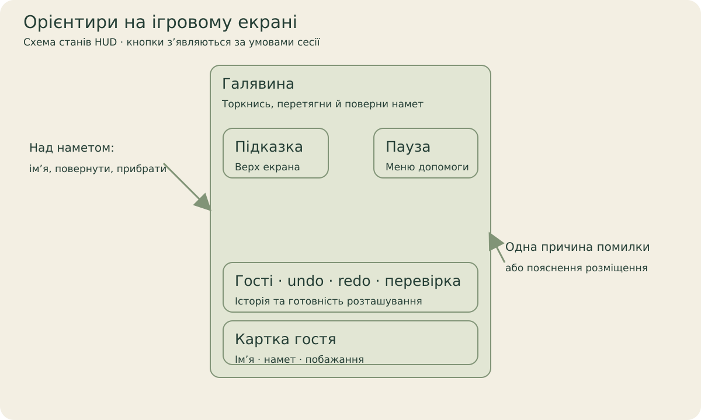

[← Головна](../README.md) · [Довідник](README.md) · [Екрани](screens.md) · [Галерея](gallery.md) · [Розробка](development.md) · [Стан](status.md)

# Атлас меню й панелей

Для кожного екрана нижче вказано, як його відкрити, що він робить і де лежить реалізація. PNG — справжні Game View captures; стан прогресу й ресурсів у них належить окремому QA-профілю.

**Навігація:** [Boot](#вхід-і-boot) · [Меню](#головне-меню) · [Мапа](#мапа-галявин) · [Подорожі](#подорожі) · [Bonus](#додаткова-галявина) · [HUD](#галявина-й-hud) · [Гості](#список-гостей) · [Пауза](#пауза) · [Знаки](#знаки-побажань) · [Завершення](#завершення-та-історія) · [Альбом](#мої-табори) · [Налаштування](#налаштування) · [Ресурси](#ресурси-та-pro) · [Інші стани](#контекстні-панелі).

## Вхід і Boot

Відкривається при запуску. Boot готує локальні дані, показує документ та явну дію входу; після неї складає сервісний граф і переходить до меню. Помилка завантаження/монтування документа має retry/exit стан. Acknowledgement документа не є згодою на необовʼязкову аналітику. [BootPrivacyPanel](../QuietCamp/Assets/QuietCamp/Scripts/Presentation/UI/BootPrivacyPanel.cs) · [QuietCampBootstrap](../QuietCamp/Assets/QuietCamp/Scripts/Presentation/QuietCampBootstrap.cs).

## Головне меню

**Почати/продовжити** веде до наступної галявини або незавершеної сесії. Картки **Мапа** та **Мої табори** показують прогрес і спогади; їхня доступність залежить від навчання. Кутова кнопка відкриває налаштування. Одноразова підказка Остапа орієнтує нового гравця. [MenuScreens](../QuietCamp/Assets/QuietCamp/Scripts/Presentation/UI/MenuScreens.cs) · [MenuSceneHost](../QuietCamp/Assets/QuietCamp/Scripts/Presentation/World/MenuSceneHost.cs).

## Мапа галявин

Меню → Мапа. Вертикальний scroll зберігає позицію після повернення. Вузол показує місце, порядок і доступність: виконаний, наступний, locked або veiled. Значки під ним описують складність. Гілки відходять від головної дороги; прихований вузол не видає майбутню сцену. [WorldMapBuilder](../QuietCamp/Assets/QuietCamp/Scripts/Infrastructure/WorldMapBuilder.cs) · [RoadmapGraphic](../QuietCamp/Assets/QuietCamp/Scripts/Presentation/UI/RoadmapGraphic.cs) · [Світ і статус композицій](world.md).

## Подорожі

| Каталог | Огляд подорожі |
| --- | --- |
|  |  |

Мапа → Подорожі або вузол гілки. Каталог показує published-напрямки та bonus/special entries; він може бути довшим за один екран. Preview містить мотив, кількість місць і умову прогресу; доступний шлях можна почати. Валютний unlock має підтвердження, а unpublished-напрямок лишається staging. `published` у локальному content catalog не означає store release. [MenuScreens.Journeys / JourneyPreview](../QuietCamp/Assets/QuietCamp/Scripts/Presentation/UI/MenuScreens.cs) · [monetization.json](../QuietCamp/Assets/QuietCamp/Resources/QuietCamp/monetization.json).

## Додаткова галявина

Мапа → бічний bonus-вузол. Панель показує власний мотив, умови пройдених місць, сезон/entitlement за потреби й кнопку входу. Непідготовлений slot має стан «готуються», без удаваного playable рівня. [BonusCampCatalog](../QuietCamp/Assets/QuietCamp/Scripts/Infrastructure/BonusCampCatalog.cs) · [BONUS-LEVELS-UA](../Design/Roadmap/BONUS-LEVELS-UA.md).

## Галявина й HUD

| Гість для розміщення | Усі намети розташовані |
| --- | --- |
|  |  |

Зверху — підказка й пауза. Знизу — список гостей, історія, перевірка й картка наступного гостя. Картка показує імʼя, намет і побажання. Undo/redo/check змінюються разом зі станом сесії; selected tent має власні rotate/remove controls біля нього. [Правила й керування](gameplay.md) · [CampHud](../QuietCamp/Assets/QuietCamp/Scripts/Presentation/UI/CampHud.cs).

## Список гостей

HUD → значок гостей. Порівняй побажання та вибери гостя; після закриття повернись до розміщення. Це допоміжна панель, вона не змінює правила рівня. [CampHud](../QuietCamp/Assets/QuietCamp/Scripts/Presentation/UI/CampHud.cs).

## Пауза

HUD → пауза. Продовжити повертає керування, Знаки пояснюють правила, Налаштування відкривають спільні категорії, Головне меню завершує навігацію до галявини. Modal блокує gameplay input до повного закриття. [CampHud](../QuietCamp/Assets/QuietCamp/Scripts/Presentation/UI/CampHud.cs).

## Знаки побажань

Пауза → Знаки. Пояснення значків доступні поруч із реальною галявиною. Повернення закриває верхню панель і лишає попередню pause sheet. [CampIcons](../QuietCamp/Assets/QuietCamp/Scripts/Presentation/UI/CampIcons.cs) · [Правила](gameplay.md).

## Завершення та історія

Правильна перевірка запускає celebration й зберігає табір. Наступна дія явна: наступний рівень, альбом або меню залежно від контенту. У story beat може зʼявитися спогад з окремою дією пропуску; він не перетворює головну дорогу на DLC. [CampMemoryPresenter](../QuietCamp/Assets/QuietCamp/Scripts/Presentation/World/CampMemoryPresenter.cs) · [CampHud](../QuietCamp/Assets/QuietCamp/Scripts/Presentation/UI/CampHud.cs).

## Мої табори

| Альбом | Залишитись |
| --- | --- |
|  |  |

Меню → Мої табори. Мініатюра обирає спогад, drag обертає активну 3D-сцену. Повторити відкриває puzzle; Залишитись прибирає основний інтерфейс. Порожній альбом пояснює, що табір зʼявиться після завершення. Відтворення використовує snapshot, placements і lighting, а не просто картинку. [AlbumDiorama](../QuietCamp/Assets/QuietCamp/Scripts/Presentation/World/AlbumDiorama.cs) · [MenuScreens.Album](../QuietCamp/Assets/QuietCamp/Scripts/Presentation/UI/MenuScreens.cs).

## Налаштування

| У меню | У галявині |
| --- | --- |
|  |  |

Меню → шестерня або Пауза → Налаштування. Коренева сторінка дає категорії, мову й повтор навчання; стрілка назад спочатку повертає з підрозділу, потім із категорії, далі закриває sheet. Усі категорії використовують один [SettingsPanel](../QuietCamp/Assets/QuietCamp/Scripts/Presentation/UI/SettingsPanel.cs).

### Звук

Master, music, ambience й effects. Зміни чути одразу; повзунок зберігає актуальне значення після release. Приглушення master не змінює окремі відносні налаштування.

### Комфорт

Масштаб тексту 85–130%, contrast, reduced motion, calm pacing, haptics. Additional відкриває scroll sensitivity. Reduced motion скорочує рух, зберігаючи callbacks і навігацію. Calm mode змінює темп анімації, а не рішення puzzle.

### Вигляд

Quality Auto/Low/Balanced/High та орієнтація. Зміна орієнтації завершує active drag перед перебудовою viewport. Quality target не є виміряним device FPS.

### Додаткове

Категорія зʼявляється після отримання декоративних нагород: навчальний pennant і/або firefly lantern. Optional video bonus та ad-privacy action показуються лише за наявного provider. Default capture не демонструє справжньої реклами. [TutorialDirector](../QuietCamp/Assets/QuietCamp/Scripts/Application/TutorialDirector.cs) · [CozyRewardService](../QuietCamp/Assets/QuietCamp/Scripts/Application/CozyRewardService.cs).

### Приватність

Дані, Аналітика, Документи. Кожна тема має власне пояснення; доступність зовнішніх посилань залежить від publication configuration. [PrivacyPanel](../QuietCamp/Assets/QuietCamp/Scripts/Presentation/UI/PrivacyPanel.cs) · [Legal design](../Design/Legal/README-UA.md).

| Локальні дані | Необовʼязкова аналітика | Документи |
| --- | --- | --- |
|  |  |  |

Скидання прогресу та повне очищення локальних даних — різні дії з окремими підтвердженнями. Очищення доступне з меню; воно стосується локальної гри, не чужих SDK, OS backups або remote account. Документування панелі не запускає ці destructive дії.

## Ресурси та Pro

Налаштування → ресурси або gameplay-повідомлення про їхню нестачу. Життя та підказки обмінюються за prototype currency з явним підтвердженням. Daily rewarded-life cap — десять за UTC day, коли provider реально доступний. Ціни покупки й restore показуються лише відповідно до доступного store state; default purchases disabled. Pro прибирає counters/limits, але не робить staging content готовим до release. [EconomyPanel](../QuietCamp/Assets/QuietCamp/Scripts/Presentation/UI/EconomyPanel.cs) · [Monetization implementation](../Design/Monetization/IMPLEMENTATION-UA.md).

## Контекстні панелі

### Навчання та пропуск

| Остап у першій галявині | Підтвердження пропуску |
| --- | --- |
|  |  |

Остап пояснює наступну дію поруч із галявиною. «Пропустити» відкриває окрему панель; можна продовжити навчання або підтвердити пропуск. Це змінює guided progression, не правила розміщення.

### Намет, підказка та історія

| Вибраний намет | Підказка | Після undo |
| --- | --- | --- |
|  |  |  |

Selected tent відкриває поворот і видалення біля намету. Підказка може підсвітити клітини або запропонувати конкретне розміщення; вона витрачає hint. Історія дозволяє повернути попередню дію й повторити її після undo.

### Підтвердження локальних дій

| Скинути прогрес | Очистити локальні дані |
| --- | --- |
|  |  |

Приватність → Дані. Кнопки відкривають підтвердження й дозволяють скасувати дію. Повна інформація про локальні дані розгортається окремо: [кадр пояснення](images/captures/2026-10-08/context-data-details.png). Під час capture обидві destructive дії скасовано.

### Обмін і відкриття подорожі

| Обмін на підказку | Відкрити Garden |
| --- | --- |
|  |  |

Обмін відкриває підтвердження в ресурсній панелі. Journey unlock потребує основного прогресу й достатніх жаринок, потім окремого підтвердження. У кадрах wallet і прогрес підготовлені QA fixture; обидва обміни скасовано. Це не платіж магазину.

### Умовні повідомлення й недоступні інтеграції

| Стан | Як зʼявляється | Що робить |
| --- | --- | --- |
| Selected tent | Торкання поставленого намету. | Імʼя, поворот і видалення; chip слідує за наметом. |
| Placement feedback | Preview під час drag. | Пояснює допустимість без зміни committed layout. |
| Rule issue | Неправильна перевірка. | Одна конкретна причина; дія показує problem area. |
| Підказка / нестача ресурсів | HUD hint. | Підказка витрачає ресурс; недоступність веде до economy panel. |
| Остап / пропуск навчання | Guided camp або новий знак. | Пояснення й окреме підтвердження пропуску. |
| Story memory | Завершення місця зі story beat. | Перегляд/пропуск спогаду, потім звичайна navigation. |
| Toast / save failure | Результат команди або помилка запису. | Коротке повідомлення; rollback не видає втрачений запис за успіх. |
| Analytics notice | Лише configured optional analytics. | Allow/decline окремі від Boot acknowledgement. |
| UI recovery | Документ не монтується після повторних спроб. | Native uGUI recovery actions, без невидимої full-screen перешкоди. |

Схема HUD вище пояснює ці області; кожен conditional стан не присутній одночасно в одному кадрі. Source owners: [CampHud](../QuietCamp/Assets/QuietCamp/Scripts/Presentation/UI/CampHud.cs), [HtmlRecoveryControls](../QuietCamp/Assets/QuietCamp/Scripts/Presentation/UI/HtmlRecoveryControls.cs), [ToastPresenter](../QuietCamp/Assets/QuietCamp/Scripts/Presentation/UI/ToastPresenter.cs).
